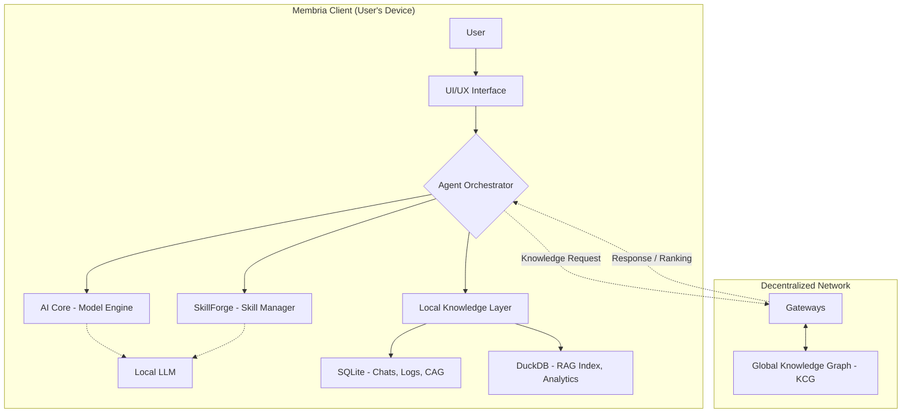

# The Membria Local Client (Final, Unabridged Version)

## 1. Executive Summary

Membria's mission is to build a decentralized, self-sustaining, and permanent knowledge base—a 'Wikipedia for Small Language Models (SLMs)'. The goal of this tokenomic model is to construct a sustainable economy that incentivizes the creation of high-quality knowledge, rewards network participants, and ensures the long-term value growth of the ecosystem.

## 2. Why Membria is Needed: From a Static Toy to a Living Personal AI

### The Current Reality: The Hugging Face "Gold Rush"

A revolution is happening right now. Millions of developers, researchers, and enthusiasts are downloading open-source language models like Llama 3, Phi-3, and Mistral from Hugging Face. For the first time, people can run powerful AI directly on their own computers, with complete privacy and at no cost. The initial experience is thrilling: "I have my own GPT running on my laptop\!"

But after a few days of use, that excitement often gives way to disappointment. Users hit a fundamental "wall of limitations" that turns their powerful AI into a clever but static toy.

### The "Wall of Limitations": Problems with Today's Local LLMs

  * **The "Static Brain" Problem:** The model you download is brilliant, but its knowledge is frozen at the moment its training ended (e.g., early 2023). It knows nothing about new technologies, recent events, or the latest version of your favorite framework. It quickly becomes obsolete.
  * **The "Amnesia" Problem:** The local model knows nothing about you. Every new conversation starts from a blank slate. It doesn't remember your previous questions, your projects, your writing style, or your goals. It's a powerful tool, but it's not a personal assistant.
  * **The "Generalist Trap":** A base model is a generalist. To make it an expert in a niche field (like law or medicine), you need to perform complex and expensive fine-tuning with LoRA adapters, which is an insurmountable barrier for most users.
  * **The "Information Silo" Problem:** The model operates in a vacuum, cut off from your own knowledge base—your PDFs, documents, notes, and emails. Making that data accessible requires building a complex RAG system from scratch.

### The Transformation: What Changes with Membria

The Membria Client is the operating system that demolishes this "wall of limitations," transforming a static model into a living, constantly evolving partner.

  * **Solving the "Static Brain" -\> A Living Brain:** When a local model doesn't know an answer, Membria's CAG (Cache-Augmented Generation) mechanism seamlessly queries the global, constantly updated Knowledge Graph. Your model trained in 2023 can now operate with facts from today.
  * **Solving "Amnesia" -\> A Personal Memory:** Membria's local database architecture (SQLite + DuckDB) becomes your AI's long-term memory. Its agents can privately index your local files, creating a rich personal context. The AI begins to understand your projects and remember your preferences.
  * **Solving the "Generalist Trap" -\> The Instant Specialist:** SkillForge makes the complex process of applying LoRA patches as simple as installing a browser extension. With a single click, you can turn your generalist AI into a "Python expert" or a "financial analyst."
  * **Solving the "Information Silo" -\> The Integrated Workspace:** With built-in RAG and autonomous agents, the AI is no longer an external program but an active participant in your work. It can independently analyze folders of documents, prepare summaries, and use your data in its responses.

Membria is the missing piece that transforms the current hype around local models into a real, productive tool. It elevates local AI from an "interesting tech demo" to an "indispensable daily assistant" that constantly learns, adapts, and grows smarter with you.

## 3. Technical Architecture and Components

### 3.1. Introduction

The Membria Client is a cross-platform application (Windows, macOS, Linux) that serves as the user's personal AI hub. Its primary mission is to provide powerful, personalized, and private AI capabilities that run directly on the user's device, with the ability to seamlessly augment its knowledge from the decentralized Membria network. The client is designed as a modular system, giving the user full control over their AI models, skills, and data.

### 3.2. Main Components

The client's architecture consists of four interconnected components:

1.  **AI Core:** Responsible for running and managing local language models.
2.  **SkillForge:** A manager for dynamically attaching "skills" (LoRA patches).
3.  **Agent Orchestrator:** Manages the execution of complex, multi-step tasks.
4.  **Local Knowledge Layer:** A hybrid data storage system that provides the AI's personal memory.

### 3.3. Visual Architecture Diagram

To visually represent how all client components interact with each other and the external network, the following conceptual architecture diagram is provided.

### 3.4. AI Core: The Local Model Engine

This is the foundation upon which all other capabilities are built. The AI Core is designed for maximum flexibility and can operate in several modes to meet the needs of both beginners and experts.

#### Operating Modes: Flexibility for Everyone

**1. Standard Mode (Built-in Engine)**
By default, the AI Core uses its own built-in engine to run models in GGUF format (e.g., Llama 3, Phi-3, Gemma, Mistral). It automatically starts a local OpenAI-compatible HTTP server, ensuring seamless operation of all Membria components. In this mode, the user is provided with a simple interface for managing basic resources (e.g., how many layers of the model to offload to the GPU).

**2. Compatibility Mode (Integration with LM Studio, Ollama, etc.)**
Membria is not a closed system. If a user has already meticulously set up their models in popular tools like **LM Studio** or **Ollama**, they can switch the AI Core to compatibility mode. In this mode, Membria does not start its own engine but instead **connects to the external local server** run by these tools (e.g., `http://localhost:1234/v1`).

  * **Advantage:** This allows the use of all of Membria's powerful features (Agents, SkillForge, Knowledge Layer) on top of the user's existing, pre-configured models, avoiding duplicate setups and resource consumption.

#### Advanced Mode: Full Control for Experts

For power users and developers, an "Advanced Mode" is available that provides access to detailed settings for the core and the models, enabling maximum performance and generation quality:

  * **Fine-grained Generation Parameters:** Direct control over parameters like `temperature`, `top_p`, `top_k`, and `repetition_penalty` for precise control over the creativity and determinism of responses.
  * **Sampler Control:** The ability to change the order and methods of sampling (e.g., Mirostat) to influence the structure and quality of the model's output.
  * **System Prompt Editing:** Customization and creation of unique system prompt templates that agents use to communicate with the model.
  * **Detailed Resource Management:** More granular control over GPU layer distribution, number of CPU threads, context window size (`n_ctx`), batch size, and other GGUF-specific parameters.
  * **Verbose Logging:** Enabling detailed logs for debugging the full text of prompts, model responses, and analyzing performance.

### 3.5. SkillForge: Dynamic Skill Management

SkillForge is an innovative component that allows for the on-the-fly specialization of the base LLM.

  * **LoRA Patch Manager:** The user can load LoRA adapters (`.safetensors` files) into the client, each representing a distinct "skill" (e.g., "Python programming," "legal text analysis").
  * **Dynamic Application:** Before executing a request, the user or an agent can select which "skills" (LoRAs) to activate. The AI Core dynamically applies these LoRA patches to the base model, instantly adapting it to the specific task without needing a restart.

### 3.6. Agent Orchestrator: Autonomous Agent Management

This component transforms the LLM from a simple chatbot into a proactive, thinking assistant capable of executing complex, multi-step tasks. Its basic features include access to tools (search, file system) and background task execution.

#### Solving the "Context Explosion" Problem: Dynamic Working Memory

When a task requires dozens of steps, the standard approach of "fitting the entire history into the prompt" quickly leads to context window overflow. The Membria Agent Orchestrator solves this by implementing an advanced framework for reasoning and memory management. Instead of a static, growing prompt, it builds **dynamic, evolving memory** that functions like a human's mental scratchpad.
**The Core Idea:** Reasoning is a stateful process. Memory is not a history of dialogue in a prompt, but a compact **latent state** that the agent learns to update, compress, and utilize.
To achieve this, Membria's modular agents use an architecture with three key components ("heads"):

1.  **Scratchpad Head:** At each step, the agent first generates internal thoughts and reasoning.
2.  **Action Head:** Based on this reasoning, the agent chooses a specific action—to call a tool or to respond to the user.
3.  **Memory Update Head:** After executing an action, this head analyzes the result and **compresses it**, updating the latent memory state. It decides what to remember and what to forget.

#### Agent Memory Storage: A Detailed Hybrid Approach

To implement this complex memory mechanic, a hybrid, three-tiered approach based on the flexible capabilities of SQLite is used.

1.  **Hot Memory (In-Memory):** The agent's active state for maximum speed. This is implemented using SQLite's **pure in-memory mode** (`sqlite3 :memory:`) for active reasoning chains (`reasoning_path`) or through **temporary tables** (`CREATE TEMP TABLE`) for a session-level key-value cache (`kv_cache`). This ensures minimal latency by completely eliminating disk I/O.
2.  **Warm Memory (SQLite Persistence):** A state journal for reliability and history. This is implemented using SQLite's **hybrid mode**, where the in-memory database is periodically backed up to a persistent file (`BACKUP TO disk`). This mechanism is used to maintain a persistent event log of the agent's actions (`event_log`), creating a reliable temporal graph of its reasoning.
3.  **Cold Memory (DuckDB):** A vector archive for semantic search. Key conclusions from the SQLite state journal can be periodically vectorized and stored in DuckDB, enabling semantic search over the agent's own "memories."

<!-- end list -->

  * **Optimization and Formats:** To improve concurrent access performance, **Write-Ahead Logging** mode is used (`PRAGMA journal_mode=WAL;`). Complex data structures, such as reasoning steps, are stored as flexible JSON objects thanks to the built-in **JSON1** extension support.
  * **Multi-Agent Collaboration:** The architecture also allows for the use of SQLite's **shared cache mode**, enabling multiple agents or threads to work efficiently on a single task with a shared context.

#### How Memory Segmentation Fights Hallucinations

Hallucinations in agents arise from context overload, context loss, or reasoning failures. The three-tiered memory system purposefully combats each of these issues:

1.  **Hot Memory Fights OVERLOAD:** The agent works with a compact, "noise-free" state, not a giant prompt. This is like a clean desk versus one buried in paper, drastically reducing the risk of getting confused and hallucinating.
2.  **Warm Memory Fights AMNESIA:** The SQLite state journal is a perfect, error-proof memory. To recall a past detail, the agent queries the database directly instead of trying to "guess." This eliminates hallucinations related to forgetfulness.
3.  **Cold Memory Fights REASONING FAILURES:** Semantic search over past successful tasks acts like human experience. The agent uses proven reasoning patterns as templates, grounding its logic and preventing it from veering into illogical fabrications.

### 3.7. Local Knowledge Layer: The Hybrid Personal Memory

This is the "brain" and long-term memory of the personal AI, implemented on a dual-database system for maximum performance.

  * **SQLite (Transactional Core):**
      * **Purpose:** Used as the primary operational database for frequent, small operations.
      * **Stores:** Full chat history, agent action logs (`event_log`), user settings, model/skill metadata, and the Cache-Augmented Generation (CAG) cache of structured knowledge retrieved from the global network.
      * **Advantage:** Guarantees the reliability and integrity of operational data.
  * **DuckDB (Analytical Engine):**
      * **Purpose:** Used as a specialized engine for resource-intensive searches over large volumes of unstructured data.
      * **Stores:** The Retrieval-Augmented Generation (RAG) index—vector embeddings generated from the user's local files (PDFs, DOCX, emails, etc.).
      * **Advantage:** Provides lightning-fast semantic search across millions of text fragments.

#### The Personal Analytics Dashboard: Visualizing Your Knowledge

The analytical power of DuckDB isn't just for the AI's internal use; it's exposed to the user through an interactive dashboard. This transforms Membria from a simple tool into a true knowledge partner.

  * **Knowledge Graph Visualization:** The dashboard can visually map how your documents, notes, and ideas are interconnected, revealing hidden relationships.
  * **Entity Analytics:** The system automatically extracts and displays frequently mentioned entities (people, companies, technologies). Users can click on any entity to see all documents where it is mentioned.
  * **Interactive Agent Memory Map:** The dashboard provides full transparency, allowing users to visually explore how an agent "thought" while solving a complex task.
  * **Discovering "Blind Spots":** By analyzing your knowledge base, the system can suggest what information is missing and offer to find relevant data on the topic.

### 3.8. Network Interaction and Quality Assurance

When local knowledge is insufficient, the client turns to the global network.

  * **Fast Response:** A Gateway instantly searches the global Knowledge Graph (KCG) and returns the most reliable, previously verified information. The client does not need to wait for a new consensus.
  * **Two-Step Filtering:** To ensure the quality of even unverified answers, the client employs a powerful filtering system:
    1.  **Answer Ranking:** The client receives several potential answers from gateways and ranks them based on a combination of factors (source reputation, metadata, etc.).
    2.  **Verification via "Teachers" (RLT):** A key innovation. Lightweight RLT models generate a high-quality, step-by-step explanation for an answer, allowing the local model not just to memorize a fact, but to "understand" it.

### 3.9. Latency Minimization: Architecture for an Instant Response

To ensure the complex verification system doesn't make the user wait, Membria's architecture is built on principles that minimize perceived latency.

  * **Optimistic Execution:** The main principle is to provide an answer immediately while verification runs in the background. The client instantly shows the most likely answer with a "verifying..." status, which updates to "verified" upon completion.
  * **Aggressive Caching:** The fastest response is one that doesn't require a network call. A multi-level caching system is used, first checking the client's ultra-fast local cache, then the gateway's cache.
  * **Adaptive Verification:** The depth of verification can change. If an answer comes from a highly reputable source, the client may apply a "lightweight" check, saving time and resources.

## 4. Security and Privacy by Design

Privacy and data security are not additional features; they are fundamental principles of the Membria architecture.

### 4.1. Local Data Protection

  * **Local by Default:** All of your personal information—documents, chat histories, indexed files, and settings—is stored **exclusively on your device**. No data is uploaded to central servers without your explicit permission.
  * **Encryption at Rest:** Local databases (SQLite, DuckDB) and configuration files can be encrypted using industry-standard practices (e.g., SQLCipher or OS-level file system encryption), protecting data even in the event of physical access to the device.

### 4.2. Skill Isolation and Safety**

A modular system requires strict isolation to prevent abuse from third-party "skills" or agents.

  * **Permission Model:** Similar to mobile apps, no skill or agent can access the file system, network, or other resources without explicit user permission. You always control what each component has access to.
  * **Sandboxing:** The processes running agent logic can be executed in a sandboxed environment, which technically restricts their access to only the resources for which permission was granted.
  * **Reputation and Signatures:** Skills distributed through the Membria ecosystem will have a digital signature from the author and a reputation system based on community feedback, helping to filter out questionable components.

### 4.3. Secure Network Communication**

  * **Fully Offline Mode:** The client can operate in a **100% offline mode**, completely disconnected from the internet. In this case, you achieve absolute "air-gapped" privacy.
  * **End-to-End Encryption:** All communication between the client and Gateways is protected using modern encryption protocols (e.g., TLS 1.3), making data interception useless.
  * **Request Anonymization:** When accessing the network, the client is designed to minimize the transmission of any personal information. Knowledge requests are generic and do not contain data that could identify the user.

## 5. Market Positioning and Competitive Analysis

#### The Existing Landscape: The Era of "Model Runners"

The current local AI market is represented by excellent tools like Ollama, LM Studio, Jan, and others. Their primary function is to provide users with a simple and effective way to download and run open-source language models. They excel in this role as the "engine" or "driver" for LLMs. Membria does not so much compete with them as it **extends their capabilities**, offering to work in compatibility mode.

#### The Membria Difference: From Inference to Agency

Membria takes the next step in the evolution of local AI. If competitors focus on **HOW TO RUN** a model, Membria focuses on **WHAT THE MODEL CAN DO** after it's running. We are building not just an engine, but a complete **operating system for personal AI**, where the model is merely the kernel that receives memory, skills, and the capacity for autonomous action.

#### Comparison Table

| Feature | Ollama / LM Studio & Analogs | Membria Client |
| :--- | :--- | :--- |
| **Core Function** | Model Runner (Inference Server) | **AI Operating System (AI OS)** |
| **Agents** | Provides an API for development | **Built-in Advanced Agent Framework** |
| **Memory** | Limited to the model's context window | **Dynamic, Long-Term Memory (Hot/Warm/Cold)** |
| **Skills** | Static model choice before launch | **Dynamic, on-the-fly skill attachment (SkillForge/LoRA)** |
| **Knowledge Source** | Local Files only (RAG) | **Hybrid Layer: Local Files (RAG) + Global Network (CAG)** |
| **Key Problem Solved**| How to run models locally? | **How to solve AI stagnation, amnesia, and hallucination?** |
| **User Analytics**| None or basic | **Interactive Dashboard & Knowledge Graph Visualization** |

### Conclusion

Membria is the "application layer" that installs on top of the "drivers" (like Ollama) and transforms a static LLM into a proactive, learning, and truly useful personal assistant. We give local AI a brain, memory, and hands.

## 6. The Knowledge Economy: The SkillForge Marketplace

This section connects the local client's technology with the global mission of Membria described in the summary. It explains how a self-sustaining, decentralized economy is created to reward participants for their contributions. To achieve this, `SkillForge` evolves from a simple local manager of LoRA files into a full-fledged gateway to a decentralized marketplace.

### How It Works

1.  **For Creators (Experts):**

      * **Any expert** in their field (law, medicine, a rare programming language, financial analysis) can create their own LoRA skill. For example, a cybersecurity expert can fine-tune a model on all vulnerability reports from the last 5 years, creating a "Cyber Threat Analyst" skill.
      * They **publish this skill on the Membria Marketplace**, setting a price in the project's native tokens. They also provide a detailed description, usage examples, and undergo a verification process to confirm the quality and safety of their product.

2.  **For Users (Consumers):**

      * A typical Membria user, facing a task that requires highly specialized knowledge, browses the marketplace built into the client.
      * They find the skill they need, read its description, and check its rating and reviews from other users.
      * With a single click, they **purchase the skill using tokens**. The skill is automatically downloaded into their `SkillForge`, and they can begin using it immediately, dramatically increasing their local AI's competence in that specific domain.

### Why This Changes Everything

  * **Economic Incentives for Knowledge Creation:** A direct and clear motivation emerges for experts worldwide to share their knowledge. Creating a high-quality LoRA skill becomes a **digital asset** that generates income.
  * **Exponential Growth of Ecosystem Capabilities:** The platform becomes populated with thousands of niche skills that would be impossible to create centrally. Do you want an AI sommelier? Or an AI expert in repairing antique clocks? They can emerge on the marketplace thanks to enthusiasts.
  * **Real Utility for the Token:** The project's token ceases to be a speculative asset and acquires fundamental utility. It becomes the **internal currency for exchanging knowledge**—the most valuable resource in this ecosystem.
  * **Competition and Quality:** Skill creators will compete with one another, which will continually drive up quality and drive down the price of expertise, making it accessible to all.

Thus, the marketplace closes the economic loop, gives the token real utility, and transforms Membria from just a powerful tool into a **living, self-improving, and economically incentivized knowledge ecosystem.**

## 7. Use Cases: Membria in Action

This section demonstrates how Membria's architecture solves concrete, real-world problems for different professionals, highlighting its advantages over alternative AI tools.

### Use Case 1: The Developer in a Legacy Project

  * **Persona:** Anna, a Senior Python Developer.
  * **Task:** To fix a critical bug in a large, confusing project she has never seen before.

**Workflow with Membria:**

1.  **Project Indexing:** Anna points the Membria client to the project's source code folder. The `Local Knowledge Layer` indexes all files in the background (RAG).
2.  **Skill Acquisition and Activation:** Anna browses the marketplace and purchases the top-rated "Python Legacy Code Expert" skill. She activates it in `SkillForge`.
3.  **Dialogue with the Agent:** Anna writes a request: *"Trace the data path from the API endpoint `/api/v1/user/profile` to the database response and find where the administrator rights check is missing."*
4.  **Result:** The `Agent Orchestrator`, using RAG on the code and the knowledge from the purchased LoRA skill, builds a call graph and, within a minute, provides a precise answer identifying the problematic function and recommending a fix.

### Why is this more effective than a hypothetical 'Cursor v.Next'?

Even a future version of Cursor powered by GPT-5 would be a brilliant **generalist**. Membria's approach provides **surgical precision** where general knowledge is not enough. The key advantage is the ability to fine-tune a LoRA skill **specifically on Anna's company codebase**. Such a skill would know every internal API and unwritten convention of that project. A GPT-5-powered Cursor would give excellent general Python advice, but Membria's LoRA skill will give advice that is perfectly relevant for **that specific system**.

### Use Case 2: The Analyst and a High Volume of Data

  * **Persona:** Victor, a Market Analyst.
  * **Task:** To prepare a summary report on global investments in green energy over the last three years, based on 75 PDF reports.

**Workflow with Membria:**

1.  **Data Ingestion:** Victor drags the folder of PDFs into Membria. The `Local Knowledge Layer` indexes all documents.
2.  **Complex Task Delegation:** He gives the agent a multi-step task to analyze, synthesize, and structure data from all documents.
3.  **Autonomous Work:** The `Agent Orchestrator` works in the background for several hours. Its **dynamic working memory** allows it to maintain context, compare data from different reports, and build a coherent picture.
4.  **Result:** Victor receives a complete, structured report with tables and conclusions, saving weeks of manual labor.

### Why is this more effective than specialized AI tools?

Membria's advantage lies in the **autonomy of the agent and its stateful memory**. It doesn't just answer questions about documents; it executes a **long-term research project**. It "remembers" its intermediate findings, can compare data from document \#5 with conclusions from document \#42, identify contradictions, and synthesize entirely new information.

### Use Case 3: The Lawyer and Cross-Domain Analysis

  * **Persona:** Elena, a lawyer at a tech company.
  * **Task:** To review a software development agreement that includes elements of AI model licensing.

**Workflow with Membria:**

1.  **Context Creation:** All of the company's standard agreements and technical documentation are already indexed in the `Local Knowledge Layer`.
2.  **Multi-Skill Activation:** Elena browses the marketplace and purchases two skills: "IT Contract Analysis" and "Software Licensing." She activates **both of them simultaneously** in `SkillForge`.
3.  **Complex Task Delegation:** She asks the agent: *"Compare this contract to our standard template. Highlight all legal risks that arise from the technical obligations."*
4.  **Result:** The agent, possessing expertise in both domains, identifies a clause where a technical requirement to use a library under a `GPL` license creates a legal risk for the entire product, according to the company's standard agreement.

### Why is this stronger than separate 'vertical' solutions?

Membria's strength is **synthesis**. A standalone "Legal AI" won't understand the technical risks, and a standalone "Code AI" won't understand the legal consequences. Membria's ability to **dynamically combine multiple skills** creates a temporary "super-expert" (in this case, an "IT Law expert") who sees the full picture and finds risks at the intersection of two domains.

## 8. Deep Research and Web Interaction: The Autonomous Research Agent

One of the most requested features for a personal AI is the ability not just to search the web, but to conduct **deep, multi-stage research** on a given topic. The Membria client handles this as an autonomous project managed by the `Agent Orchestrator`.

### Architecture of the Research Agent

To perform this function, the `Agent Orchestrator` utilizes the existing modules:

1.  **The "Brain" (`Agent Orchestrator`):** Acts as the "project lead," decomposing the topic into sub-tasks and forming a research plan.
2.  **The "Senses" (Tools):** The agent is provided with a `web_search` tool to get a list of URLs and a `web_browser` tool to "visit" those links.
3.  **The "Memory" (`Hybrid Memory`):** Uses all three memory tiers (hot, warm, cold) to manage context, log steps, and recall successful strategies.

### Technical Implementation of Web Access: Privacy and Costs

To ensure maximum privacy and control, web access is implemented via a hybrid model:

  * **Step 1: Retrieving Links (API-dependent).** To search and retrieve a list of URLs (`web_search`), the agent accesses an external API. The recommended solution is the **Brave Search API**, as it is privacy-focused and offers a generous free tier.
      * **Cost:** For the vast majority of users, this is **free**, as the free tier (up to 2,000 queries per month) covers standard needs. For power users who exceed this limit, an option is provided in the settings to add their own API key for a "Pay-as-you-go" model.
  * **Step 2: Browse Pages (Fully Local).** After receiving a list of links, the agent uses the `web_browser` tool, which runs **entirely locally** on the user's device.
      * **Solution:** The Membria client integrates a headless browser based on **Playwright**. The agent programmatically "opens" a page in this invisible browser, waits for it to fully load (including JavaScript), and extracts its content.
      * **Cleaning:** The content is then processed by a local scraper (based on a library like `trafilatura`) to remove ads, menus, and other boilerplate.
      * **Advantage:** This approach guarantees that the content of the pages you browse never leaves your device, ensuring maximum privacy and reliability.

### The "Deep Research" Workflow

The agent decomposes the user's topic into a multi-step plan. It then iteratively uses the `web_search` tool to get links and the local `web_browser` tool to scrape and analyze content from those links. It uses its dynamic memory to synthesize findings from dozens of sources, notes contradictions, and builds a coherent picture. The entire process is logged for auditability. Once complete, the agent generates a structured report and indexes the findings and key sources into the user's permanent `Local Knowledge Layer`.

## 9. Conclusion

Membria is born from a simple yet profound observation: the current revolution in local AI is incomplete. While powerful language models can now run on personal devices, they exist as static, amnesiac tools—brilliant but fundamentally limited, like a genius with no memory or connection to the outside world. This document has detailed the architecture of the Membria Client, which is designed to solve this problem comprehensively.

Membria is not just another application; it is an **AI Operating System** built on three core pillars:

1.  **Agency and Memory:** Beyond mere inference, Membria introduces true agency. Its advanced `Agent Orchestrator`, equipped with a dynamic, stateful memory system, allows AI to execute complex, long-horizon tasks without suffering from context explosion or hallucinations. By managing memory across hot (in-memory), warm (transactional log), and cold (semantic search) tiers, it transforms a stateless model into a reflective, thinking partner.

2.  **Specialization and Skill:** Recognizing that a single model cannot be an expert in everything, Membria's `SkillForge` architecture provides a mechanism for deep, modular specialization. Through dynamically loaded LoRA skills—created by experts and shared on a decentralized **Marketplace**—a generalist model can instantly become a surgical expert in niche domains, from analyzing proprietary codebases to understanding complex legal contracts.

3.  **Knowledge and Growth:** Membria shatters the "static brain" problem by creating a hybrid knowledge system. The `Local Knowledge Layer` gives the AI a perfect, searchable memory of the user's personal world (RAG). Crucially, this is connected to the global, ever-growing Membria network, allowing the agent to pull fresh, validated information from the outside world (CAG). This ensures the AI is not only personalized but also perpetually learning and up-to-date.

The result is a paradigm shift in what a personal AI can be. It moves from a passive "co-pilot" that responds to commands to a proactive, autonomous partner that can manage projects, conduct research, and synthesize knowledge across multiple domains. All of this is accomplished within a **"privacy-by-design"** framework that keeps the user's data on their device by default, giving them ultimate control.

Membria is the missing piece that completes the puzzle of personal artificial intelligence. It is the foundation for a future where every user is equipped with an AI that is truly their own—private, adaptable, and perpetually growing smarter with them.
