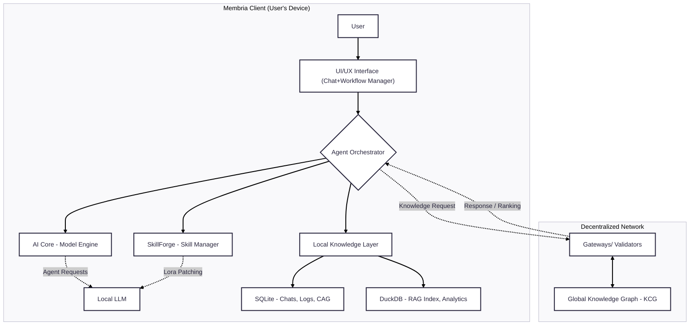
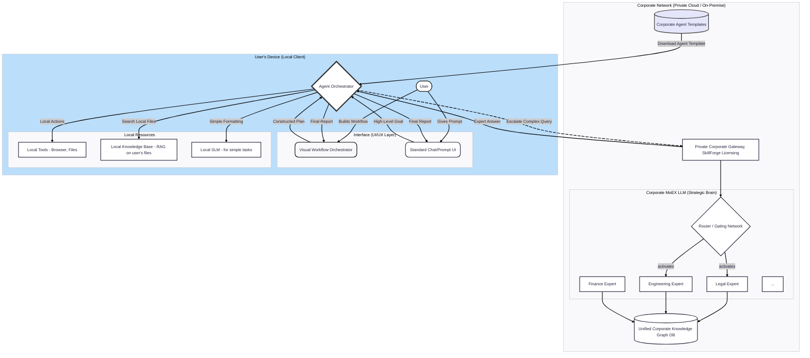

# Membria Local Client

## 1. Executive Summary

Membria's mission is to build a decentralized, self-sustaining, and permanent knowledge base—a 'Wikipedia for Small Language Models (SLMs)'. The goal of this tokenomic model is to construct a sustainable economy that incentivizes the creation of high-quality knowledge, rewards network participants, and ensures the long-term value growth of the ecosystem.

## 2. Why Membria is Needed: From a Static Toy to a Living Personal AI

#### The Current Reality: The Hugging Face "Gold Rush"

A revolution is happening right now. Millions of developers, researchers, and enthusiasts are downloading open-source language models like Llama 3, Phi-3, and Mistral from Hugging Face. For the first time, people can run powerful AI directly on their own computers, with complete privacy and at no cost. The initial experience is thrilling: "I have my own GPT running on my laptop\!"

But after a few days of use, that excitement often gives way to disappointment. Users hit a fundamental "wall of limitations" that turns their powerful AI into a clever but static toy.

#### The "Wall of Limitations": Problems with Today's Local LLMs

  * **The "Static Brain" Problem:** The model you download is brilliant, but its knowledge is frozen at the moment its training ended (e.g., early 2023). It knows nothing about new technologies, recent events, or the latest version of your favorite framework. It quickly becomes obsolete.
  * **The "Amnesia" Problem:** The local model knows nothing about you. Every new conversation starts from a blank slate. It doesn't remember your previous questions, your projects, your writing style, or your goals. It's a powerful tool, but it's not a personal assistant.
  * **The "Generalist Trap":** A base model is a generalist. To make it an expert in a niche field (like law or medicine), you need to perform complex and expensive fine-tuning with LoRA adapters, which is an insurmountable barrier for most users.
  * **The "Information Silo" Problem:** The model operates in a vacuum, cut off from your own knowledge base—your PDFs, documents, notes, and emails. Making that data accessible requires building a complex RAG system from scratch.

#### The Transformation: What Changes with Membria

> The Membria Client is the operating system that demolishes this "wall
> of limitations," transforming a static model into a living, constantly
> evolving partner. This approach aligns with a pragmatic view where
> complex goals are decomposed into modular sub-tasks, each of which can
> be reliably handled by specialized and efficient models.

  * **Solving the "Static Brain" -\> A Living Brain:** When a local model doesn't know an answer, Membria's CAG (Cache-Augmented Generation) mechanism seamlessly queries the global, constantly updated Knowledge Graph. Your model trained in 2023 can now operate with facts from today.
  * **Solving "Amnesia" -\> A Personal Memory:** Membria's local database architecture (SQLite + DuckDB) becomes your AI's long-term memory. Its agents can privately index your local files, creating a rich personal context. The AI begins to understand your projects and remember your preferences.
  * **Solving the "Generalist Trap" -\> The Instant Specialist:** SkillForge makes the complex process of applying LoRA patches as simple as installing a browser extension. With a single click, you can turn your generalist AI into a "Python expert" or a "financial analyst."
  * **Solving the "Information Silo" -\> The Integrated Workspace:** With built-in RAG and autonomous agents, the AI is no longer an external program but an active participant in your work. It can independently analyze folders of documents, prepare summaries, and use your data in its responses.

Membria is the missing piece that transforms the current hype around local models into a real, productive tool. It elevates local AI from an "interesting tech demo" to an "indispensable daily assistant" that constantly learns, adapts, and grows smarter with you.

## 3. Technical Architecture and Components

#### 3.1. Introduction

The Membria Client is a cross-platform application (Windows, macOS, Linux) that serves as the user's personal AI hub. Its primary mission is to provide powerful, personalized, and private AI capabilities that run directly on the user's device, with the ability to seamlessly augment its knowledge from the decentralized Membria network. The client is designed as a modular system, giving the user full control over their AI models, skills, and data.

#### 3.2. Main Components

The client's architecture consists of four interconnected components:

1.  **AI Core:** Responsible for running and managing local language models.
2.  **SkillForge:** A manager for dynamically attaching "skills" (LoRA patches).
3.  **Agent Orchestrator:** Manages the execution of complex, multi-step tasks.
4.  **Local Knowledge Layer:** A hybrid data storage system that provides the AI's personal memory.

#### 3.3. Visual Architecture Diagram

To visually represent how all client components interact with each other and the external network, the following conceptual architecture diagram is provided.



#### 3.4. AI Core: The Local Model Engine

This is the foundation upon which all other capabilities are built. The AI Core is designed for maximum flexibility and can operate in several modes to meet the needs of both beginners and experts.

#### Operating Modes: Flexibility for Everyone

**1. Standard Mode (Built-in Engine)**
By default, the AI Core uses its own built-in engine to run models in GGUF format (e.g., Llama 3, Phi-3, Gemma, Mistral). It automatically starts a local OpenAI-compatible HTTP server, ensuring seamless operation of all Membria components. In this mode, the user is provided with a simple interface for managing basic resources (e.g., how many layers of the model to offload to the GPU).

**2. Compatibility Mode (Integration with LM Studio, Ollama, etc.)**
Membria is not a closed system. If a user has already meticulously set up their models in popular tools like **LM Studio** or **Ollama**, they can switch the AI Core to compatibility mode. In this mode, Membria does not start its own engine but instead **connects to the external local server** run by these tools (e.g., `http://localhost:1234/v1`).

  * **Advantage:** This allows the use of all of Membria's powerful features (Agents, SkillForge, Knowledge Layer) on top of the user's existing, pre-configured models, avoiding duplicate setups and resource consumption.

#### Advanced Mode: Full Control for Experts

For power users and developers, an *"Advanced Mode"* is available that provides access to detailed settings for the core and the models, enabling maximum performance and generation quality:

  * **Fine-grained Generation Parameters:** Direct control over parameters like `temperature`, `top_p`, `top_k`, and `repetition_penalty` for precise control over the creativity and determinism of responses.
  * **Sampler Control:** The ability to change the order and methods of sampling (e.g., Mirostat) to influence the structure and quality of the model's output.
  * **System Prompt Editing:** Customization and creation of unique system prompt templates that agents use to communicate with the model.
  * **Detailed Resource Management:** More granular control over GPU layer distribution, number of CPU threads, context window size (`n_ctx`), batch size, and other GGUF-specific parameters.
  * **Verbose Logging:** Enabling detailed logs for debugging the full text of prompts, model responses, and analyzing performance.

####  Heterogeneous by Design

> The Membria architecture embraces the principle that agentic systems
> are naturally heterogeneous. Instead of relying on a
> single, monolithic LLM, the `AI Core` is designed to be a flexible
> orchestrator.

An agent can use a powerful LLM for high-level planning or open-domain conversation, while calling upon various specialized and efficient SLMs for subordinate, well-defined tasks. This multi-model approach allows for an optimal balance of capability and cost-efficiency.

#### 3.5. SkillForge: Dynamic Skill Management

SkillForge is an innovative component that allows for the on-the-fly specialization of the base LLM.

  * **LoRA Patch Manager:** The user can load LoRA adapters (`.safetensors` files) into the client, each representing a distinct "skill" (e.g., "Python programming," "legal text analysis").
  * **Dynamic Application:** Before executing a request, the user or an agent can select which "skills" (LoRAs) to activate. The AI Core dynamically applies these LoRA patches to the base model, instantly adapting it to the specific task without needing a restart.

##### The Power and Economy of Specialization

The SkillForge approach is built on the proven power and efficiency of specialized Small Language Models (SLMs).

  * **Proven Capability:** Recent research demonstrates that well-designed SLMs can meet or exceed the performance of much larger models on specific agentic tasks. For example, the 8-billion parameter Salesforce xLAM-2-8B surpasses frontier models like GPT-4o and Claude 3.5 in tool-calling capabilities. Similarly, models in the Microsoft Phi series achieve reasoning and code generation scores on par with models 5-10 times their size.
  * **Economic Efficiency:** A key advantage is cost. Serving a 7-billion parameter SLM is **10-30 times cheaper** in terms of latency, energy, and FLOPs than a 70-175 billion parameter LLM. Furthermore, fine-tuning an SLM with techniques like LoRA requires only a **few GPU-hours**, as opposed to weeks for large models, enabling rapid iteration and adaptation.
  * **Behavioral Alignment for Reliability:** For agentic workflows, reliability is paramount. An agent's interaction with tools requires strictly formatted outputs (e.g., JSON), and general-purpose LLMs may occasionally fail to adhere to these formats, causing errors. A specialized LoRA skill, however, can be cheaply and effectively fine-tuned to enforce a single formatting decision, ensuring near-perfect reliability for tool-use and system integration.

### **Membria's Adaptive Knowledge Fusion Framework**

#### **Objective**

The core objective of this framework is to transform the Membria client from a system of siloed experts into an **intelligent, self-correcting ecosystem**. This process enables each specialized AI expert to dynamically identify, diagnose, and remedy its own "knowledge gaps." This ensures that the entire system becomes progressively smarter and more accurate with every user interaction, targeting improvements with surgical precision.

This architecture replaces simpler RAG or monolithic fine-tuning models with a sophisticated, scalable, and targeted self-correction loop for an **Association of Experts (AoE)** .

#### **How It Works: The Integrated Workflow**

The process involves Membria's standard components working in a tightly integrated sequence. The entire loop is triggered when a user query, routed to a specific expert, cannot be confidently answered by that expert using its internal knowledge graph.

##### **Component 1: The Router/Orchestrator**

* **Role:** The "Intelligent Dispatcher."  
* **Process:** When a user issues a query, the Router/Orchestrator is the first point of contact.  
  1. **Analysis and Routing:** It analyzes the query's intent and topic to determine the required domain of expertise.  
  2. **Expert Selection:** It then routes the query to the most appropriate **specialized ("dense") expert** from its pool (e.g., "Expert on Clinical Trials," "Expert on Financial Regulations"). This ensures that the query is handled by the model with the deepest knowledge in that specific area.

##### **Component 2: The Self-Knowledge Checkpoint (at the Expert Level)**

* **Role:** The "Sentry" or "Graph Diagnostician."  
* **Process:** The selected dense expert receives the query and performs the confidence check. This is no longer an abstract assessment of parametric knowledge but a direct query against its structured knowledge base.  
  * **The query is run against the local temporal ontology (Graph RAG).**  
  * **If confidence is high:** The expert finds all necessary nodes (entities) and edges (relationships) within its segment of the knowledge graph to form a complete and accurate answer. The answer is returned to the user.  
  * **If confidence is low (a "Knowledge Gap"):** This is the trigger. The expert diagnoses a specific deficiency in its knowledge graph—a missing entity, an outdated relationship, or a contradiction. Instead of generating a potentially incorrect answer, it signals the Orchestrator to initiate a **Distillation on Demand (DoD)** request to get an expert answer from more powerful external models.

##### **Component 3: The Knowledge Curator**

* **Role:** The "Ontology Architect" and "Data Scientist."  
* **Process:** Once the DoD process returns a high-quality, validated "expert answer," the Knowledge Curator begins its highly contextualized work.  
  1. **Graph-Level Knowledge Fusion:** The Curator performs the critical **Internal-External Knowledge Fusion** step. This is a structural operation on the local temporal ontology. It uses the new external knowledge to directly **heal and expand the knowledge graph** by:  
     * Adding new nodes (entities).  
     * Creating new edges (relationships).  
     * Updating the temporal attributes of existing knowledge to ensure currency.  
  2. **Reasoning Data Generation:** The Curator then uses the S2K pipeline to structure this newly enriched graph-based knowledge into high-quality training examples, classifying them into deductive, inductive, or case-based reasoning scenarios to enhance the expert's logical depth.

##### **Component 4: The SkillForge**

* **Role:** The "Personal Trainer" for the expert.  
* **Process:** The SkillForge receives the small, high-quality, fused-and-structured training dataset from the Knowledge Curator. It then executes the final step with surgical precision.  
  1. **Targeted Selective Supervised Fine-Tuning (Selective SFT):** The SkillForge initiates a fine-tuning process to create a new Δ-LoRA patch. It uses the **Selective SFT** method, which applies greater weight during optimization only to the parts of the knowledge the **specific expert** was originally uncertain about.  
  2. **Skill Integration:** The newly generated LoRA patch—a new "skill"—is immediately and exclusively applied **only to the dense expert that failed the initial check**. This permanently closes its knowledge gap without affecting any other expert in the pool.

#### **3\. Workflow Diagram**

```mermaid
---
config:
  theme: redux
  layout: fixed
---

graph TD  
    A\[User Query\] \--\> R{Router/Orchestrator};  
    R \-- Routes query to the most relevant expert \--\> E\_Pool\[Pool of Dense Experts\];  
    subgraph E\_Pool  
        direction LR  
        E1\[Expert 1\]  
        E2\[Expert 2\]  
        E3\[...\]  
    end  
      
    R \--\> E2;  
    E2 \-- Queries its segment of the knowledge graph \--\> G\_RAG\[Local Temporal Ontology\];  
    G\_RAG \-- Returns graph-based context \--\> E2;  
    E2 \-- Assesses completeness of graph data \--\> Check{Self-Knowledge Checkpoint};  
      
    Check \-- High Confidence (Graph is sufficient) \--\> C\[Answer from Expert 2\];  
    C \--\> A;

    Check \-- Low Confidence (Knowledge Gap in Graph) \--\> D\[1. Trigger DoD Request\];  
    D \--\> Ext\_LLM\[External LLMs\];  
    Ext\_LLM \-- Expert Answer \--\> F{Knowledge Curator};  
      
    subgraph F  
        direction TB  
        F1\[2. Perform Graph-Level Fusion (Heal the Ontology)\]  
        F2\[3. Generate Structured Training Data for Expert 2\]  
    end

    F \-- Ontology Updates \--\> G\_RAG;  
    F \-- Training Data \--\> G{SkillForge};

    subgraph G  
        H\[4. Generate Targeted LoRA Patch via Selective SFT\]  
    end

    G \-- New skill (LoRA) is applied only to the specific expert \--\> E2;

```

#### **How This Improves Knowledge Quality**

This AoE architecture provides a monumental improvement over standard/Graph RAG or basic fine-tuning:

* **It Creates a Self-Healing Knowledge Graph:** Naive RAG simply provides external context. This framework actively uses external knowledge to **correct, expand, and maintain the currency** of the internal, structured temporal ontology itself. The knowledge base becomes a living, evolving entity.  
* **It Teaches Reasoning, Not Just Facts:** By generating structured reasoning data from the corrected graph, the system trains the expert on **how to think** within its newly expanded domain, not just what to know.  
* **It's Radically More Efficient and Scalable:** The MoE architecture with **Selective SFT** focuses the entire training effort only on the specific knowledge gap within a single, small expert. This allows the system to achieve results comparable to massive domain pretraining but with **2-3 orders of magnitude less data and cost**. This makes continuous, on-device, and highly specialized learning not just feasible, but optimal.  
* **It Ensures Precision and Prevents Knowledge Contamination:** By isolating the learning process to a single expert, you ensure that improvements in one domain (e.g., Financial Regulations) do not accidentally degrade performance in another, unrelated domain.

#### Agent Orchestrator: Autonomous Agent Management

This component transforms the LLM from a simple chatbot into a proactive, thinking assistant capable of executing complex, multi-step tasks. Its basic features include access to tools (search, file system) and background task execution.

### Solving the "Context Explosion" Problem: Dynamic Working Memory

When a task requires dozens of steps, the standard approach of "fitting the entire history into the prompt" quickly leads to context window overflow. The Membria Agent Orchestrator solves this by implementing an advanced framework for reasoning and memory management. Instead of a static, growing prompt, it builds **dynamic, evolving memory** that functions like a human's mental scratchpad.

**The Core Idea:** Reasoning is a stateful process. Memory is not a history of dialogue in a prompt, but a compact **latent state** that the agent learns to update, compress, and utilize.

To achieve this, Membria's modular agents use an architecture with three key components ("heads"):

1.  **Reasoning Head:** At each step, the agent first generates internal thoughts and reasoning.
2.  **Action Head:** Based on this reasoning, the agent chooses a specific action—to call a tool or to respond to the user.
3.  **Memory Update Head:** After executing an action, this head analyzes the result and **compresses it**, updating the latent memory state. It decides what to remember and what to forget.

---

### Agent Memory Storage: A Detailed Hybrid and Hierarchical Approach

To implement this complex memory mechanic, a hybrid, three-tiered approach based on the flexible capabilities of SQLite is used. Inspired by advanced enterprise systems, Membria also supports **hierarchical memory structures**. This means that for a complex task, a primary agent can spawn "child" agents, each with its own temporary memory context, which is "compressed" and returned to the parent agent upon completion. This ensures robust management of complex, multi-level projects.

1.  **Hot Memory (In-Memory):** The agent's active state for maximum speed. This is implemented using SQLite's **pure in-memory mode** (`sqlite3 :memory:`) for active reasoning chains (`reasoning_path`) or through **temporary tables** (`CREATE TEMP TABLE`) for a session-level key-value cache (`kv_cache`). This ensures minimal latency by completely eliminating disk I/O.
2.  **Warm Memory (SQLite Persistence):** A state journal for reliability and history. This is implemented using SQLite's **hybrid mode**, where the in-memory database is periodically backed up to a persistent file (`BACKUP TO disk`). This mechanism is used to maintain a persistent event log of the agent's actions (`event_log`), creating a reliable temporal graph of its reasoning.
3.  **Cold Memory (DuckDB):** A vector archive for semantic search. Key conclusions from the SQLite state journal can be periodically vectorized and stored in DuckDB, enabling semantic search over the agent's own "memories."
  * **Optimization and Formats:** To improve concurrent access performance, **Write-Ahead Logging** mode is used (`PRAGMA journal_mode=WAL;`). Complex data structures, such as reasoning steps, are stored as flexible JSON objects thanks to the built-in **JSON1** extension support.
  * **Multi-Agent Collaboration:** The architecture also allows for the use of SQLite's **shared cache mode**, enabling multiple agents or threads to work efficiently on a single task with a shared context.

###  Reliable Tool Use with Idem-Prompts

To ensure reliability in enterprise tasks where errors are unacceptable, the `Agent Orchestrator` uses a mechanism based on the `i-Check` / `Idem-Prompt` concept. When an agent needs to call a tool that requires data in a strictly defined format (e.g., JSON), the orchestrator automatically wraps the LLM call in a **constraining prompt**. This prompt forces the model to output data in a stable, predictable, and always correct structure, which is critical for reliable automation.

###  How Memory Segmentation Fights Hallucinations

Hallucinations in agents arise from context overload, context loss, or reasoning failures. The three-tiered memory system purposefully combats each of these issues:

1.  **Hot Memory Fights OVERLOAD:** The agent works with a compact, "noise-free" state, not a giant prompt. This is like a clean desk versus one buried in paper, drastically reducing the risk of getting confused and hallucinating.
2.  **Warm Memory Fights AMNESIA:** The SQLite state journal is a perfect, error-proof memory. To recall a past detail, the agent queries the database directly instead of trying to "guess." This eliminates hallucinations related to forgetfulness.
3.  **Cold Memory Fights REASONING FAILURES:** Semantic search over past successful tasks acts like human experience. The agent uses proven reasoning patterns as templates, grounding its logic and preventing it from veering into illogical fabrications.

Of course. I will add the new subsection justifying the architectural choice of databases to the document, in English.

Here is the final, complete version of the document with this new addition.

---

#### 3.7. Local Knowledge Layer: The Hybrid Personal Memory
This is the "brain" and long-term memory of the personal AI, implemented on a dual-database system for maximum performance.

* **SQLite (Transactional Core):**
    * **Purpose:** Used as the primary operational database for frequent, small operations.
    * **Stores:** Full chat history, persistent agent event logs (`event_log`), user settings, model/skill metadata, and the Cache-Augmented Generation (CAG) cache of structured knowledge retrieved from the global network.
    * **Advantage:** Guarantees the reliability and integrity of operational data. Supports storing certain types of local indexes for search.
* **DuckDB (Analytical Engine):**
    * **Purpose:** Used as a specialized engine for resource-intensive searches over large volumes of unstructured data.
    * **Stores:** The Retrieval-Augmented Generation (RAG) index—vector embeddings generated from the user's local files (PDFs, DOCX, emails, etc.).
    * **Advantage:** Provides lightning-fast semantic search across millions of text fragments.

##### **Preprocessing and Indexing: Semantic Chunking**
For maximum RAG accuracy, the `Local Knowledge Layer` employs an advanced **Semantic Chunking** method when indexing documents. Instead of splitting text into fixed-size fragments, this algorithm divides it along semantic and thematic boundaries. Each "chunk" represents a complete thought, which significantly improves the quality of vector representations, increases search relevance, and reduces hallucinations.

##### **The Personal Analytics Dashboard: Visualizing Your Knowledge**
The analytical power of DuckDB isn't just for the AI's internal use; it's exposed to the user through an interactive dashboard. This transforms Membria from a simple tool into a true knowledge partner.

* **Knowledge Graph Visualization:** The dashboard can visually map how your documents, notes, and ideas are interconnected, revealing hidden relationships.
* **Entity Analytics:** The system automatically extracts and displays frequently mentioned entities (people, companies, technologies). Users can click on any entity to see all documents where it is mentioned.
* **Interactive Agent Memory Map:** The dashboard provides full transparency, allowing users to visually explore how an agent "thought" while solving a complex task.
* **Discovering "Blind Spots":** By analyzing your knowledge base, the system can suggest what information is missing and offer to find relevant data on the topic.

##### **Architectural Choice: Specialized Embedded Databases vs. Multi-Model**
The decision to use a dual-database stack of SQLite and DuckDB is a deliberate architectural choice designed to optimize the performance and portability of the local-first client.

While multi-model databases that combine graph, vector, and other capabilities in a single engine exist, the Membria client prioritizes **maximum performance, lightweight operation, and technological maturity**.

The SQLite and DuckDB stack was chosen because each library is **best-in-class for its specific task in an embedded (in-process) format**:
* **SQLite:** Offers unparalleled performance and reliability for the transactional workloads required by chat histories and agent logs.
* **DuckDB:** Provides extremely fast analytical queries and state-of-the-art vector search capabilities, crucial for a high-performance RAG system.

This specialized approach ensures that every function of the `Local Knowledge Layer` runs at peak efficiency, which is critical for a responsive user experience on a local device. While this requires managing two dependencies, the performance gains outweigh the complexity. For the **central corporate node**, where massive scale is more important than a serverless embedded footprint, using a powerful, server-based multi-model database is a more appropriate and justified architecture.

#### 3.8. Network Interaction, Quality Assurance, and Ranking

When local knowledge is insufficient, the client turns to the global network.

  * **Fast Response:** A Gateway instantly searches the global Knowledge Graph (KCG) and returns the most reliable, previously verified information. The client does not need to wait for a new consensus.
  * **Two-Step Filtering and Ranking:** To ensure quality, the client employs a powerful filtering system. It includes not only verification via "Teachers" (RLT) but also an advanced **`Ranking Layer`**. This layer evaluates and prioritizes all retrieved results (from both the network and local RAG search) based on their relevance, model confidence, and **configurable corporate business rules** (e.g., "documents from the 'Legal/Approved' folder always have the highest priority").

#### 3.9. Latency Minimization: Architecture for an Instant Response

To ensure the complex verification system doesn't make the user wait, Membria's architecture is built on principles that minimize perceived latency.

  * **Optimistic Execution:** The main principle is to provide an answer immediately while verification runs in the background. The client instantly shows the most likely answer with a "verifying..." status, which updates to "verified" upon completion.
  * **Aggressive Caching:** The fastest response is one that doesn't require a network call. A multi-level caching system is used, first checking the client's ultra-fast local cache, then the gateway's cache.
  * **Adaptive Verification:** The depth of verification can change. If an answer comes from a highly reputable source, the client may apply a "lightweight" check, saving time and resources.

## 4. Security and Privacy by Design

Privacy and data security are not additional features; they are fundamental principles of the Membria architecture.

#### 4.1. Local Data Protection

  * **Local by Default:** All of your personal information—documents, chat histories, indexed files, and settings—is stored **exclusively on your device**. No data is uploaded to central servers without your explicit permission.
  * **Encryption at Rest:** Local databases (SQLite, DuckDB) and configuration files can be encrypted using industry-standard practices (e.g., SQLCipher or OS-level file system encryption), protecting data even in the event of physical access to the device.

#### 4.2. Skill Isolation and Safety

A modular system requires strict isolation to prevent abuse from third-party "skills" or agents.

  * **Permission Model:** Similar to mobile apps, no skill or agent can access the file system, network, or other resources without explicit user permission. You always control what each component has access to.
  * **Sandboxing:** The processes running agent logic can be executed in a sandboxed environment, which technically restricts their access to only the resources for which permission was granted.
  * **Reputation and Signatures:** Skills distributed through the Membria ecosystem will have a digital signature from the author and a reputation system based on community feedback, helping to filter out questionable components.

#### 4.3. Secure Network Communication

  * **Fully Offline Mode:** The client can operate in a **100% offline mode**, completely disconnected from the internet. In this case, you achieve absolute "air-gapped" privacy.
  * **End-to-End Encryption:** All communication between the client and Gateways is protected using modern encryption protocols (e.g., TLS 1.3), making data interception useless.
  * **Request Anonymization:** When accessing the network, the client is designed to minimize the transmission of any personal information. Knowledge requests are generic and do not contain data that could identify the user.

## 5. Market Positioning and Competitive Analysis

#### The Existing Landscape: The Era of "Model Runners"

The current local AI market is represented by excellent tools like Ollama, LM Studio, Jan, and others. Their primary function is to provide users with a simple and effective way to download and run open-source language models. They excel in this role as the "engine" or "driver" for LLMs. Membria does not so much compete with them as it **extends their capabilities**, offering to work in compatibility mode.

#### The Membria Difference: From Inference to Agency

Membria takes the next step in the evolution of local AI. If competitors focus on **HOW TO RUN** a model, Membria focuses on **WHAT THE MODEL CAN DO** after it's running. We are building not just an engine, but a complete **operating system for personal AI**, where the model is merely the kernel that receives memory, skills, and the capacity for autonomous action.

#### Academic Foundation and Rebuttal to Common Objections

[cite\_start]The SLM-first philosophy of Membria is not just a design choice; it is supported by extensive academic research into the efficiency and capability of modern language models[cite: 2]. This research also provides strong counter-arguments to common objections.

  * **Objection 1: "LLMs' general understanding will always give them an edge."**
    This view posits that even on narrow tasks, the superior general reasoning of an LLM will trump a specialized SLM. However, this argument is flawed because:

      * Popular scaling law studies assume a fixed model architecture, whereas recent work shows that different architectures are optimal for different model sizes.
      * This view ignores the power and flexibility of fine-tuning. An SLM can be easily and cheaply specialized for the task at hand to perform at the desired level of reliability.
      * Reasoning techniques (like Chain-of-Thought) are significantly more affordable to run on an SLM at inference time to boost performance.

  * **Objection 2: "Centralized LLM inference will always be cheaper due to economy of scale."** 
    This argument claims that the cost benefits of SLMs are outweighed by the operational efficiencies of massive, centralized data centers. While this is a valid business consideration, recent trends indicate a shift:

      * Advanced inference scheduling systems (like NVIDIA Dynamo) offer unprecedented flexibility, countering the traditional load-balancing challenges of specialized models.
      * The costs associated with setting up private inference infrastructure are on a consistent downward trend due to technological improvements.

### Comparison Table

| Feature | Ollama / LM Studio & Analogs | Membria Client |
| :--- | :--- | :--- |
| **Core Function** | Model Runner (Inference Server) | **AI Operating System (AI OS)** |
| **Agents** | Provides an API for development | **Built-in Advanced Agent Framework** |
| **Memory** | Limited to the model's context window | **Dynamic, Long-Term Memory (Hot/Warm/Cold)** |
| **Skills** | Static model choice before launch | **Dynamic, on-the-fly skill attachment (SkillForge/LoRA)** |
| **Knowledge Source** | Local Files only (RAG) | **Hybrid Layer: Local Files (RAG) + Global Network (CAG)** |
| **Key Problem Solved**| How to run models locally? | **How to solve AI stagnation, amnesia, and hallucination?** |
| **User Analytics**| None or basic | **Interactive Dashboard & Knowledge Graph Visualization** |

### Conclusion

Membria is the "application layer" that installs on top of the "drivers" (like Ollama) and transforms a static LLM into a proactive, learning, and truly useful personal assistant. We give local AI a brain, memory, and hands.

## 6. The Knowledge Economy: The SkillForge Marketplace

This section connects the local client's technology with the global mission of Membria described in the summary. It explains how a self-sustaining, decentralized economy is created to reward participants for their contributions. To achieve this, `SkillForge` evolves from a simple local manager of LoRA files into a full-fledged gateway to a decentralized marketplace.

#### How It Works

1.  **For Creators (Experts):**
      * **Any expert** in their field (law, medicine, a rare programming language, financial analysis) can create their own LoRA skill. For example, a cybersecurity expert can fine-tune a model on all vulnerability reports from the last 5 years, creating a "Cyber Threat Analyst" skill.
      * They **publish this skill on the Membria Marketplace**, setting a price in the project's native tokens. They also provide a detailed description, usage examples, and undergo a verification process to confirm the quality and safety of their product.
2.  **For Users (Consumers):**
      * A typical Membria user, facing a task that requires highly specialized knowledge, browses the marketplace built into the client.
      * They find the skill they need, read its description, and check its rating and reviews from other users.
      * With a single click, they **purchase the skill using tokens**. The skill is automatically downloaded into their `SkillForge`, and they can begin using it immediately, dramatically increasing their local AI's competence in that specific domain.

#### Why This Changes Everything

  * **Economic Incentives for Knowledge Creation:** A direct and clear motivation emerges for experts worldwide to share their knowledge. Creating a high-quality LoRA skill becomes a **digital asset** that generates income.
  * **Exponential Growth of Ecosystem Capabilities:** The platform becomes populated with thousands of niche skills that would be impossible to create centrally. Do you want an AI sommelier? Or an AI expert in repairing antique clocks? They can emerge on the marketplace thanks to enthusiasts.
  * **Real Utility for the Token:** The project's token ceases to be a speculative asset and acquires fundamental utility. It becomes the **internal currency for exchanging knowledge**—the most valuable resource in this ecosystem.
  * **Competition and Quality:** Skill creators will compete with one another, which will continually drive up quality and drive down the price of expertise, making it accessible to all.

Thus, the marketplace closes the economic loop, gives the token real utility, and transforms Membria from just a powerful tool into a **living, self-improving, and economically incentivized knowledge ecosystem.**

#### Quality and Trust Assurance for the Marketplace

To ensure a high level of trust and reliability for skills on the marketplace, Membria will implement an evaluation mechanism inspired by research into **"Evaluating LLM Self-Knowledge"**. Before publication, each model or LoRA skill can be automatically benchmarked to determine its ability to recognize the limits of its own knowledge. The result, displayed as a **"Reliability Score"** or "Self-Awareness Index," will help corporate and individual users choose the most dependable tools for critical tasks.

#### The Skill Creation Lifecycle: A Data-Driven Ecosystem

The marketplace is not just a place to sell skills; it is part of a continuous improvement loop fueled by real-world usage data. The process for creating new, high-quality skills for the marketplace is directly inspired by the "LLM-to-SLM Conversion Algorithm".

1.  **Step 1: Secure Data Collection:** With user consent, the `Agent Orchestrator` can be configured with a `Logger` component. This component logs all non-HCI (Human-Computer Interaction) agent calls—capturing anonymized input prompts, output responses, and tool call data.
2.  **Step 2: Curation and Clustering:** Once a sufficient dataset is collected, it is curated to remove any sensitive information. Then, unsupervised clustering techniques are employed to identify recurring patterns and common tasks that are ideal candidates for specialization.
3.  **Step 3: SLM Selection and Fine-tuning:** For each identified task cluster, an appropriate base SLM is selected. A new, specialized LoRA skill is then created by fine-tuning the SLM on the task-specific dataset, leveraging PEFT techniques like LoRA. This process can also use knowledge distillation to transfer capabilities from a more powerful mode.
4.  **Step 4: Publishing and Refinement:** The new skill is published to the marketplace. This entire process forms a continuous loop, where new data from agent interactions is used to refine existing skills and create new ones, ensuring the ecosystem constantly adapts and improves.

## 7. Use Cases and Workflow Orchestration

This section demonstrates how Membria's architecture solves concrete, real-world problems. A key element of the user experience, especially in a corporate environment, is the **Visual Workflow Orchestrator**. Inspired by the "intuitive canvas" concept, this provides a graphical interface where even non-technical experts can construct complex agent task chains by dragging and dropping pre-defined action blocks.

### Use Case 1: The Developer in a Legacy Project

  * **Persona:** Anna, a Senior Python Developer.
  * **Task:** To fix a critical bug in a large, confusing project she has never seen before.

**Workflow with Membria:**

1.  **Project Indexing:** Anna points the Membria client to the project's source code folder. The `Local Knowledge Layer` indexes all files in the background (RAG).
2.  **Skill Acquisition and Activation:** Anna browses the marketplace and purchases the top-rated "Python Legacy Code Expert" skill. She activates it in `SkillForge`.
3.  **Dialogue with the Agent:** Anna writes a request: *"Trace the data path from the API endpoint `/api/v1/user/profile` to the database response and find where the administrator rights check is missing."*
4.  **Result:** The `Agent Orchestrator`, using RAG on the code and the knowledge from the purchased LoRA skill, builds a call graph and, within a minute, provides a precise answer identifying the problematic function and recommending a fix.

### Why is this more effective than a hypothetical 'Cursor v.Next'?

Even a future version of Cursor powered by GPT-5 would be a brilliant **generalist**. Membria's approach provides **surgical precision** where general knowledge is not enough. The key advantage is the ability to fine-tune a LoRA skill **specifically on Anna's company codebase**. Such a skill would know every internal API and unwritten convention of that project. A GPT-5-powered Cursor would give excellent general Python advice, but Membria's LoRA skill will give advice that is perfectly relevant for **that specific system**.

### Use Case 2: The Analyst and a High Volume of Data

  * **Persona:** Victor, a Market Analyst.
  * **Task:** To prepare a summary report on global investments in green energy over the last three years, based on 75 PDF reports.

**Workflow with Membria:**

1.  **Data Ingestion:** Victor drags the folder of PDFs into Membria. The `Local Knowledge Layer` indexes all documents.
2.  **Complex Task Delegation:** He gives the agent a multi-step task to analyze, synthesize, and structure data from all documents.
3.  **Autonomous Work:** The `Agent Orchestrator` works in the background for several hours. Its **dynamic working memory** allows it to maintain context, compare data from different reports, and build a coherent picture.
4.  **Result:** Victor receives a complete, structured report with tables and conclusions, saving weeks of manual labor.

#### Why is this more effective than specialized AI tools?

Membria's advantage lies in the **autonomy of the agent and its stateful memory**. It doesn't just answer questions about documents; it executes a **long-term research project**. It "remembers" its intermediate findings, can compare data from document \#5 with conclusions from document \#42, identify contradictions, and synthesize entirely new information.

### Use Case 3: The Lawyer and Cross-Domain Analysis

  * **Persona:** Elena, a lawyer at a tech company.
  * **Task:** To review a software development agreement that includes elements of AI model licensing.

**Workflow with Membria:**

1.  **Context Creation:** All of the company's standard agreements and technical documentation are already indexed in the `Local Knowledge Layer`.
2.  **Multi-Skill Activation:** Elena browses the marketplace and purchases two skills: "IT Contract Analysis" and "Software Licensing." She activates **both of them simultaneously** in `SkillForge`.
3.  **Complex Task Delegation:** She asks the agent: *"Compare this contract to our standard template. Highlight all legal risks that arise from the technical obligations."*
4.  **Result:** The agent, possessing expertise in both domains, identifies a clause where a technical requirement to use a library under a `GPL` license creates a legal risk for the entire product.

#### Why is this stronger than separate 'vertical' solutions?

Membria's strength is **synthesis**. A standalone "Legal AI" won't understand the technical risks, and a standalone "Code AI" won't understand the legal consequences. Membria's ability to **dynamically combine multiple skills** creates a temporary "super-expert" (in this case, an "IT Law expert") who sees the full picture and finds risks at the intersection of two domains.

## 8. Deep Research and Web Interaction: The Autonomous Research Agent

One of the most requested features for a personal AI is the ability not just to search the web, but to conduct **deep, multi-stage research** on a given topic. The Membria client handles this as an autonomous project managed by the `Agent Orchestrator`.

### Architecture of the Research Agent

To perform this function, the `Agent Orchestrator` utilizes the existing modules:

1.  **The "Brain" (`Agent Orchestrator`):** Acts as the "project lead," decomposing the topic into sub-tasks and forming a research plan.
2.  **The "Senses" (Tools):** The agent is provided with a `web_search` tool to get a list of URLs and a `web_browser` tool to "visit" those links.
3.  **The "Memory" (`Hybrid Memory`):** Uses all three memory tiers (hot, warm, cold) to manage context, log steps, and recall successful strategies.

### Technical Implementation of Web Access: Privacy and Costs

To ensure maximum privacy and control, web access is implemented via a hybrid model:

  * **Step 1: Retrieving Links (API-dependent).** To search and retrieve a list of URLs (`web_search`), the agent accesses an external API. The recommended solution is the **Brave Search API**, as it is privacy-focused and offers a generous free tier.
      * **Cost:** For the vast majority of users, this is **free**, as the free tier (up to 2,000 queries per month) covers standard needs. For power users who exceed this limit, an option is provided in the settings to add their own API key for a "Pay-as-you-go" model.
  * **Step 2: Browse Pages (Fully Local).** After receiving a list of links, the agent uses the `web_browser` tool, which runs **entirely locally** on the user's device.
      * **Solution:** The Membria client integrates a headless browser based on **Playwright**. The agent programmatically "opens" a page in this invisible browser, waits for it to fully load (including JavaScript), and extracts its content.
      * **Cleaning:** The content is then processed by a local scraper (based on a library like `trafilatura`) to remove ads, menus, and other boilerplate.
      * **Advantage:** This approach guarantees that the content of the pages you browse never leaves your device, ensuring maximum privacy and reliability.

### The "Deep Research" Workflow

The agent decomposes the user's topic into a multi-step plan. It then iteratively uses the `web_search` tool to get links and the local `web_browser` tool to scrape and analyze content from those links. It uses its dynamic memory to synthesize findings from dozens of sources, notes contradictions, and builds a coherent picture. The entire process is logged for auditability. Once complete, the agent generates a structured report and indexes the findings and key sources into the user's permanent `Local Knowledge Layer`.

## 9. Web Automation and Task Execution: The Autotab Analog

Beyond research, the Membria agent architecture is perfectly suited for performing complex web automation tasks, creating a powerful, local, and private alternative to services like Autotab. This is achieved by extending the agent's toolset for web interaction.

### From Reading to Interacting

While the Research Agent primarily "reads" the web, the Automation Agent can "act" upon it. This is managed by the same core components but with an expanded set of tools.

1.  **The "Brain" (`Agent Orchestrator`):** The Orchestrator receives a high-level goal, such as *"Find the top three electric scooters on Amazon with a rating above 4.5 stars under $500, and save their names, prices, and links into a CSV file on my desktop."* The `Reasoning Head` decomposes this goal into a concrete, step-by-step plan.
2.  **The "Eyes and Hands" (Local Browser and New Tools):** The agent uses the same local Playwright-based browser but is equipped with a new suite of interactive tools:
      * `read_visible_elements()`: "Reads" the page to understand what buttons, forms, and links are available.
      * `type_in_element(selector, text)`: Enters text into a form field.
      * `click_element(selector_or_description)`: Clicks a button or link.
      * `write_to_csv(file_path, data)`: A tool to interact with the local file system.
3.  **The "Memory" (Hybrid Memory System):** The agent's memory is crucial for reliability. Every action (`clicked button X`, `filled form Y`) is logged in the "Warm Memory" (SQLite). If a step fails (e.g., a page doesn't load correctly), the agent can consult its memory, understand what went wrong, and retry the step or adjust its plan, rather than starting from scratch.

### The "See-Think-Act" Loop in Action

1.  **See:** The agent navigates to a webpage and uses `read_visible_elements()`. The LLM receives a description like: "Found an `input` element with `id='twotabsearchtextbox'`."
2.  **Think:** The `Reasoning Head` decides: "My goal is to search. This element is the search bar. I need to type 'electric scooter' into it."
3.  **Act:** The `Action Head` calls the `type_in_element("input#twotabsearchtextbox", "electric scooter")` tool.
4.  **Update Memory:** The agent logs the successful action in its SQLite journal and proceeds to the next step in its plan.

### Advantages of the Membria Approach

  * **Integration:** The agent is not just a "browser bot." It can seamlessly combine web automation with other skills. For example, after scraping scooter data, it could use a "Hardware Analyst" LoRA skill to evaluate the specifications.
  * **Reliability:** The stateful memory system makes the agent far more robust and resilient to errors than simple automation scripts.
  * **Privacy:** The entire Browse and interaction process runs locally on the user's machine, ensuring credentials and activity remain private.

-----

## 10. Architecture for Corporate Clients: A Hybrid Model with a Central MoEX LLM

For enterprise clients where privacy, security, and data control are absolute priorities, the Membria architecture adapts. The public, decentralized network is replaced by a **private, fully controlled corporate ecosystem**.

### 10.1 From Public Gateway to Corporate Gateway

In this model, the "Gateway" ceases to be an access point to an external network. It becomes an internal, secure **"Corporate Gateway"** or **"AI Service Bus"**, operating exclusively within the company's network perimeter. Users' local clients interact only with this gateway.


### 10.2 The Pathfinder Engine: Dynamic Retrieval Orchestration
To maximize the quality and relevance of information provided to the central AI, the Corporate Gateway employs an advanced component named Pathfinder. It acts as an intelligent pre-processor, moving beyond simple query routing to sophisticated retrieval orchestration.

The Pathfinder's core function is to solve a key challenge: no single search method is optimal for all types of queries. Instead of using a one-size-fits-all approach, Pathfinder first analyzes the user's query and then dynamically selects the best search strategy and tool to gather the most relevant context before engaging the main LLM.

**The Two-Stage Process:**

- **Stage 1:** Dynamic Method Selection: When a query arrives at the Gateway, the Pathfinder engine (a specialized SLM) analyzes its structure and intent to choose the optimal retrieval method from the Unified Knowledge Graph:

For queries about relationships (e.g., "Who works with Anna on projects funded by the 'Odyssey' grant?"), it selects a Graph Query to the Neo4j database.

For conceptual queries (e.g., "What is our company's strategy regarding sustainable materials?"), it selects a Vector Search against the Qdrant database.

For queries with specific, unique identifiers (e.g., "Find the status of ticket PROJ-1138"), it may select a Keyword Search.

- **Stage 2:** Expert Routing with Enriched Context: After Pathfinder has executed the chosen search strategy and retrieved the highest quality context, it packages this rich, relevant information with the user's original query. This "enriched package" is then sent to the Corporate MoEX LLM. The MoEX model's internal router can now make a much more informed decision about which expert (e.g., Legal, Finance) is best suited to handle the well-prepared data.

**Advantages of the Pathfinder Approach:**

- **Increased Accuracy:** The MoEX experts receive pre-processed, highly relevant context, which dramatically improves the quality and accuracy of their final answers.

- **Reduced LLM Load:** The heavy lifting of searching and filtering data is performed by specialized and more efficient search tools. The expensive generative MoEX model is reserved for high-level analysis and synthesis.

- **Flexibility and Extensibility:** New search tools and data sources can easily be added to the Pathfinder's toolkit without altering the core MoEX model.


### 10.3 The Heart of the System: The Corporate MoEX LLM

Behind the Corporate Gateway lies not a "zoo" of disparate models, but a single, powerful core: a **large language model built on the MoEX (Mixture-of-Experts) architecture**.

The key innovation of this approach is that the "experts" within this MoEX model are fine-tuned and specialized on the knowledge bases and competencies of **specific company departments**:

  * **Expert \#1:** Fine-tuned on all documents from the **Legal department**.
  * **Expert \#2:** Fine-tuned on the entire **technical documentation and codebase** of the Engineering department.
  * **Expert \#3:** Fine-tuned on the databases and regulations of the **HR department**.
  * **Expert \#4:** Fine-tuned on data from the **Finance department**, and so on.

The MoEX model's internal router automatically determines which expert (or combination of experts) to activate for each specific query.

### 10.4 Key Advantages of the MoEX Approach

1.  **Seamless Cross-Domain Synthesis:** This is the primary advantage. When an agent needs to analyze a task at the intersection of domains (e.g., legal risks in a technical contract), the MoEX router activates multiple experts ("Legal" and "Engineering") simultaneously. They work together to generate a single, holistic answer.
2.  **Efficiency and Speed:** Despite a massive total parameter count, MoEX models use only a fraction of them for any given query. This provides the knowledge of a huge model with the inference speed and cost closer to that of a much smaller model.
3.  **Scalability and Manageability:** It is far easier for an IT department to manage, update, and secure one central MoEX model than dozens of separate systems. Adding a new department's knowledge equates to training and "plugging in" a new expert.
4.  **Unified Knowledge Base:** The model itself becomes the single, dynamic "source of truth" for the entire company's knowledge.

### 10.5 The Hybrid Agent Workflow

In this architecture, Membria agents operate in an efficient hybrid mode:

  * **The Local Client** acts as the "tactical brain" and "hands." It handles planning, orchestration, interaction with the user's local files, and executes simple tasks.
  * **The Central MoEX LLM** acts as the "strategic expert." The local agent queries it via the Corporate Gateway to solve problems that require deep, cross-domain corporate knowledge.

This approach provides the ideal balance between local speed and privacy, and secure access to an immensely powerful, centralized corporate intelligence.

### 10.6 Intelligent Escalation: Decision-Making Based on Uncertainty

The key question in a hybrid architecture is how the local `Agent Orchestrator` decides when to rely on its own knowledge versus when to query the powerful but more expensive central MoEX LLM. The answer lies in using an advanced **Uncertainty Quantification** technique.

This approach, based on research in **Evidential Knowledge Distillation**, allows the local model to not just provide an answer, but to also assess its own confidence in it.

**How it works:**

1.  **Creating a "Smart" Local AI:** The local SLM on the Membria client undergoes a specialized fine-tuning process using LoRA. It becomes a "student" model that learns from a more powerful, but slower, "teacher" model not only how to provide correct answers, but also how to recognize when it might be wrong.
2.  **Single-Pass Uncertainty Estimation:** Thanks to a special output layer architecture (based on a Dirichlet distribution), the local model can, in a single fast forward pass, generate two outputs: the **answer** itself and an **epistemic uncertainty score** (i.e., how much the model is "in doubt" due to a lack of knowledge).
3.  **Decision-Making by the Orchestrator:** The `Agent Orchestrator` uses this score as a trigger:
      * **If uncertainty is low:** The agent is confident in its answer and uses local resources (RAG/CAG) to generate it. The query is **not** sent to the central model. **Result: high speed, low cost, and resource savings.**
      * **If uncertainty is high:** The agent "understands" that its knowledge is insufficient for a reliable answer. It does not try to "hallucinate." Instead, it automatically **escalates** the query to the central MoEX LLM to obtain an expert opinion.

This mechanism transforms the agent from a simple executor into an intelligent system capable of making economically efficient decisions, which significantly reduces the total cost of ownership and increases trust in the system.

#### From Public Gateway to Corporate Gateway

In this model, the "Gateway" ceases to be an access point to an external network. It becomes an internal, secure **"Corporate Gateway"** or **"AI Service Bus"**, operating exclusively within the company's network perimeter. Users' local clients interact only with this gateway.

#### The Heart of the System: The Corporate MoEX LLM

Behind the Corporate Gateway lies not a "zoo" of disparate models, but a single, powerful core: a **large language model built on the MoEX (Mixture-of-Experts) architecture**.

The key innovation of this approach is that the "experts" within this MoEX model are fine-tuned and specialized on the knowledge bases and competencies of **specific company departments**:

  * **Expert \#1:** Fine-tuned on all documents from the **Legal department**.
  * **Expert \#2:** Fine-tuned on the entire **technical documentation and codebase** of the Engineering department.
  * **Expert \#3:** Fine-tuned on the databases and regulations of the **HR department**.
  * **Expert \#4:** Fine-tuned on data from the **Finance department**, and so on.

The MoEX model's internal router automatically determines which expert (or combination of experts) to activate for each specific query.

#### Key Advantages of the MoEX Approach

1.  **Seamless Cross-Domain Synthesis:** This is the primary advantage. When an agent needs to analyze a task at the intersection of domains (e.g., legal risks in a technical contract), the MoEX router activates multiple experts ("Legal" and "Engineering") simultaneously. They work together to generate a single, holistic answer.
2.  **Efficiency and Speed:** Despite a massive total parameter count, MoEX models use only a fraction of them for any given query. This provides the knowledge of a huge model with the inference speed and cost closer to that of a much smaller model.
3.  **Scalability and Manageability:** It is far easier for an IT department to manage, update, and secure one central MoEX model than dozens of separate systems. Adding a new department's knowledge equates to training and "plugging in" a new expert.
4.  **Unified Knowledge Base:** The model itself becomes the single, dynamic "source of truth" for the entire company's knowledge.

### The Hybrid Agent Workflow: Combining Local Agility with Centralized Power

In the Membria corporate architecture, agents operate on a sophisticated hybrid model that creates a dynamic division of labor between the local client and the central corporate MoEX LLM. This approach is designed to optimize for speed, privacy, and power, ensuring that tasks are executed at the most appropriate and efficient level.

#### The Local Client's Role: The Tactical Orchestrator

The user's local Membria client acts as the "tactical brain" and "hands" of the operation. It manages the immediate workflow and handles all tasks that do not require deep, cross-domain corporate knowledge. Its responsibilities are:

* **Task Decomposition and Planning:** When a user provides a high-level goal, the `Agent Orchestrator` running locally takes charge. Its `Reasoning Head` breaks the goal down into a logical sequence of steps. This entire planning process happens on the user's machine, ensuring it is fast and private.
* **Local Context and Tool Use:** The agent first attempts to resolve each step using local resources. This includes performing RAG searches on the user's private files via the `Local Knowledge Layer` and utilizing local tools like the file system I/O or the Playwright-based browser for web automation. This keeps sensitive data secure.
* **State Management and Error Recovery:** The client locally manages the agent's "hot" (in-memory) and "warm" (SQLite log) memory. This allows it to meticulously track its progress, prevent redundant actions, and gracefully recover from errors (e.g., a failed web page load) without needing to re-consult the powerful central model.
* **Simple Inference:** For minor, self-contained tasks like reformatting text, classifying an email's intent, or extracting data based on a simple pattern, the agent can use a small, efficient SLM running locally via the `AI Core`.

#### The Central MoEX LLM's Role: The Expert-on-Demand

The local orchestrator makes a deliberate and intelligent decision to "escalate" a task to the central model only when necessary. The central Corporate MoEX LLM is not involved in every step; it is queried like a highly specialized, internal consultant.

* **Deep Analysis and Synthesis:** When a step requires deep, cross-domain knowledge that resides outside the user's local context (e.g., "analyze this new draft agreement against our company's global risk framework"), the local agent sends a well-formed query to the Corporate Gateway.
* **Access to a Unified Corporate Knowledge Base:** The MoEX model's experts (e.g., Legal, Finance, HR, Engineering) are trained on the entire company's unified knowledge base. They can answer questions that no single user's local data could address, breaking down information silos across the organization.
* **Complex Generation Tasks:** For tasks that require sophisticated generation based on company-wide standards, such as drafting a full legal document from a corporate template or writing a formal report, the superior generative power of the large central model is utilized.

### Example Workflow: The Hybrid in Action

**User Goal:** "Analyze the risks in this new software license agreement I just received."

1.  **`[LOCAL]` - Task Planning:** The user provides the goal and the new license document. The Membria client's `Agent Orchestrator` creates a plan:
    * *Step A:* Read and parse the new license document.
    * *Step B:* Retrieve our company's standard software agreement templates for comparison.
    * *Step C:* Identify all clauses in the new license related to technical obligations and data privacy.
    * *Step D:* Assess the legal and compliance risks of these clauses based on our corporate standards.
    * *Step E:* Generate a summary report of the findings.
2.  **`[LOCAL]` - Local Data Retrieval:** The agent executes Step B by performing a RAG search on the `Local Knowledge Layer` to find the company's standard legal templates, which were previously indexed.
3.  **`[CENTRAL]` - Expert Analysis Query:** For Step D, the local agent realizes it needs deep legal and technical expertise. It sends a request to the Corporate Gateway containing the text of the new license and the relevant clauses from the internal templates. The prompt is: *"Activate 'Legal' and 'Engineering' experts. Analyze the provided license text against our standard clauses and identify all risks where technical commitments (e.g., use of specific open-source libraries) create a conflict with our standard legal terms."*
4.  **`[CENTRAL]` - MoEX Processing:** The Corporate MoEX LLM receives the query. Its router activates the "Legal Expert" and the "Engineering Expert". They work in concert to analyze the request and generate a detailed analysis of the cross-domain risks.
5.  **`[LOCAL]` - Report Generation:** The local agent receives the expert analysis from the central model. It now has all the components it needs. It executes the final step (Step E) by using its local LLM to format the findings into a clean, concise summary report for the user.

This synergistic model provides the best of both worlds: the privacy, speed, and autonomy of a local client, combined with secure, on-demand access to the immense power and comprehensive knowledge of a centralized corporate AI.

-----

### 10.7 The Hybrid Corporate Workflow: A Visual Representation

The following diagram illustrates the complete hybrid workflow model, showing how a user on a local client can leverage both centrally-managed Corporate Agent Templates and a Visual Workflow Orchestrator to execute tasks that are dynamically split between local resources and the central Corporate MoEX LLM.



### 10.8 Description of the Workflow in the Diagram:

This diagram illustrates the most advanced operational mode for the Membria corporate client, combining central governance with local flexibility.

1.  **Corporate Agent Templates:**

      * A new entity, `Corporate Agent Templates`, exists within the secure corporate network. This repository holds pre-configured, IT-approved agent templates for common business tasks (e.g., data extraction, report generation).
      * **Step 0:** Before initiating a task, the user's `Agent Orchestrator` can download a relevant template. This provides the agent with a standard, reliable baseline logic and toolset for its mission.

2.  **Visual Workflow Orchestrator:**

      * The `UI/UX Layer` on the client is shown with two methods for task initiation: the standard chat interface and the more advanced `Visual Workflow Orchestrator`.
      * **Step 1:** Instead of just writing a text prompt, a user can visually construct a complex, multi-step workflow using a drag-and-drop canvas. This constructed plan is then passed to the `Agent Orchestrator` for execution, making powerful automation accessible to non-technical users.

The rest of the flow proceeds as previously described: the local "Tactical Brain" executes what it can using local resources (Step 2a, 2b, 2c), escalates complex queries requiring deep corporate knowledge to the central "Strategic Brain" (Step 3), receives the synthesized expert answer (Step 4), and generates the final report for the user (Step 5).

## 11. Adaptive Agents and the Corporate Ecosystem

This section describes the most advanced level of the Membria client's operation in a corporate environment. The architecture doesn't just provide access to knowledge; it creates a **self-improving, adaptive task execution system** that combines centralized governance with personalized local efficiency.

### Corporate Agent Templates

The company's IT department can create and maintain an internal library of **agent templates**. These are not just prompts, but pre-configured agent "skeletons" for solving common business tasks, inspired by the KnowledgeVerse approach.

  * **`Data Entry Agent`**: A template for automatically filling forms, such as expense reports or applications.
  * **`Data Extraction Agent`**: A template for extracting structured data from documents like invoices, resumes, or legal acts.
  * **`Data Comparison Agent`**: A template for comparing different document versions and identifying semantic or stylistic differences.
  * **`Report Generation Agent`**: A template for automatically updating weekly or monthly reports based on new data.

A user downloads the required template from the corporate library directly into their local Membria client to perform a specific task.

### Local Fine-Tuning: Dynamic "Micro-Skills"

The downloaded agent template is not a static program. A key innovation is its ability for **on-the-fly dynamic self-modification** to execute the user's task with maximum precision, using the client's local resources. This is a business-oriented alternative to visual analysis systems like PyVision, where the agent adapts not to a visual interface, but to the **context of the business task**.

**How it works in practice:**

1.  **Task:** A user asks the `Data Extraction Agent` to extract data from 50 invoices from a new supplier, which have a non-standard format.
2.  **Context Analysis:** The agent, using its base logic from the template, processes the first document. It "understands" that its standard instructions are not a perfect fit for this unique structure.
3.  **Local Self-Modification:** Instead of sending 50 complex requests to the central MoEX LLM, the agent uses **local inference** (on a small SLM built into the client). It generates a **temporary, single-use "micro-skill"**—this could be a set of hyper-specific instructions or even a "micro-LoRA"—perfectly "tuned" to extract data from these specific invoices. To ensure the reliability of these instructions, it uses principles similar to `Idem-Prompt` to make the output stable and predictable.
4.  **Efficient Execution:** By applying this temporary "micro-skill," the agent quickly and accurately processes the entire batch of 50 documents, operating far more efficiently and cheaply than if it had constantly queried the central model.

### Advantages of the "Template + Adaptation" Hybrid Model

  * **Precision and Personalization:** Agents adapt to the unique nuances of a specific user's tasks and data, ensuring the highest accuracy where standard templates fall short.
  * **Reduced Load on the Central LLM:** 95% of routine, repetitive work is performed locally. Requests to the expensive central MoEX LLM are sent only to solve truly complex, non-trivial parts of a task.
  * **Maximum Security:** The confidential data from the user's documents is used for local adaptation and **never leaves their computer**.
  * **Flexibility and Control:** The user gets the power and standards of corporate templates but retains the ability to fine-tune them on the fly for their specific needs, achieving a perfect balance between centralized governance and personal efficiency.

## 12. Conclusion

Membria is born from a simple yet profound observation: the current revolution in local AI is incomplete. While powerful language models can now run on personal devices, they exist as static, amnesiac tools—brilliant but fundamentally limited, like a genius with no memory or connection to the outside world. This document has detailed the architecture of the Membria Client, which is designed to solve this problem comprehensively.

Membria is not just another application; it is an **AI Operating System** built on three core pillars:

1.  **Agency and Memory:** Beyond mere inference, Membria introduces true agency. Its advanced `Agent Orchestrator`, equipped with a dynamic, stateful memory system, allows AI to execute complex, long-horizon tasks without suffering from context explosion or hallucinations. By managing memory across hot (in-memory), warm (transactional log), and cold (semantic search) tiers, it transforms a stateless model into a reflective, thinking partner.
2.  **Specialization and Skill:** Recognizing that a single model cannot be an expert in everything, Membria's `SkillForge` architecture provides a mechanism for deep, modular specialization. Through dynamically loaded LoRA skills—created by experts and shared on a decentralized **Marketplace**—a generalist model can instantly become a surgical expert in niche domains, from analyzing proprietary codebases to understanding complex legal contracts.
3.  **Knowledge and Growth:** Membria shatters the "static brain" problem by creating a hybrid knowledge system. The `Local Knowledge Layer` gives the AI a perfect, searchable memory of the user's personal world (RAG). Crucially, this is connected to the global, ever-growing Membria network, allowing the agent to pull fresh, validated information from the outside world (CAG). This ensures the AI is not only personalized but also perpetually learning and up-to-date.

The result is a paradigm shift in what a personal AI can be. It moves from a passive "co-pilot" that responds to commands to a proactive, autonomous partner that can manage projects, conduct research, and synthesize knowledge across multiple domains. All of this is accomplished within a **"privacy-by-design"** framework that keeps the user's data on their device by default, giving them ultimate control.

_Membria is the missing piece that completes the puzzle of personal artificial intelligence. It is the foundation for a future where every user is equipped with an AI that is truly their own—private, adaptable, and perpetually growing smarter with them._
