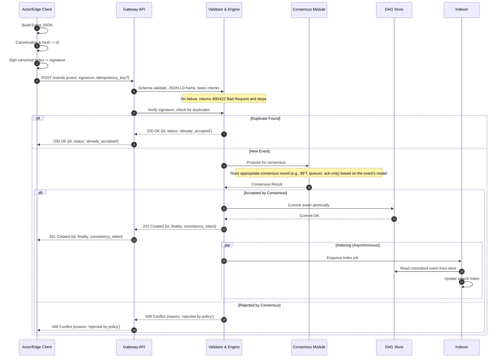
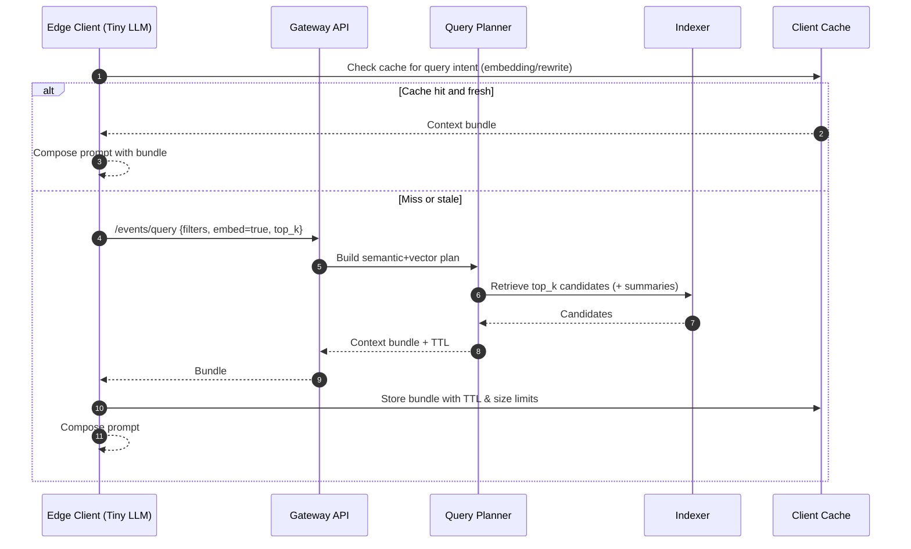
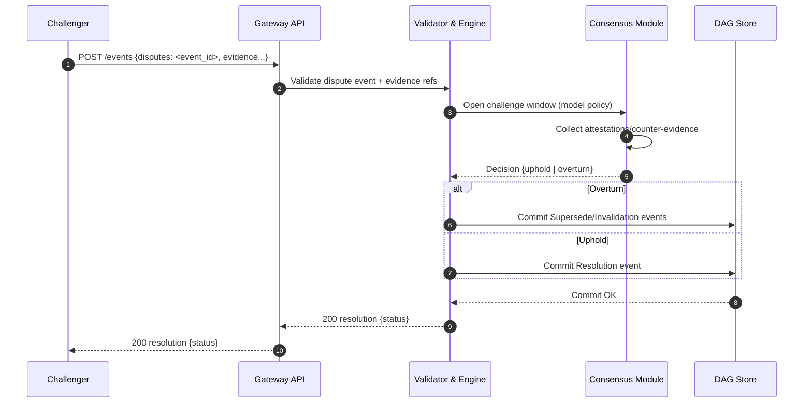
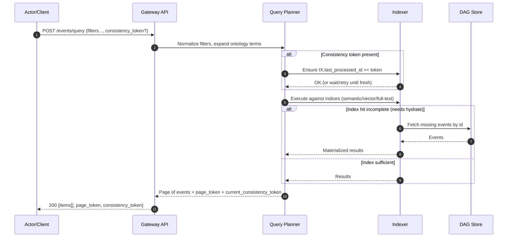
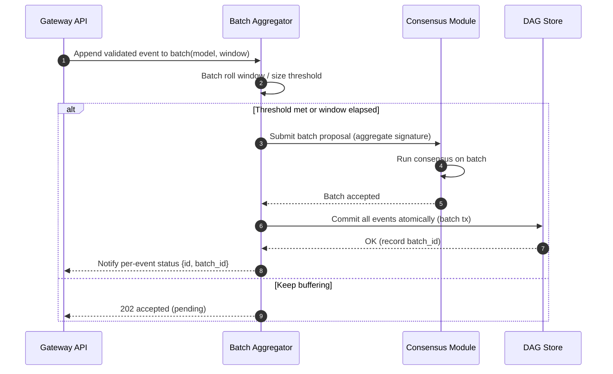
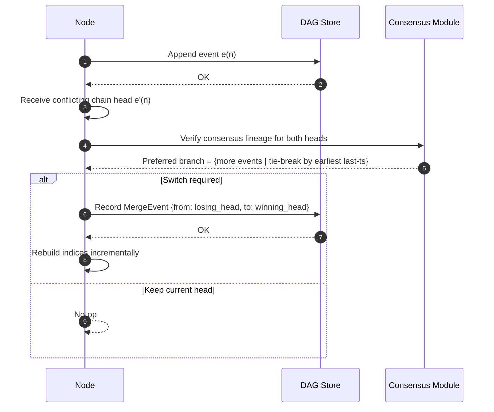
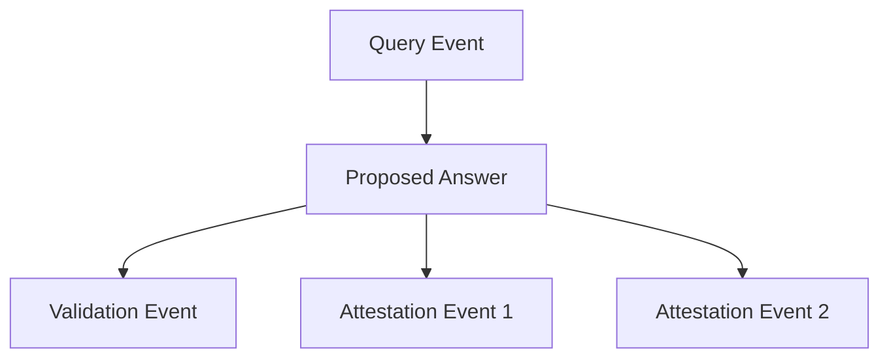

# Membria: A Decentralized Knowledge Architecture

-----

## Abstract

This document provides a detailed architectural specification for the integration of the Arweave network within the Membria Knowledge Cache Graph (KCG). Membria employs a **hybrid blockchain architecture**, separating the logical, transactional operations of the graph from the permanent storage of its data payloads. This brief clarifies the specific role of Arweave as the immutable data archive, details the structure and format of the data stored, and provides an in-depth, step-by-step protocol for both writing data to and reading data from the Arweave permaweb. It's intended for architects, developers, and stakeholders seeking to understand the foundational layer of trust and permanence within the Membria ecosystem.

We introduce the **Decentralized Knowledge Graph (DKG)**—a verifiable and efficient system for the continuous learning and reasoning enhancement of on-device, lightweight large language models (Tiny LLMs). Instead of costly retraining, Membria utilizes **Distillation on Demand (DoD)**, a process where knowledge from large "teacher" LLMs is re-checked, validated, and recorded as immutable events in a public graph. This approach allows Tiny LLMs to dynamically retrieve and leverage high-quality, verified knowledge through fast **Cache-Augmented Generation (CAG)** pipelines, drastically reducing latency, cost, and dependence on centralized APIs.

-----

## 1: Core Architecture: A Symbiotic Hybrid Model

Membria's architecture is not a single blockchain but a symbiotic system that leverages the distinct strengths of two specialized networks: the Peaq Protocol for high-speed logic and Arweave for permanent data storage.

### **The Peaq Protocol: The Logic/Graph Layer**

The **Peaq Protocol** serves as the brain of the system. It manages the graph's structure, rules, and transactional state. All logical operations—such as proposing knowledge, casting consensus votes, and defining data models—occur as lightweight transactions on the Peaq chain. Its core is a **Temporal Semantic Graph**, implemented as a Directed Acyclic Graph (DAG) where every node is an **event**. An event is an atomic, immutable, and cryptographically signed record of a specific fact or action. Each event contains standardized fields, including `actor` (who created it), `timestamp` (when), and `cause` (linking it to preceding events), providing a complete and auditable history.

### **The Arweave Permaweb: The Memory Layer**

**Arweave** serves as the permanent, immutable memory for the DKG. While Peaq manages the "who, what, when, and why" of a knowledge event, Arweave stores the "heavy" data payload itself—the full text of a validated answer, for example. By offloading storage to Arweave, the Peaq chain remains fast and cost-effective, focusing solely on validating and ordering the logical event graph.

-----

## 2: The Decentralized Knowledge Graph (DKG): Layers & Components

The DKG is a living, self-organizing system composed of two primary layers: a flexible ontological foundation and a dynamic knowledge layer.

### **The Ontology Layer: A Flexible System of Dictionaries**

Membria rejects a rigid, universal ontology in favor of a flexible and modular approach. This allows for the creation of custom ontologies tailored to specific users or domains—a concept referred to as *"сustom ontology for the client"*.

  * **Dictionaries as Building Blocks**: The foundation of the ontology is **"dictionaries"**—reusable, named collections of concepts and relationships for a specific domain. Users can leverage public, standardized dictionaries (e.g., based on **Schema.org**) for broad interoperability or create their own private, specialized dictionaries for unique business needs.
  * **Marketplace of Dictionaries**: The Membria ecosystem will feature a catalog or marketplace for dictionaries and semantic models. This encourages the reuse of high-quality ontologies and enhances interoperability across the network.
  * **On-Chain Definition on Peaq**: The ontology and its dictionaries exist as **genesis events** on the Peaq blockchain, making them a fundamental and verifiable part of the graph's structure.

### **The Knowledge Layer: Validated Answers as Event Chains**

This is the dynamic layer where verified facts from teacher LLMs are recorded and interlinked.

  * **Executable Semantic Models**: Every type of knowledge (e.g., a "Verified Answer") is governed by an **Executable Semantic Model** recorded on Peaq. Written in a declarative language like BSL, these models act as verifiable "knowledge contracts." They define the data structure and the validation rules (`Restrictions`) that all new knowledge events must adhere to, ensuring deterministic and transparent logic execution.
  * **Reasoning Chains as Events**: A verified answer from a teacher LLM is stored in the graph as a chain of events, cryptographically linked by the `cause` field. This provides a complete, auditable history for any fact, from the initial query to the final validation status.

-----

## 3: The Lifecycle of Knowledge: A Step-by-Step Protocol

The process of transforming a raw answer from a teacher LLM into a trusted DKG entry follows a precise, four-step lifecycle across both the Peaq and Arweave blockchains.

### **Step 1: Define the "Knowledge Contract" on Peaq**
* **Action**: Community experts define and deploy an Executable Semantic Model on the Peaq network. This model acts as a verifiable template for a "validated knowledge entry."
* **Protocol**: An expert sends a transaction to Peaq containing a **genesis event** with the BSL code of the model as its payload. Once finalized, the model becomes an immutable part of the on-chain ontology. Arweave is not used in this step.
* **Role in the Intent: Definition.** This phase establishes the rules and the "schema" for the successful fulfillment of all future Intents of this type.

### **Step 2: Propose New Knowledge via Arweave and Peaq**
* **Role in the Intent: Execution.** A DoD agent, acting to fulfill the Intent, obtains data from a "teacher" LLM, stores it on Arweave, and creates a proposal event on Peaq.

### **Step 3: Gateway Consensus**
* **Role in the Intent: Verification.** A quorum of independent gateway agents verifies that the Intent was executed correctly and that the results comply with the predefined rules (the contract).

### **Step 4: Finalizing the Result**
* **Role in the Intent: Completion.** A final `validation_event` is created, which officially closes the Intent by recording its outcome (success or failure) in the graph.

The entire process, from a query to the retrieval of verified knowledge, is treated within the Membria architecture as the fulfillment of a primary system **Intent**: the **"Knowledge Distillation Request."** This is a formalized goal, initiated by a user or a Tiny LLM, that triggers a well-defined sequence of events to achieve its objective. Each step of the protocol is a phase in this Intent's lifecycle.

---

## 4: The Arweave Write Protocol

This is the protocol for how a DoD Agent securely writes a knowledge payload to Arweave.
1.  **Trigger**: Initiated by a DoD Agent after a teacher LLM generates a response, but **before** a proposal event is created on Peaq.
2.  **Data Preparation**: The agent assembles the knowledge payload into a **JSON-LD (JSON for Linked Data)** object. This ensures the data is machine-readable and semantically interoperable.
3.  **Transaction Formation & Tagging**: The agent prepares an Arweave transaction. The JSON-LD object is the transaction's data. A set of descriptive **Tags** is added, which are critical for efficient querying without needing to download the data itself.

| Tag Name | Example Value | Purpose |
| :--- | :--- | :--- |
| `Content-Type` | `application/ld+json` | Informs clients how to interpret the data. |
| `App-Name` | `Membria-DKG` | Identifies the transaction as part of the Membria ecosystem. |
| `App-Version` | `3.0` | Versions the protocol for future upgrades. |
| `Event-Type` | `ProposedAnswer` | Specifies the type of knowledge event. |
| `Query-ID` | `{query_hash_on_peaq}` | Links this data back to the originating query on Peaq. |

4.  **Signing and Broadcasting**: The agent signs the transaction and broadcasts it to the Arweave network. For efficiency, multiple small entries can be packaged into a single base transaction via a **bundling service**, significantly reducing cost and time.
5.  **Confirmation and ID Retrieval**: The Arweave network returns a permanent, unique **Arweave Transaction ID (ArTxID)**. This 43-character string is the immutable address of the knowledge payload.

### **Payload Example: Arweave JSON-LD Object**

The following is a detailed example of the JSON-LD object stored on Arweave, representing a proposed answer.
```json
{
  "@context": "https://schema.org",
  "@type": "Answer",
  "identifier": "proposed_answer_uuid_xyz123",
  "encodingFormat": "application/ld+json",
  "inResponseTo": {
    "@type": "Question",
    "identifier": "{query_event_hash_on_peaq}"
  },
  "author": {
    "@type": "AIApplication",
    "name": "GPT-4-Turbo",
    "version": "2024-04-09"
  },
  "dateCreated": "2025-08-12T12:50:20Z",
  "text": "The Membria architecture separates logic and data. The Peaq Protocol manages the graph's transactional logic and structure as a Temporal Semantic Graph of events, while Arweave provides permanent, immutable storage for the actual data payloads.",
  "keywords": ["Membria", "Architecture", "Peaq", "Arweave", "Hybrid Blockchain"]
}
```
---

### **Advantages of This Approach**

* **Precision**: This uses the key terminology of SpiralOS ("Intent") but applies it specifically to the core process that Membria implements.
* **Coherence**: It creates a stronger, more unified narrative. The entire complex protocol now has a clear purpose: to fulfill one specific "Intent."
* **Scalability**: This approach allows for the future addition of other "Intent" types (e.g., "Request to generate a report" or "Initiate a voting process"), which would logically fit into the same architecture.


---


## 5: The Peaq Proposal Protocol

**Trigger:** This protocol is initiated immediately after a DoD Agent successfully writes a data payload to the Arweave network and retrieves the unique Arweave Transaction ID (ArTxID).

**Protocol:** The DoD Agent creates and broadcasts a lightweight transaction to the Peaq network. [cite_start]This transaction creates a **domain event** (`предметное событие`) that formally logs the new knowledge proposal on the logic layer[cite: 242].

The payload of this domain event is minimal but crucial, containing two key elements:

* **Data Pointer**: A direct reference to the full data payload stored on Arweave, in the format of `data_pointer: "{ArTxID}"`. This creates the essential link between the logic layer (Peaq) and the permanent storage layer (Arweave).
* **A graph edge** is created in the event's `cause` field, which contains the identifier of the original query event[cite: 72, 227]. [cite_start]This cryptographically links the new proposal to the action that prompted it, maintaining the auditable history of the Temporal Semantic Graph

**Purpose:** The successful execution of this protocol places the proposed knowledge into the DKG's logical graph. It makes the proposal discoverable by the network's Gateways and formally enters it into the next phase of the lifecycle: Gateway Consensus.

  * **Action**: The DoD Agent creates a lightweight transaction on the Peaq network to officially log the proposal.
  * **Protocol**: The transaction contains a **domain event** (`proposed_answer_event`). Its payload includes a pointer to the data (`data_pointer: "{ArTxID}"`) and a graph edge in the `cause` field linking it to the original query event.

### **Step 1: Gateway Consensus on Peaq**

  * **Action**: A quorum of Gateways reviews the proposal. They use the `ArTxID` pointer to fetch the full data from Arweave and perform a detailed validation against the rules in the Knowledge Contract.
  * **Protocol**: Gateways cast their votes (`attestation_event`) as transactions on the Peaq network. To optimize costs, these individual vote transactions can be **batched** into a single transaction before being submitted.

### **Step 2: Finalize the Result on Peaq**

  * **Action**: The outcome of the consensus vote is recorded immutably on Peaq, completing the knowledge lifecycle.
  * **Protocol**: A final `validation_event` is created on Peaq. Its payload contains the final status (e.g., `Status: Verified`, `ConfidenceScore: 0.98`). Its `cause` field points to the `proposed_answer_event`, creating the final, definitive edge in the knowledge subgraph.

---

## 6: Cost Optimization: Transaction Batching on Peaq

[cite_start]The Membria architecture, inspired by the principles of SpiralOS, incorporates transaction batching as a core feature to optimize network traffic and reduce operational costs on the Peaq network[cite: 134].

### **How It Works**

Instead of each Gateway submitting its consensus vote (`attestation_event`) during Phase 3 of the Intent lifecycle as a separate transaction, a designated coordinator node can gather multiple votes into a single "batch." This approach is particularly effective for high-frequency, repetitive operations that are part of a single logical process.

### **The Protocol**

The batching protocol is straightforward:

1.  **Vote Submission**: Individual Gateways in the consensus quorum sign their votes and send them to a designated coordinator node.
2.  **Aggregation**: The coordinator waits to receive multiple votes and aggregates these signed events into a single array or list.
3.  **Batch Transaction**: This single array of events is then submitted as the payload of a single transaction to the Peaq network.

### **The Advantage**

This method drastically reduces transaction costs. [cite_start]The base network fee is paid once for the entire batch rather than for each individual micro-transaction[cite: 134]. For processes like consensus voting, where many small, similar events are generated in a short period, batching provides a significant efficiency gain and makes the system more economical to operate.

---

## 7: Gateway Functionality: Reading and Managing Knowledge

Gateways are intelligent nodes that serve as the primary interface to the DKG for on-device agents.

### **The Read Protocol: An Intelligent Query Processor**

Gateways use a multi-layered strategy to find information, prioritizing speed and cost-efficiency. They **do not** blindly search the entire Arweave network.

1.  **Check "Hot" Cache (50-200 ms)**: The Gateway first searches its own high-speed, off-chain KV-cache for a direct hit.
2.  **Search Off-Chain Indexes**: If there's no cache hit, the Gateway consults its local semantic and vector indexes. These indexes act as a "map" of the entire DKG, allowing it to quickly locate relevant event hashes on Peaq.
3.  **Retrieve Data from Arweave (300-1000 ms)**: Only after the indexes have identified a relevant event on Peaq does the Gateway read its `data_pointer`. It then makes a targeted HTTP GET request to an Arweave gateway using the specific `ArTxID` to retrieve the "heavy" data payload.
4.  **Assemble Context (SCR)**: The Gateway aggregates the retrieved data into an enriched prompt for the Tiny LLM using the **Selective Contextual Reasoning (SCR)** pipeline.
5.  **Fallback to DoD**: If a high-confidence answer cannot be constructed from the DKG, the request is escalated to external "teacher" LLMs, triggering a new knowledge lifecycle.

### **Versioning and Updates**

Knowledge stored on Arweave is **permanent and cannot be overwritten**. To update an entry, a new version of the JSON-LD object is uploaded to Arweave, receiving a **new ArTxID**. The logical graph on Peaq is then updated with a new event that supersedes the old one, and the mutable Gateway indexes are updated to point to the new ArTxID as the canonical version. All previous versions remain accessible on Arweave, providing a complete and verifiable audit trail.

---

## 8: Trust, Validation, and Privacy

The integrity of the DKG is secured by a multi-faceted trust model executed on the Peaq Protocol.

  * **Hybrid Consensus Mechanism**: Consensus among Gateways occurs exclusively on the Peaq blockchain. The network combines **Proof-of-Stake (PoS)** for validator security with **Byzantine Fault-Tolerant (BFT)** algorithms for rapid transaction finality.
  * **Dispute Resolution Protocol**: An economically-incentivized challenge system allows any stakeholder to challenge a verified fact. The outcome is determined by a stake-weighted re-vote among validators, with **slashing** penalties for those who approved incorrect information or made a frivolous challenge.
  * **Privacy with Zero-Knowledge Proofs**: The system integrates **Zero-Knowledge Proofs** via the **Peaq ZK Layer**. This enables confidential operations, such as a Gateway proving it has checked a fact against a private database without revealing the database, or a user proving they have the right to access knowledge without revealing their identity.

---

## 9: Advanced On-Device Agent Capabilities

Membria's architecture is designed to directly enhance the performance of on-device Tiny LLMs.

  * **Context and Memory Management**: Membria uses a **Segmented KV Buffer** for context window optimization and a hybrid **Persistent Memory** system (Local RAG Store + Disk-Based KV Archive) to prevent model "amnesia" between sessions.
  * **Synergy with Periodic LoRA Adaptation**: An automated offline pipeline uses knowledge accumulated in the DKG to periodically fine-tune the base Tiny LLM using **QLoRA**. This enhances the model's foundational understanding and embeds frequently used knowledge patterns directly into the model, often with minimal or no increase in its final size on the device.

---

## 10: Conclusion: The Symbiotic Relationship

Arweave provides the indispensable foundation of **trust, permanence, and verifiability** for the Membria DKG. By serving as the immutable archive for all knowledge payloads, it allows the Peaq Protocol to operate as a fast, flexible, and efficient logic layer. This symbiotic relationship enables Membria to create a knowledge graph that is both dynamic and eternally auditable, solving the core problem of creating a lasting, shared memory for decentralized AI.

-----

# KCG Architectural Addendum

## Purpose
This addendum outlines additional architectural considerations for the **Knowledge Cache Graph (KCG)** in the Membria ecosystem. It focuses exclusively on elements that were missing or not fully detailed in the base architecture specification, with an emphasis on operational robustness, data integrity, indexing efficiency, and DAG integration over Peaq Protocol.

---

## 1: Formal Data Model
### 1.1: Canonical Event Structure


All events in the temporal semantic graph MUST conform to a canonical JSON representation and hashing scheme. 

{
  "id": "sha256(<canonical_event_json>)",
  "actor": "did:example:123456789abcdefghi",
  "model": "urn:model:approval_v1",
  "cause": ["<event_id_1>", "<event_id_2>"],
  "base": "<parent_event_id_or_null>",
  "type": "Attribute | Relation | Role | Act | Concept | Individual",
  "value": "<string | number | object | array | null>",
  "timestamp": "2025-08-12T21:15:00Z",
  "meta": {
    "version": "1.0.0",
    "tags": ["..."],
    "signature": "<base64_signature>"
  }
}

---

Every KCG event should adhere to a **canonical structure** to ensure interoperability between independent gateways and external agents.  
While the base document defined core fields (`actor`, `timestamp`, `cause`), the following are required for deterministic processing:

| Field | Type | Description |
|-------|------|-------------|
| `event_id` | Hash | Unique event hash derived from all fields except signatures. |
| `version` | Integer | Event schema version. |
| `payload_hash` | Hash | SHA-256 of the immutable payload stored on Arweave. |
| `signatures[]` | Array | Signatures from event originator and validators. |
| `ontology_ref` | String | Reference to the ontology dictionary version used for semantic alignment. |

**Canonicalization:**

- Use JSON-LD 1.1 framing and [URDNA2015](https://json-ld.github.io/rdf-dataset-canonicalization/spec/)for deterministic serialization.    
- Hash algorithm: SHA-256 over canonical form.

**Rationale:**  
Explicit schema versioning and ontology references ensure future compatibility when updating semantic models.

---

### 1.2: Edge Types

### Edges in the DAG MUST be typed. Allowed edge types:

| Edge Type | Purpose |
| :--- | :--- |
| `cause` | Causal relationship, required for all events |
| `supersedes` | Marks newer version replacing an older event |
| `disputes` | Links an event to one it challenges/disputes |
| `depends_on` | Denotes a dependency without strict causality |
| `references` | Soft reference, e.g., citation or metadata |

**Rules:**
- DAG MUST remain acyclic for cause and supersedes.
- Cycles allowed only for references.

---

### 1.3: Versioning and Lineage

- Each event MAY have zero or one supersedes link.
- Canonical version = last event in the supersedes chain with no successor.
- Clients MUST support retrieval of full lineage for audit.

---

### 1.4: Read/Write API Specification

### REST API Endpoints

#### Create Event

POST /events
```
Content-Type: application/json
Body: Event JSON without id (computed by server).
Response: { "id": "<event_id>", "status": "accepted" }
```
#### Get Event
```
GET /events/{id}
```
#### Response: Full event JSON.

#### Query Events
```
POST /events/query
Content-Type: application/json
```
#### Example:
```
{
  "filters": [
    { "field": "actor", "op": "eq", "value": "did:example:123" },
    { "field": "type", "op": "in", "value": ["Attribute", "Relation"] }
  ],
  "limit": 50,
  "offset": 0,
  "order_by": "timestamp"
}
```
---

### 1.5: Indexing and Search

#### Index Types
- Semantic Index: By concept, property, ontology term.
- Full-text Index: On string values.
- Vector Index: For embeddings (optional, LLM-assisted).

#### Index Consistency
- Each index MUST store last processed event ID.
- Periodic Merkle proofs verify index matches canonical DAG.

---

### 1.6: SCR (Selective Context Retrieval) for Edge Clients
- SCR pipeline MUST define:
- Input constraints: max token count / payload size.
- Context selection policy: recency, relevance score, ontology match.
- Caching: TTL, eviction policy, encryption for private data.
- Cache format:
```
{
  "event_id": "...",
  "embedding": [ ... ],
  "summary": "...",
  "expires_at": "..."
}
```

---
### 1.7: Tags and Metadata
- Required tags: model, actor, version, timestamp, content_hash.
- Tags MUST be stable across replays; version changes must be explicit.

---

### 1.8: Privacy Pattern
- Encrypt-then-store: Payload encrypted with a content key (CEK).
- CEK encrypted separately per authorized recipient using their public key.
- Encrypted payload stored in DAG; key grants managed out-of-band or in a KeyGrant event.

---

### 1.9: Observability

- Minimum metrics every node MUST expose:

| Metric | Type | Description |
| :--- | :--- | :--- |
| `event_ingest_latency_ms` | `histogram` | Time from reception to commit |
| `event_validation_failures_total` | `counter` | Failed validation attempts |
| `scr_cache_hit_ratio` | `gauge` | Cache effectiveness for SCR |
| `graph_fork_count` | `counter` | Number of local fork resolutions |


---

### 1.10: Consistency and Fork Resolution
- Nodes MUST detect divergent DAG branches.
- Merge rule: Prefer branch with more total events; tie-break by earliest timestamp of last event.
- Fork resolution MUST be signed and recorded as a MergeEvent.

---

### 1.11: Protocol Versioning
- SemVer: MAJOR.MINOR.PATCH.
- Breaking changes increment MAJOR.
- Clients MUST refuse events with higher MAJOR version unless in compatibility mode.

---

### 1.12: Sequence Diagrams



### **Notes**

-   **Idempotency:**  Clients SHOULD send  Idempotency-Key; server MUST dedupe by  (hash || key).  
-   **Finality field:**  none | soft | confirmed; depends on consensus profile for the model.   
-   **Consistency token:**  opaque cursor for “read-your-writes” on the read path.

---

### 1.13: SCR (Selective Context Retrieval) Pipeline



### **Notes**

-   **Bundle format:**  event ids, summaries, citations, optional embeddings.   
-   **Limits:**  max bundle tokens, per‑device cache size, LRU eviction.   
-   **Privacy:**  bundle items may be encrypted; cache MUST respect TTL and key revocation.

---

## 2: Gateway Index Architecture

Gateways act as the primary query layer for the DKG. To optimize retrieval, each gateway should maintain:

1. **Hot Cache (RAM)**  
   - KV store for the most frequently accessed `event_id` → payload mappings.  
   - TTL-based eviction to keep memory footprint predictable.

2. **Semantic Index**  
   - Stores mappings from ontology concepts to event IDs.  
   - Enables concept-based search without scanning full graph.

3. **Vector Index**  
   - Embedding-based similarity search for approximate reasoning queries.  
   - Periodically rebuilt or incrementally updated after consensus events.

4. **Arweave Pointer Map**  
   - Minimal persistent index of `event_id` → `ArTxID` for quick deep retrieval.

5. **Dispute (challenge) Flow (condensed)**



6. **Read/Query Path (with “read-your-writes”)**



7. **Optional Batch Aggregation (when models use batching)**



### **Notes**

-   **Pagination:**  limit, page_token.    
-   **Ordering:**  default  timestamp ASC, override via  order_by.    
-   **Consistency:**  Server MAY block until index catches up to  consistency_token.

---

## 3: Fork Resolution Protocol

Even in a DAG-based architecture, transient forks or conflicting attestations can occur.  
We define a **Fork Resolution Protocol**:

1. **Detection**  
   - Gateways detect multiple competing validation events for the same proposal.

2. **Resolution Rules**  
   - Prefer the branch with the higher stake-weighted consensus.
   - If equal, prefer the branch with the earliest finalized timestamp.

3. **Pruning**  
   - Once resolved, outdated branches are marked as `orphaned` in indexes but remain retrievable for audit.

4. **Fork Detection & Mesh**



---

## 4. DAG Implementation on Peaq Protocol

Use Peaq for ordering, attestation, and light headers, while keeping full payloads off‑chain (Arweave). We can also run a pure‑Peaq mode for small events. The Directed Acyclic Graph (DAG) structure is implemented at the **event layer** on Peaq:

- **Nodes:** Represent immutable knowledge events.
- **Edges:** Defined via the `cause` field to ensure causal ordering.
- **Topological Ordering:** Enforced at insertion time to prevent cycles.
- **Parallelism:** Independent branches can be validated concurrently.

**Mermaid Diagram:**


### **Custom pallet: pallet-kcg**

- Define compact on‑chain headers and batch commitments.

**Types**
```
pub struct EventHeader {
  pub event_id: H256,          // sha256 of canonical payload
  pub model_urn: BoundedVec<u8, _>,
  pub actor: BoundedVec<u8, _>, // DID or account binding
  pub ts: u64,                 // unix ms
  pub ar_tx: Option<BoundedVec<u8, _>>, // Arweave tx id (if off-chain)
}

pub struct Adjacency {
  pub event_id: H256,
  pub cause: BoundedVec<H256, _>, // parent ids
}

pub struct BatchCommit {
  pub batch_id: H256,
  pub merkle_root: H256,       // over canonical event bytes
  pub count: u32,
}
```

### **Extrinsics**

-   propose_event(header: EventHeader, adj: Adjacency, sig: Signature)  
-   finalize_event(event_id: H256) or finalize_batch(commit: BatchCommit)   
-   dispute(event_id: H256, evidence_ref: Vec<u8>)  
-   checkpoint(root: H256, height: u64) (optional, for fast trust)
    

### **Events (runtime)**

-   Proposed(event_id)  
-   Finalized(event_id | batch_id)  
-   Disputed(event_id)   
-   Checkpoint(root)

---

## 5: Write path (two practical modes)
  
### Mode A (Header‑only on Peaq, payload on Arweave)

1.  **Client canonicalizes and signs payload.**
2.  **Upload payload to Arweave; get  ar_tx.** 
3.  **Call propose_event**{ header{event_id, model, actor, ts, ar_tx}, adj{cause}, sig }  
4.  **Gateways/validators check:**
    
    -   signature against DID/account
    -   Arweave availability of ar_tx  
    -   parents exist (either on‑chain header present or in same batch)    
    -   no cycle (local index check)
           
5.  Runtime marks it  **proposed**; when policy met (e.g., quorum or authority), call  finalize_event  or include in a  finalize_batch.   
6.  Indexers watch Peaq events, fetch payloads by  ar_tx, and update local indices.
    
### Mode B — Full payload on Peaq for tiny events)
-   Put canonical payload bytes as  Vec<u8>  in the extrinsic (or store in an on‑chain blob map).
-   Costs rise quickly; use sparingly or for “critical minimal facts.”
    

### **Batching on Peaq**

-   Aggregate many  event_ids off‑chain, compute Merkle root.    
-   Submit finalize_batch{batch_id, merkle_root, count} to the pallet.   
-   Emit Finalized(batch_id).  
-   Each leaf (event) still has its header on‑chain (cheap); the batch just finalizes them in one shot.
    

### **Identity & signatures**

-   Bind DID ↔ Peaq account (one‑time link event) or use DID‑Key as the signing key if supported.    
-   The pallet verifies signatures over the  **same canonical bytes**  used to derive  event_id.
    

### **Reading**

-   Light clients:
    
    -   Query Peaq RPC for EventHeader/Adjacency by event_id.   
    -   If  ar_tx  present, fetch payload from Arweave and re‑verify  event_id  and signature.
        
    
-   Heavy clients:
    
    -   Subscribe to runtime events, stream headers, hydrate payloads, maintain topo index.
        
   
### **Consistency, finality, forks**

-   Rely on Peaq’s chain finality (GRANDPA‑style). Only treat events as  **final**  after finalized block.  
-   If you ingest from mempool or non‑finalized blocks, tag results as  soft.  
-   On reorgs: reprocess affected headers; your local index replaces losing heads. Record a signed  **MergeEvent**off‑chain (or an on‑chain note if you expose one).
    

### **Disputes**

-   dispute(event_id, evidence_ref)  stores a lightweight on‑chain record and opens a  **challenge window**  (pallet policy).
    
-   Resolution emits either:
    
    -   Finalized(superseding_event_id) (if overturned) 
    -   or a Resolution(event_id, status=upheld) runtime event.
        
    
-   Off‑chain indexers mirror the resolution by linking  supersedes.
  

### **Cost control**

-   Keep headers compact; move bulk to Arweave.  
-   Prefer **batch finalization**.   
-   Compress adjacency: if there are many parents, store only first K on‑chain and put the full set in Arweave; include a  **parent set hash**  in the header to bind them.
    

### **Minimal guarantees (both stores)**

-   **Integrity:**  event_id = sha256(canonical(payload)); signatures over the same bytes.
-   **Acyclicity:**  enforced by gateways/indexers before accept; rejected events never get posted. 
-   **Replay safety:**  duplicate  event_id  is idempotent; pallet returns “already proposed/finalized”. 
-   **Discoverability:**  stable tag schema (Arweave) and stable runtime storage keys (Peaq).

## 4: DAG Implementation on Arweave (possible alternative)

### **What lives on Arweave?**
- Full event payloads (JSON‑LD, encrypted if needed)
- Adjacency (list of cause event IDs)
- Detached signatures (or included in payload)
- Minimal headers duplicated in tags for fast search

```
{
  "id": "ev_<sha256(canonical_bytes)>",
  "actor": "did:example:abc",
  "model": "urn:model:approval_v1",
  "type": "Attribute|Relation|Act|Concept|Individual|Role",
  "value": { "...": "..." },
  "cause": ["ev_...","ev_..."],
  "timestamp": "2025-08-12T21:15:00Z",
  "signature": "base64(ed25519(sig over canonical_bytes))",
  "meta": { "version": "1.0.0", "content_hash": "sha256(...)" }
}
```

### **Arweave transaction layout**

-   **Data**: the canonical event JSON (optionally encrypted: CEK → payload, CEK wrapped per recipient).    
-   **Tags**  (flat, stable keys; repeatable where needed):
    
    -   App: KCG   
    -   App-Version: 1.0.0
    -   Event-Id: ev_... 
    -   Event-Type: Attribute|Relation|...
    -   Actor-DID: did:...
    -   Model-URN: urn:model:...
    -   Cause-Id: repeated tag for each parent (0..N)
    -   Timestamp: ISO8601
    -   Content-Hash: sha256(...)
    -   Sig-Alg: ed25519
    -   Sig-Base64: detached signature (if you don’t embed it)
        

This gives you direct GraphQL filtering by  Event-Id,  Actor-DID,  Model-URN, and by multiple  Cause-Id.

### **Acyclicity and validation**

-   Gateways validate locally  **before**  upload:
    -   every  cause  exists (by  Event-Id) 
    -   id  matches canonical hash
    -   signatures verify
    -   no path back from any  cause  to this  id  (local index check)
        
-   If any check fails, the event never gets uploaded.
  

### **Batching (optional but recommended)**

-   Use  **Bundlr**  (or arweave bundles) to batch many events.
-   Create a  **batch manifest**  object with:
    
    -   batch_id   
    -   list of  Event-Id's
    -   **Merkle root**  over the canonical bytes of all events
        
    
-   Store the manifest as its own Arweave tx:
    
    -   Tags: KCG-Batch-Id, KCG-Merkle-Root.
        
-   Each event still has its own tx; the batch manifest just commits a root for quick integrity checks.
    

### **Read path**

-   Query Arweave GraphQL by tags; hydrate events.   
-   Verify  id, signatures, and that all  cause  events are present.  
-   Build/maintain a **local adjacency index**:
    
    -   parents[id] = [...cause]   
    -   children[id] = [...] (derived)
    -   Record  **topo order**  for fast cycle checks and lineage walks.
        
  
### **Consistency and “finality”**

-   Arweave is append‑only, but you still want  **gateway‑level finality**:
    
    -   Keep a signed  **Checkpoint**  (Arweave tx with tag  KCG-Checkpoint) that includes:
        
        -   high‑water mark (last known stable topo index)
            
        -   Merkle root over the set of  Event-Ids ≤ checkpoint
            
    -   Clients can trust up to the last Checkpoint without replaying the world.
      

### **Disputes**

-   A  **Dispute**  is just another event:
    
    -   type: "Act", disputes: "<Event-Id>"
        
    -   Stored as a normal Arweave tx, linked via  Cause-Id  or a  Disputes  tag.
        
    
-   Gateways follow your policy to “overturn” by emitting a  supersedes  event that points to a corrected event.

---

## 5: API Contracts

### **Event Ingestion API**
- **POST /events**
- Payload:
```json
{
  "event_id": "...",
  "version": 1,
  "payload_hash": "...",
  "ontology_ref": "schema.org/v1",
  "signatures": ["sig1", "sig2"],
  "cause": "event_hash",
  "data_pointer": "ArTxID"
}
```

### **Event Query API**
- **GET /events/{event_id}**
- Supports query by:
  - `event_id`
  - `ontology_concept`
  - `vector_embedding`

---

## 6: Privacy Enhancements

To align with zero-knowledge patterns:
- Gateways can issue **ZK proofs** of validation without exposing raw data.
- Example: Prove that a fact was checked against a private dataset without revealing dataset contents.

---

## 7: Metrics and Observability

Operational metrics for gateways:
- `avg_query_latency_ms`
- `cache_hit_ratio`
- `consensus_vote_time`
- `fork_resolution_count`
- `arweave_retrieval_time`

All metrics should be exposed via a `/metrics` endpoint in Prometheus format.

---

## 8: Security Considerations

- **Replay Protection:** Every event includes a nonce and timestamp.
- **Sybil Resistance:** Gateway participation requires staking on Peaq.
- **Data Immutability:** Enforcement via Arweave transaction permanence.

---

## 9: Conclusion

This addendum provides the missing operational, indexing, and integrity details for the KCG architecture.  
By integrating these enhancements, Membria gains stronger query performance, auditability, and fault tolerance, without deviating from the core hybrid model of Peaq (logic) + Arweave (storage).
