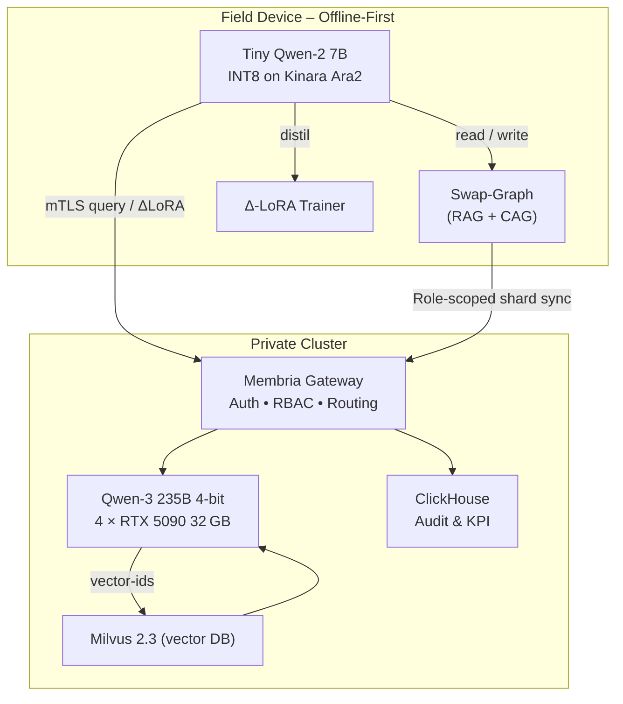

-----

# Membria Enterprise Edition

*A Hybrid Memory & Routing Layer for Privacy‑First Corporate AI*

-----

## Executive Summary

Membria Enterprise Edition (EE) delivers **GPT‑4‑class intelligence on‑device** while keeping corporate data private and GPU costs under control. *Edge* devices run an INT8 **Qwen‑2 7B** model accelerated by Kinara Ara2; *cloud* hosts a **Qwen3‑235B‑A22B** frontier LLM. A role‑aware Gateway routes only unfamiliar or high‑risk queries to the cloud, returns answers, and distils them into lightweight LoRA patches for reuse on the edge. Result: field staff get realtime, offline answers; headquarters retain full audit & RBAC over knowledge access.

-----

## 1 Problem Space

Real‑world deployments expose **four** overlapping bottlenecks that classic cloud‑only LLM solutions cannot simultaneously solve:

| \# | Pain‑Point | Why it hurts today | Example Scenario |
|---|---|---|---|
| **1** | **Zero / flaky connectivity** | Mines, ships, and far‑edge plants run in RF shadows; SaaS LLM calls simply fail. | Maintenance crew 120 km offshore loses link for 3 h. |
| **2** | **Hard privacy / sovereignty law** | GDPR, ITAR, HIPAA, EU‑AI Act forbid raw data or CoT logs leaving device. | X‑ray image of worker injury; defence schematics. |
| **3** | **Exploding GPU & token cost** | Frontier‑model API = $0.01–0.03 / token → O(10⁶ $/ year) for a fleet. | 1 000 techs × 1 k prompts /day × 1 k tok =$ 10 k / day. |
| **4** | **Context deficit & knowledge drift** | Cloud LLM forgets site‑specific SOP, causing hallucinations; re‑upload each prompt wastes tokens. | "Torque spec for Valve ZX‑14?" — model hallucinates 45 N·m, real is 60 N·m. |

Existing stop‑gaps (paper manuals, VDI, caching proxy) address **one** constraint but break another. **Membria EE** integrates:

  * on‑device tiny‑LLM + swap‑graph → offline & law‑compliant,
  * hybrid Gateway routing → GPU only for 5 % hardest queries,
  * diff‑sync knowledge shards → fleet stays aligned while private LoRA patches remain on their originating devices.

## 2 High‑Level Architecture

*A symbolic view of data & compute flow*



> **Edge** answers \~90 % locally. Only unfamiliar or high‑risk queries travel the red mTLS link; the cloud reply is distilled and shared back overnight.

## 3 Core Components

### 3.1 Edge Stack

| Module | Tech | Footprint | Function |
|---|---|---|---|
| **Tiny‑LLM** | Qwen‑2 7B‑INT8 | ≈3.4 GB | Runs all common prompts offline |
| **Hardware NPU** | Kinara Ara2 (M.2) | \<5 W | 280 ms median latency |
| **Swap‑RAM Graph** | SQLite + Qdrant‑lite | up to 1 GB | Stores facts (RAG) + chains‑of‑thought (CAG) |
| **DoD Loop** | LoRA trainer (bitsandbytes) | bursts 1.2 W | Distils cloud answers into Δ‑weights |
| **Response Cache** | ModelCache | optional | Instant replay of identical queries |

### 3.2 Cloud Stack

| Module | Tech | Notes |
|---|---|---|
| **Gateway** | Membria Gateway (Go, gRPC/HTTP) | JWT Auth • RBAC • Adaptive routing |
| **Frontier LLM** | Qwen3‑235B 4‑bit (GPTQ) | 4 × RTX 5090 32 GB · 20–40 tok/s |
| **LMCache Layer** | LMCache (Apache‑2.0) | KV‑reuse; cuts TTFT & GPU by \~35 % |
| **Vector DB** | Milvus 2.3 + RBAC | per‑role partitions, HNSW‑GPU |
| **Ops Analytics** | ClickHouse + Superset | Token savings, SLA, audit trails |

### 3.3 GPU Scaling & Concurrency Capacity

| Parameter | Value / Formula | Notes |
|---|---|---|
| **Sustained throughput** | **20–40 tokens / sec** on 4 × RTX 5090 32 GB @ 4‑bit | Measured with vLLM paged‑attention, context 8 k. |
| **Interactive chat budget** | *concurrent users* ≈ **throughput / 1 tok·s⁻¹** | To keep latency \< 5 s, aim for ≥1 tok/s per session. |
| **Example** | 30 tok/s ⇒ **\~30 simultaneous users** get \~200‑token answer in ≈7 s. | Suitable for one engineering shift. |
| **Burst mode (batch)** | vLLM micro‑batch 8 req ⇒ +25 % throughput | Spikes handled without over‑scaling. |
| **Autoscale metric** | GPU util \> 70 % *and* queue \> 3 s → add node | K8s + KEDA or Slurm + Prometheus. |
| **Scale‑out node** | Same 4×5090 rig or **Threadripper 7980X (256 GB) + 4×5090** | Threadripper hosts LMCache shard & extra PCIe lanes. |
| **Linear capacity rule** | n nodes × 30 tok/s ≈ *n × 30 users* | 10 nodes → \~300 concurrent users. |
| **Edge off‑load win** | If 90 % queries served on device, cloud sees only **3 tok/s per 100 workers** | Delays cluster expansion by \~10×. |

> **Take‑away:** one 4‑GPU box covers a small field fleet; scale horizontally by adding identical nodes—no model re‑shard needed because LMCache + Gateway round‑robins at token level.

### 3.4 Base Node Hardware Spec

```
• CPU: AMD Threadripper PRO 7995WX — 96 cores / 192 threads
• RAM: 256–512 GB DDR5 ECC (fits Qwen3 weights + KV)
• GPU: 4 × GeForce RTX 5090 32 GB, NVLink/SLI bridged
• Storage: 2 TB NVMe RAID‑0 (OS + LMCache shards)
• Network: dual 10 GbE + 200 Gbps InfiniBand HDR
• Parallelism: Tensor‑Parallel × Expert‑Parallel (vLLM TP=4, EP=4)
• Capacity: one node ⇒ ≤ 100 concurrent users (@30 tok/s budget)
• Scale‑out: add 1 node, link over 200 Gbps IB; Gateway load‑balances & LMCache sharding auto‑sync.
```

## 4 Data Flow

*(see diagram above)*

### Offline Resilience & Gateway Fail‑over

  * **Local-first autonomy** keeps 90 % of answers offline.
  * All new chunks/logs queue in an encrypted outbox.
  * UI shows “Cloud unavailable — best‑effort answer”.
  * Secondary Gateway list → round‑robin retry.

-----

## 5 Synchronization & Versioning Protocol

### 5.1 Object model

| Entity | ID scheme | Version field | Payload |
|---|---|---|---|
| **Chunk** (RAG fact) | `sha256(doc_id‖chunk_no)` | `uint32 rev` | Plain‑text, MIME, metadata |
| **CoT trace** | `sha256(prompt‖crc32(CoT))` | implicit (immutable) | JSON array of steps |
| **Δ‑LoRA patch** | `sha256(base‑model‖timestamp)` | `semantic ver` | 16‑bit weight diff |

### 5.2 Delta sync ("chase" algorithm)

1.  **Vector clock** in device header → Gateway reply tells *latest rev* per collection.
2.  Device computes **missing range**. If \< 20 MB, pulls incremental diff; else requests **snapshot**.
3.  Gateway streams blocks (`PUT /sync?id=&rev=`) in order; device acks.
4.  After full catch‑up, device sends its own queued chunks (`POST /push`).

### 5.3 Conflict resolution

  * **Chunk** – *last‑writer‑wins* (higher `rev`) with audit kept in ClickHouse.
  * **CoT** – immutable; duplicates deduped via hash in Milvus tag.
  * **Δ‑LoRA** – private per device; no merge.

### 5.4 Long‑offline devices (\> 30 days)

| Size of gap | Action |
|---|---|
| ≤ 500 MB | Auto snapshot download over VPN. |
| \> 500 MB | Ops ticket: ship USB package with encrypted snapshot. |

### 5.5 Security

  * All endpoints mTLS; snapshot encrypted with device TPM‑bound key.
  * Outbox rotates key daily; if device revoked → key purge.

-----

## 6 LoRA Distillation Pipeline

*How a cloud answer becomes a private Δ‑LoRA patch*

### 6.1 Steps

1.  **Capture pair** — Edge device stores *(prompt, cloud\_answer, CoT)* in an encrypted buffer.
2.  **Data augmentation** — Tiny script creates 3–5 paraphrase variants via on‑device Qwen‑Paraphraser (1.3 B).
    *Rationale: diversifies gradients, avoids over‑fitting.*
3.  **QLoRA fine‑tune**
      * Base: Tiny Qwen‑2 7 B INT8 weights.
      * Optimiser: 8‑bit AdamW, 4 epochs, learning‑rate 2e‑4.
      * Target modules: **LoRA‑A/B** on attention q,k,v + MLP gates (rank = 8).
4.  **Self‑eval** — New LoRA patch is mounted in a sandbox; device runs a 30‑example regression set (locally cached).
    Metrics: BLEU ≥ base, Toxicity Δ ≤ 0. 05, avg latency \< +5 ms.
5.  **Apply or discard**
    *If pass →* move patch to live folder and increment `lora_version`.
    *If fail →* wipe patch; log diff for later analysis.
6.  **Privacy guarantee** — Patch never leaves device. Only quality telemetry (`pass/fail`, token diff) is uploaded in outbox.

### 6.2 Why not distil on gateway?

| Edge‑only distil | Benefit |
|---|---|
| Data never leaves laptop | GDPR / ITAR safe |
| Tailors to user phrasing | Higher hit‑rate in ModelCache & CAG |
| Kinara Ara2 INT8 matmul fast enough (≃4 min/train) | No extra cloud GPU |

### 6.3 Roll‑back mechanism

A “gold prompts” suite (encrypted) runs weekly; if BLEU or JEM falls \> σ, the device rolls back to previous LoRA version and flags for support.

-----

## 7 Roadmap

| Quarter | Milestone |
|---|---|
| **Q3 2025** | Pilot with 50 field laptops in oil-&-gas plant (Loira, TX). |
| **Q4 2025** | Full RBAC diff-sync; delta-LoRA v2 (parameter-efficient). |
| **Q1 2026** | Kinara Ara3 support (INT4); multilingual OCR. |
| **Q2 2026** | BYO-Chip SDK (NPU, TPU-edge) & FIPS-140-3 certification. |

-----

## 8 Threat Model & Security

### 8.1 Physical Device Risks

| Risk | Mitigation |
|---|---|
| Theft / loss | Full-disk encryption (AES-256 XTS); TPM-bound key; PIN/biometric unlock |
| Cold-boot / DMA attack | Memory scrambling; Thunderbolt disabled; no RAM-sleep |
| Hardware tamper | Seals + chassis intrusion sensor → key wipe |

### 8.2 Data & Model Protection

  * On-device graph & LoRA encrypted with ChaCha20-Poly1305; keys in RAM only.
  * Kinara Ara2 secure enclave loads weights, thwarts DMA.
  * Models signed with ECDSA; verified at load.

### 8.3 Remote Revocation

| Scenario | Response |
|---|---|
| Stolen device | Gateway flags device revoked → wipe keys after 3 handshake failures |
| Offboard | SCIM service triggers blacklist → next sync clears shards & tokens |
| Suspected compromise | Ops sends signed wipe command → device enters lockdown |

### 8.4 Network Security

  * mTLS v1.3 mutual-auth; cert pinning.
  * OIDC JWT refresh daily; role tags enforced.
  * OPA policies for row-level access in Milvus.

-----

## 9 Operational Model & TCO

### 9.1 Managed‑Service Approach

  * **Primary ops owner:** Membria NOC (24×7) operates Gateway, Milvus, LMCache and ClickHouse in the customer’s private VPC or on‑prem K8s.
  * **Edge fleet support:** Certified SI / device‑OEM partner (e.g. Accenture, Jabil) images Kinara‑enabled laptops and handles RMA.
  * **Update pipeline:**
    1.  Monthly **security patch** (Gateway container).
    2.  Quarterly **Qwen & LoRA refresh** signed via OTA.
    3.  Emergency CVE ≤ 24 h.
  * **Customer IT** is responsible only for network, VPN and account provisioning (LDAP/OIDC).

### 9.2 Total Cost of Ownership (3‑Year, 500 Field Workers)

| Cost bucket | Qty | Unit price (USD) | 3‑yr cost | Notes |
|---|---|---|---|---|
| **Edge HW** (rugged laptops + Ara2) | 500 | $1 800 | **$0.90 M** | amortised 3 yrs |
| Tiny‑LLM lic. (Apache) | ― | $0 | — | OSS / Apache‑2.0 |
| **Central Services Nodes (Gateway/Milvus)** | 2 nodes | $28 k | **$0.06 M** | 2 nodes for High Availability. Calc. load for 500 workers (\~15-20 tok/s) fits within one node's capacity; second node provides redundancy. |
| Kinara SDK + support | 500 | $30 | **$0.015 M** | 1‑yr, then 20 % maint. |
| Membria Managed‑Service fee | 1 | $12 k / yr | **$0.036 M** | incl. 24×7 NOC |
| Cloud GPU burst (5 %) | 15 M tokens/mo | $0.005 | **$0.27 M** | 3 yrs, LMCache offsets 35 % |
| Internal IT labour | 0.5 FTE | $120 k | **$0.18 M** | onboarding & RBAC |
| **Total 3‑yr TCO** | | | **$1.46 M** | ≈ $975 / worker / yr |

> **Benchmark:** Pure‑cloud GPT‑4o at 500 workers × 1 k prompts /day would cost \~$10 M over 3 yrs (GPU tokens + API fees). Membria EE saves **85 %**.

-----

## 10 Central Data-Plane Disaster Recovery

### 10.1 Failure Scenarios

| Component | Failure Mode | Edge Impact |
|---|---|---|
| **Milvus** | Pod crash / disk failure | Edge continues offline; cloud retrieval returns "context unavailable" |
| **ClickHouse** | Replica lag / table corrupt | Audit metrics delayed; no interruption to field device operations |
| **Gateway** | Container crash / network | Secondary endpoint used; if both fail, cloud-assist layer degrades but edge autonomy remains |

### 10.2 HA & Backup Strategy

| Layer | Technique | RPO / RTO |
|---|---|---|
| **Milvus** | Raft metadata replicas; WAL to object store; hourly snapshots | RPO ≤ 60 s; RTO ≈ 15 min |
| **ClickHouse** | ReplicatedMergeTree (3 replicas); incremental backups every 5 min | RPO ≤ 5 min; RTO \< 10 min via SYSTEM RESTORE |

### 10.3 Recovery Procedure (Milvus)

1.  **Detect** via Prometheus alert on replica lag (\>30 s).
2.  **Isolate** failing pod with Kubernetes taint; remove from service.
3.  **Recreate** new pod; replay WAL from object store.
4.  **Re-index** HNSW index in background; Gateway serves partial queries.
5.  **Heal**: LB reintegrates node once health checks pass.

### 10.4 Edge Continuity Guarantee

  * Field devices remain fully operational; only cloud-assist results delay.
  * On recovery, queued cloud prompts replay and vector shards sync at next diff.

-----

## 11 Competitive Comparison

| Criteria | **Membria EE** | Azure AI (Private Link) | AWS Bedrock (VPC Endpoints) |
|---|---|---|---|
| **Edge autonomy** | Tiny Qwen on Kinara; 90 % offline queries | No on-device LLM; 100 % cloud | 100 % cloud |
| **GPU cost savings** | ≈ 85 % via edge pre-filter & LoRA adaptation | None; full VM billing | None; full instance billing |
| **Privacy & sovereignty** | Local data & LoRA; only shard deltas to cloud | Data in Azure region; limited on-prem | Data in AWS region; Outposts limited |
| **Self-improving** | On-device Δ-LoRA fine-tune | No local fine-tune | No local fine-tune |
| **Scale model** | 4×RTX 5090 nodes; linear add | A100/H100 VMs; higher cost | Trn1/Inf2 instances; variable cost |
| **Offline resilience** | Field answers 90 % offline | No answers if cloud down | Same |
| **3-yr TCO (500 users)** | ≈ $1.46 M (≈$975/user/yr) | ≈ $9 M | ≈ $8 M |

> **Summary:** Membria EE uniquely combines offline-first AI, self-learning and low TCO, outperforming hyperscaler private AI offerings.

-----

## 12 Appendix — Hardware Node Spec

| Component | Spec |
|---|---|
| **CPU** | AMD Threadripper PRO 7995WX (96c/192t) |
| **RAM** | 256–512 GB DDR5 ECC |
| **GPU** | 4 × RTX 5090 32 GB (NVLink) |
| **Storage** | 2 TB NVMe RAID-0 (Gen4) |
| **Network** | dual 10 GbE + 200 Gbps InfiniBand |
| **Throughput** | 20–40 tokens / s (Qwen-3 235B 4-bit via vLLM TP+EP) |
| **Concurrent users** | ≤ 100 per node |

-----

## 13 Conclusion

Membria Enterprise Edition empowers organisations with:

  * **Offline autonomy** for critical field operations.
  * **Data sovereignty** via encrypted on-device graph & LoRA.
  * **Seamless scaling** on commodity hardware.
  * **Cost-effectiveness**—under **$1 000 per user per year**.

> **Membria EE** is the strategic choice for deploying frontier AI securely and affordably at the edge.
