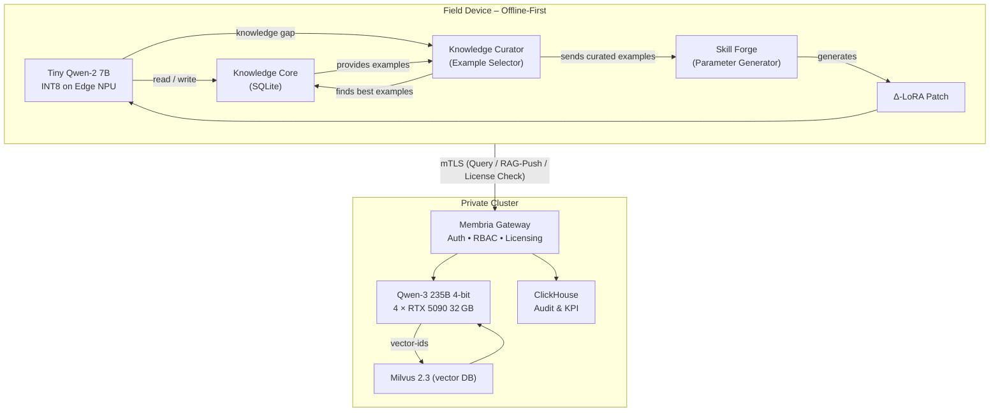

-----

# **Membria Enterprise Edition**

*A Hybrid Memory & Routing Layer for Privacy‑First Corporate AI*

-----

## Executive Summary

Membria Enterprise Edition (EE) delivers **GPT‑4‑class intelligence on‑device** while keeping corporate data private and GPU costs under control. *Edge* devices run an INT8 **Qwen‑2 7B** model accelerated by an on-device **NPU (e.g., from Intel, AMD, NVIDIA)**. Instead of slow, per-task fine-tuning, Membria EE uses a proprietary **Skill Forge** that creates task-specific LoRA patches in seconds. This process is driven by an autonomous **Knowledge Curator** agent that selects the best examples from the local database. A role‑aware Gateway routes only the most complex queries to the cloud. Result: field staff get realtime, offline, and instantly personalized AI through an **Autonomous Personalization Loop**; headquarters retain full audit, IP protection, and license control.

-----

## 1 Problem Space

Real‑world deployments expose **four** overlapping bottlenecks that classic cloud‑only LLM solutions cannot simultaneously solve:

| \# | Pain‑Point | Why it hurts today | Example Scenario |
|---|---|---|---|
| **1** | **Zero / flaky connectivity** | Mines, ships, and far‑edge plants run in RF shadows; SaaS LLM calls simply fail. | Maintenance crew 120 km offshore loses link for 3 h. |
| **2** | **Hard privacy / sovereignty law** | GDPR, ITAR, HIPAA, EU‑AI Act forbid raw data or CoT logs leaving device. | X‑ray image of worker injury; defence schematics. |
| **3** | **Exploding GPU & token cost** | Frontier‑model API = $0.01–0.03 / token → O(10⁶ $/ year) for a fleet. | 1 000 techs × 1 k prompts /day × 1 k tok =$ 10 k / day. |
| **4** | **Context deficit & knowledge drift** | Cloud LLM forgets site‑specific SOP, causing hallucinations; re‑upload each prompt wastes tokens. | "Torque spec for Valve ZX‑14?" — model hallucinates 45 N·m, real is 60 N·m. |

-----

## 2 High‑Level Architecture

*A symbolic view of data & compute flow*



> **Edge** answers \~90 % locally. Personalization is instantaneous and autonomous. Only the most complex queries travel the red mTLS link.

-----

## 3 Core Components

### 3.1 Edge Stack

| Module | Tech | Footprint | Function |
|---|---|---|---|
| **Tiny‑LLM** | Qwen‑2 7B‑INT8 | ≈3.4 GB | Runs all common prompts offline. |
| **Hardware NPU** | Edge NPU (e.g., Intel, AMD, NVIDIA) | \<10 W | Provides low-latency hardware acceleration. |
| **Knowledge Core** | SQLite (RAG + Graph + Agent Memory) | up to 1 GB | Stores all local knowledge and agent state. |
| **Personalization Loop** | **Knowledge Curator** + **Skill Forge** | ≈1.5 GB | **Instantly generates LoRA weights from curated examples.** |
| **Response Cache** | ModelCache | optional | Instant replay of identical queries. |

### 3.2 Cloud Stack

| Module | Tech | Notes |
|---|---|---|
| **Gateway** | Membria Gateway (Go, gRPC/HTTP) | JWT Auth • RBAC • **Policy-based routing & Licensing** |
| **Frontier LLM** | Qwen3‑235B 4‑bit (GPTQ) | 4 × RTX 5090 32 GB · 20–40 tok/s |
| **LMCache Layer** | LMCache (Apache‑2.0) | KV‑reuse; cuts TTFT & GPU by \~35 % |
| **Vector DB** | Milvus 2.3 + RBAC | Per‑role partitions, HNSW‑GPU |
| **Ops Analytics** | ClickHouse + Superset | Token savings, SLA, audit trails |

### 3.3 GPU Scaling & Concurrency Capacity

| Parameter | Value / Formula | Notes |
|---|---|---|
| **Sustained throughput** | **20–40 tokens / sec** on 4 × RTX 5090 32 GB @ 4‑bit | Measured with vLLM paged‑attention, context 8 k. |
| **Interactive chat budget** | *concurrent users* ≈ **throughput / 10 tok·s⁻¹** | To keep latency \< 5 s, aim for ≥1 tok/s per session. |
| **Example** | 30 tok/s ⇒ **\~30 simultaneous users** get \~200‑token answer in ≈7 s. | Suitable for one engineering shift. |
| **Burst mode (batch)** | vLLM micro‑batch 8 req ⇒ +25 % throughput | Spikes handled without over‑scaling. |
| **Autoscale metric** | GPU util \> 70 % *and* queue \> 3 s → add node | K8s + KEDA or Slurm + Prometheus. |
| **Scale‑out node** | Same 4×5090 rig or **Threadripper 7980X (256 GB) + 4×5090** | Threadripper hosts LMCache shard & extra PCIe lanes. |
| **Linear capacity rule** | n nodes × 30 tok/s ≈ *n × 30 users* | 10 nodes → \~300 concurrent users. |
| **Edge off‑load win** | If 90 % queries served on device, cloud sees only **3 tok/s per 100 workers** | Delays cluster expansion by \~10×. |

### 3.4 Base Node Hardware Spec

```
• CPU: AMD Threadripper PRO 7995WX — 96 cores / 192 threads
• RAM: 256–512 GB DDR5 ECC (fits Qwen3 weights + KV)
• GPU: 4 × GeForce RTX 5090 32 GB, NVLink/SLI bridged
• Storage: 2 TB NVMe RAID‑0 (OS + LMCache shards)
• Network: dual 10 GbE + 200 Gbps InfiniBand HDR
• Parallelism: Tensor‑Parallel × Expert‑Parallel (vLLM TP=4, EP=4)
• Capacity: one node ⇒ ≤ 100 concurrent users (@30 tok/s budget)
• Scale‑out: add 1 node, link over 200 Gbps IB; Gateway load‑balances & LMCache sharding auto‑sync.
```

-----

## 4 Data Flow & Offline Resilience

  * **Local-first autonomy** keeps 90 % of answers offline.
  * All new data and logs queue in an encrypted outbox in the local SQLite DB.
  * UI shows “Cloud unavailable — best‑effort answer” during connectivity loss.
  * The system automatically syncs when connectivity is restored.

-----

## 5 Synchronization & Versioning Protocol

This section details the bidirectional data flow that keeps the edge fleet aligned with the central knowledge base while allowing new information to be securely uploaded from the field.

### 5.1 Object model

| Entity | ID scheme | Version field | Payload |
|---|---|---|---|
| **Chunk** (RAG fact) | `sha256(doc_id‖chunk_no)` | `uint32 rev` | Plain‑text, MIME, metadata |
| **CoT trace** | `sha256(prompt‖crc32(CoT))` | implicit (immutable) | JSON array of steps |
| **Δ‑LoRA patch** | `sha256(base‑model‖timestamp)` | `semantic ver` | 16‑bit weight diff |

### 5.2 Cloud-to-Edge Sync (Delta Download)

1.  **Vector clock** in device header → Gateway reply tells *latest rev* per collection.
2.  Device computes **missing range**. If \< 20 MB, pulls incremental diff; else requests **snapshot**.
3.  Gateway streams blocks (`PUT /sync?id=&rev=`) in order; device acks.
4.  After full catch‑up, device sends its own queued chunks (`POST /push`).

### 5.3 Edge-to-Cloud Sync (RAG Upload)

This workflow securely uploads new documents and facts created by field workers to the central Milvus database, with full role-based access control enforced by the Gateway. The `sync_status` flag in the local SQLite `chunks` table tracks the state of each chunk (`local`, `queued`, `synced`) to ensure reliable, transactional updates.

### 5.4 Conflict resolution

  * **Chunk** – *last‑writer‑wins* (higher `rev`) with audit kept in ClickHouse.
  * **CoT** – immutable; duplicates deduped via hash in Milvus tag.
  * **Δ‑LoRA** – private per device; no merge.

### 5.5 Long‑offline devices (\> 30 days)

| Size of gap | Action |
|---|---|
| ≤ 500 MB | Auto snapshot download over VPN. |
| \> 500 MB | Ops ticket: ship USB package with encrypted snapshot. |

-----

## 6 The Autonomous Personalization Loop (APL)

To eliminate the time and resource costs of on-device fine-tuning, Membria EE uses an **Autonomous Personalization Loop**. This replaces the slow, traditional "distillation-via-training" pipeline with an instantaneous "personalization-via-generation" process. The loop consists of two key proprietary components.

### 6.1 APL Components

1.  **The Knowledge Curator:** This is an intelligent agent within the Edge SDK. When a knowledge gap is identified (e.g., a failed local query), its job is to automatically search the entire SQLite **Knowledge Core**. It selects a small, diverse, and representative set of examples that best define the new task or skill the local LLM needs to learn.

2.  **The Skill Forge (Parameter Generator):** This is a pre-trained "hyper-network" model. It takes the curated examples from the **Knowledge Curator** as input. In a single forward pass that takes **seconds**, the Skill Forge generates a new, highly specialized `Δ-LoRA` patch tailored to the new task.

### 6.2 Key Advantages

  * **Massive Time & Energy Savings:** Replaces a multi-minute, energy-intensive fine-tuning process with a near-instantaneous one.
  * **Fully Autonomous:** The Knowledge Curator automates the example selection process, removing the need for human intervention to personalize the model.
  * **Zero-Shot Personalization:** The system can adapt to completely new tasks on the fly.

### 6.3 Resilience to Catastrophic Forgetting

A key challenge in continuous learning is "catastrophic forgetting". The Membria architecture has a multi-layered defense against this:

1.  **Inherent LoRA Stability:** LoRA only modifies a small fraction of the model's weights, leaving the vast knowledge of the base LLM untouched.
2.  **Dynamic Patch Management:** The system maintains a library of task-specific LoRA patches. A lightweight intent classifier in the Edge SDK analyzes each user query and **dynamically loads only the relevant LoRA patch** for that specific task.
3.  **External Knowledge Core as a Safety Net:** The system's true "memory" is externalized in the SQLite database. Even if a LoRA patch were to degrade the model's ability to recall a fact, the RAG system will still retrieve the correct information from the database and provide it to the model as context.

-----

## 7 Roadmap

| Quarter | Milestone |
|---|---|
| **Q3 2025** | Pilot with 50 field laptops. |
| **Q4 2025** | Full RBAC diff-sync; Skill Forge v1.2 with improved generalization. |
| **Q1 2026** | Support for next-gen Edge NPUs (INT4); multilingual OCR. |
| **Q2 2026** | BYO-Chip SDK (NPU, TPU-edge) & FIPS-140-3 certification. |

-----

## 8 Threat Model & Security

  * **Physical Security:** Full-disk encryption, TPM-bound keys.
  * **Data Protection:** On-device DB encrypted; model weights protected by NPU secure enclave.
  * **Remote Revocation:** Stolen or non-compliant devices can be remotely wiped or locked out by the Gateway.
  * **Network Security:** End-to-end mTLS 1.3 with certificate pinning.

-----

## 9 Operational Model & TCO

### 9.1 Managed-Service Approach

  * **Primary ops owner:** Membria NOC (24×7) operates Gateway, Milvus, LMCache and ClickHouse in the customer’s private VPC or on‑prem K8s.
  * **Edge fleet support:** Certified SI / device‑OEM partner (e.g. Accenture, Jabil) images NPU-enabled laptops and handles RMA.
  * **Update pipeline:**
    1.  Monthly **security patch** (Gateway container).
    2.  Quarterly **Qwen & LoRA refresh** signed via OTA.
    3.  Emergency CVE ≤ 24 h.
  * **Customer IT** is responsible only for network, VPN and account provisioning (LDAP/OIDC).

### 9.2 Detailed TCO Analysis (3-Year, 500 Workers)

The Total Cost of Ownership (TCO) is calculated for a deployment scenario of 500 field workers over a 3-year period to provide a transparent view of all capital (CapEx) and operational (OpEx) expenditures.

| Cost bucket | Qty | Unit price (USD) | 3‑yr cost | Notes |
|---|---|---|---|---|
| **Edge HW** (laptops + NPU) | 500 | $1,800 | **$0.90 M** | CapEx for 500 field worker devices. |
| **Tiny-LLM License** | ― | $0 | — | Based on Apache 2.0 licensed Qwen-2 model. |
| **Central Services Nodes** | 2 | $28,000 | **$0.06 M** | High Availability cluster for Gateway/Milvus. |
| **Edge NPU SDK + Support** | 500 | $30 | **$0.015 M** | Proprietary SDK license for NPU optimization. |
| **Membria Managed Service** | 1 | $12,000 /yr | **$0.036 M** | Annual fee for 24/7 NOC and updates. |
| **Cloud GPU Burst (5%)**| 1.5M tok/mo | $0.005 /token | **$0.27 M** | OpEx for complex queries sent to cloud LLM. |
| **Internal IT Labour** | 0.5 FTE | $120,000 /yr | **$0.18 M** | Client-side user and role management. |
| **Total 3-yr TCO** | | | **$1.46 M** | **(≈ $975 per worker per year)** |

-----

## 10 Licensing Model

Membria Enterprise Edition utilizes a **per-seat, annual subscription model**, enforced by the Gateway acting as a central **License Server**.

### 10.1 Licensed Components

The license covers the proprietary **Membria Gateway**, the **Edge SDK** (which includes the Knowledge Curator and Skill Forge), and the **Support & Maintenance Contract**.

### 10.2 Activation & Watermarking

Each licensed device receives a unique cryptographic **Device License Certificate** from the Gateway upon first activation. The LoRA patches generated by the Skill Forge are automatically **watermarked** using this certificate. The Edge SDK will refuse to load any LoRA patch with a missing or invalid watermark, thus tying the use of personalized skills to a valid license.

-----

## 11 Central Data-Plane Disaster Recovery

  * **Milvus:** HA via Raft, WAL backups, hourly snapshots (RPO ≤ 60s).
  * **ClickHouse:** 3-replica cluster, incremental backups (RPO ≤ 5 min).
  * **Gateway:** Redundant instances behind a load balancer.

-----

## 12 Competitive Comparison

| Criteria | **Membria EE** | Azure AI / AWS Bedrock (Private) |
|---|---|---|
| **Edge autonomy** | 90% offline via on-device LLM+NPU | 100% cloud-dependent |
| **GPU cost savings** | ≈ 85% via edge pre-filtering | None; full instance billing |
| **Privacy & sovereignty**| Sensitive data never leaves device | Data resides in cloud region |
| **Self-improving**| **Instant** on-device personalization via APL | No local fine-tuning |
| **Offline resilience**| Fully functional offline | No functionality if cloud is down |

-----

## 13 Conclusion

Membria Enterprise Edition empowers organisations with a self-improving, privacy-first AI fabric that scales from cloud to edge. By leveraging a cutting-edge **Autonomous Personalization Loop**, it delivers instantaneous on-device personalization, ensuring offline autonomy, data sovereignty, and significant cost savings while remaining highly resilient to common continual learning challenges.

The primary value for corporate clients lies in solving four critical, previously irreconcilable challenges of modern AI deployment:

1.  **True Offline Autonomy:** It provides continuous AI support for field workers in environments with unstable or non-existent connectivity.
2.  **Unyielding Data Sovereignty:** By processing sensitive information and personalizing models directly on the device, it guarantees compliance with strict data privacy laws like GDPR, ITAR, and HIPAA.
3.  **Enhanced Reliability:** The hybrid architecture drastically reduces context deficits and knowledge drift, minimizing model hallucinations.
4.  **Fundamental Economic Shift:** Most importantly, Membria EE fundamentally changes the economic model of using frontier AI. It moves enterprises away from the prohibitively high and unpredictable operational expenditure (OpEx) of per-token API calls to a predictable, controlled cost structure. The Total Cost of Ownership analysis shows that for a fleet of 500 workers, the 3-year cost is approximately **$1.46 million**, representing a cost reduction of up to **85%** compared to the estimated **\~$10 million** for a pure-cloud solution.
