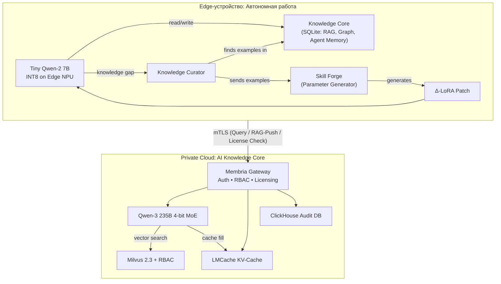

# Корпоративная двухуровневая ИИ-инфраструктура

**Гибридный слой памяти и маршрутизации для корпоративного AI с приоритетом на приватность**

⸻

## 0. Введение
Современным предприятиям в энергетике и телекоммуникациях требуется мощный искусственный интеллект, способный обрабатывать разнородные данные всех подразделений. При этом критически важны снижение издержек, защита конфиденциальных данных и способность работать автономно вне сети. Предлагаемая двухуровневая архитектура Membria решает эту задачу, сочетая частное облачное **AI Knowledge Core** и распределенные **Edge-агенты** на устройствах сотрудников. Такой подход позволяет интеллектуально распределять инференс между облаком и переферийными устройствами, что усиливает безопасность данных и экономит ресурсы. В результате компания получает гибкую, персонализируемую систему: сложные запросы обрабатываются центральной высокоточной моделью, а повседневные и чувствительные задачи – легковесными моделями на местах.

Предлагаемая архитектура сочетает мощное AI Knowledge Core (центральная многоэкспертная модель + единое хранилище знаний) и распределённые Edge-агенты (компактные Tiny-LLM с локальной памятью RAG / CAG). Такой подход решает сразу четыре задачи:
- Снижает OPEX на GPU ~75 % — тяжёлый инференс выполняется только при необходимости.
- Соблюдает GDPR / ITAR — чувствительные данные не покидают устройство.
- Обеспечивает офлайн-автономность — 90% запросов закрываются локально.
- Дает гипер-персонализацию — каждое устройство адаптирует модель под сотрудника.

Если у компании уже есть ERP-система, где данные структурированы, зачем вкладывать ресурсы в корпоративный ИИ?

Ответ заключается в том, что традиционные системы, включая ERP, работают с **данными**, в то время как корпоративный ИИ работает со **знаниями**. Внедрение ИИ-ядра — это не просто модернизация, а фундаментальный шаг к решению трех главных проблем современного бизнеса, которые ERP-системы решить не в состоянии.

### Причина №1: Превратить главную проблему в главный актив

**80% корпоративной информации — это "темные данные".** Это огромный, хаотичный массив отчетов в PDF, переписок в почте и мессенджерах, проектной документации, записей звонков и технических логов. Для ERP-системы это просто файлы, занимающие место на диске. Для бизнеса — это пассив, источник затрат на хранение и источник рисков.

**Корпоративный ИИ превращает этот хаос в самый ценный актив компании — централизованную, доступную для поиска базу знаний.**
* **Что это дает:** Вместо того чтобы тратить часы на поиск нужного пункта в 500-страничной инструкции, инженер может просто спросить: "Какая процедура безопасности при работе с клапаном VX-55?". Система мгновенно найдет ответ. Это высвобождает тысячи человеко-часов и ускоряет принятие решений.

### Причина №2: Сохранить и приумножить опыт сотрудников

Ключевые знания компании находятся не в базах данных, а в головах опытных сотрудников. Когда такой сотрудник увольняется, его уникальный опыт уходит вместе с ним.

**Корпоративный ИИ решает проблему "неявных знаний" (tacit knowledge), делая опыт многоразовым.**
* **Что это дает:** Когда инженер решает сложную проблему и пишет отчет, AI-ядро не просто сохраняет этот отчет. Оно "понимает" его содержание. В следующий раз, когда молодой специалист столкнется с похожей ситуацией, AI-ассистент сможет сказать: "Иван Петров решал похожую проблему три года назад. Вот его отчет и рекомендации. Он выяснил, что причина в коррозии из-за влажности, и посоветовал использовать уплотнитель марки X". Это создает самообучающуюся организацию, которая не теряет свой опыт.

### Причина №3: Обеспечить конкурентное преимущество в эпоху AI

В ближайшие годы конкурентное преимущество будет не у тех, у кого больше данных, а у тех, кто умеет быстрее и эффективнее извлекать из них ценность.

**Корпоративный ИИ — это создание собственного "мозга" компании, который невозможно скопировать.**
* **Что это дает:**
    1.  **Скорость и качество решений:** Сотрудники, у которых есть мгновенный доступ ко всему коллективному опыту компании, принимают более быстрые и качественные решения, чем конкуренты.
    2.  **Экономическая эффективность:** Архитектура, подобная Membria, снижает затраты на облачный AI до **85%**, позволяя использовать самые передовые технологии без непомерных расходов.
    3.  **Безопасность и суверенитет:** Позволяет применять AI к самым чувствительным данным, не опасаясь утечек и нарушений GDPR/ITAR, в то время как конкуренты, зависимые от публичных облаков, не могут этого сделать.

**Итог:** Внедрять корпоративный ИИ нужно не потому, что это модно. Его внедряют потому, что это единственный способ справиться с экспоненциальным ростом неструктурированных данных, сохранить бесценный опыт команды и построить более быструю, умную и эффективную организацию, чем у конкурентов. **ERP — это система учета прошлого, а корпоративный AI — это двигатель для принятия решений в будущем.**

⸻

## 1. Проблемы

| Боль | Следствие | Типичный "костыль" |
|---|---|---|
| **Нестабильная связь на объектах** | SaaS-LLM недоступен | Бумажные/pdf инструкции |
| **Дорогие облачные токены** | $0.02 / токен × 1000 пользователей → $10M/год | Кеш-прокси без reasoning |
| **Жесткие регуляции (GDPR, ITAR)** | Нельзя выгружать данные в публичное облако | VDI / air-gap без ИИ |
| **Контекст растёт экспоненциально** | Облако берёт $$$ за длинные окна | Сокращать запросы вручную |

⸻

## 2. Архитектура

⸻

## 3\. Компоненты архитектуры

### 3.1. AI Knowledge Core (Центральное ядро корпоративных знаний)

Разворачивается в частном облаке или on-premise дата-центре клиента. Ядро агрегирует общие корпоративные знания и использует большую языковую модель (MoE LLM) для решения сложных, междисциплинарных задач.

- **AI Knowledge Core** – это центральное хранилище знаний и инфраструктура инференса, развернутая в облаке или локальном дата-центре предприятия. Ядро собирает и консолидирует данные от всех подразделений (закупки, логистика, продажи, поддержка, инженерные службы и др.), формируя единую корпоративную базу знаний. На этом уровне работает крупная языковая модель (LLM) нового поколения с архитектурой Mixture-of-Experts (MoE), например Qwen3. Архитектура MoE означает, что модель состоит из множества специализированных экспертов и на каждый запрос активируются только необходимые подмодели – это повышает эффективность и производительность системы .

- **Возможности ядра знаний:** Большая модель в ядре обладает высоким уровнем интеллекта и широкой эрудицией. MoE-модели типа Qwen3-30B-A3B (30 млрд параметров, из них 3 млрд активных) близки по качеству к GPT-4, но за счет динамического подключения экспертов оптимизируют затраты на вычисление . Такая центральная система поддерживает большой контекст (например, до 128k токенов), что позволяет ей учитывать огромные объемы документов при ответе. Ядро знаний способно решать сложные аналитические задачи, требующие информации сразу из нескольких отделов, и обеспечивает глубину рассуждений в ответах. Кроме того, централизованное управление знаниями упрощает контроль версий и обновлений: новая информация (например, обновленный технический регламент или сводка с рынка) размещается в ядре и становится доступна всем Edge-узлам после синхронизации.

| Подсистема | Технология | Назначение |
|---|---|---|
| **Large LLM** | Qwen-3 235B 4-bit (MoE) | Обработка \~5% самых сложных запросов, требующих междепартаментных знаний. |
| **Оркестратор** | Membria Gateway | Управление доступом (RBAC), маршрутизация запросов, лицензирование и аудит. |
| **Векторная БД** | Milvus 2.3 | Центральное хранилище для RAG-данных с разделением по ролям и отделам. |
| **Кеш инференса** | LMCache | KV-кэширование для ускорения повторных запросов к LLM на 35%+. |
| **Отказоустойчивость**| Raft, WAL→S3, Репликация | Обеспечение непрерывности работы (RPO ≈ 60с, RTO \< 15 мин). |

### 3.2. Edge-агент (Локальный ИИ)

Разворачивается на устройствах сотрудников. Обеспечивает автономную работу, приватность и глубокую персонализацию.

На втором уровне находятся распределенные ИИ-агенты, развёрнутые на персональных устройствах сотрудников – ноутбуках, планшетах, смартфонах. Каждый такой Edge-узел содержит компактную локальную модель (Tiny-LLM), например 7-миллиардную Qwen 3, оптимизированную до 4-битной точности.

- **Локальная память и знание:** Edge-ИИ оснащается собственной базой знаний, относящейся к работе конкретного пользователя или отдела. Это могут быть внутренние документы, руководства, чертежи, фотографии оборудования, справочные материалы и пр. Для эффективного использования этих данных применяются методы RAG и CAG. Retrieval-Augmented Generation (RAG) означает, что перед формированием ответа локальная модель делает поиск по встроенной базе: специальный модуль извлекает релевантные документы (например, из векторного хранилища) и подставляет их содержимое в контекст модели. Cache-Augmented Generation (CAG) дополняет систему тем, что часто используемые или критичные знания предварительно загружаются в кеш модели, то есть в её контекст или ключево-значную память, обеспечивая мгновенный доступ без внешних запросов. Комбинация RAG + CAG создает локальную память: устройство может сразу отвечать на вопросы, опираясь на актуальные документы и заранее сохраненные факты.

- **Персонализация и офлайн-режим:** Локальные ИИ-агенты могут быть настроены под задачи конкретного сотрудника или подразделения. Например, инженерный планшет будет содержать технические схемы и последние фото объектов, а ноутбук менеджера – договоры с клиентами и презентации. За счет обучения на этих данных (в рамках локального контекста) ответы модели учитывают специфику пользователя – стилистику, терминологию, предпочтения. Важное преимущество Edge-решений – автономная работа офлайн. Даже без подключения к сети сотрудник в поле или на выезде получит консультацию ИИ, так как все необходимые вычисления и данные находятся на устройстве. Это критично для отраслей с удаленными объектами (ЛЭП, вышки связи и пр.), где связь может быть нестабильной. Локальный инференс также повышает приватность: чувствительная информация (пароли, персональные данные клиентов, коммерческая тайна) не покидает устройство и не отправляется во внешние облака. В результате предприятие соблюдает требования безопасности и регуляторов, контролируя, какие данные циркулируют между центром и периферией.

| Подсистема | Технология | Характеристики |
|---|---|---|
| **Tiny LLM** | Qwen-2 7B INT8 | Обработка \~90% запросов локально, без доступа к сети. |
| **Аппаратный ускоритель**| Edge NPU (Intel, AMD, Qualcomm, Kinara) | Энергоэффективное ( \<10 Вт) ускорение инференса. |
| **Ядро знаний (локальное)** | SQLite | **Единая база** для RAG, темпорального графа знаний и памяти агентов. |
| **Персонализация** | **Autonomous Personalization Loop** (Curator + Skill Forge) | **Мгновенная генерация** LoRA-патчей (секунды) для адаптации к новым задачам. |
| **Безопасность** | LUKS, TPM, mTLS | Ключи в RAM, нулевой экспорт данных. |

⸻

## 4\. Маршрутизация запросов между ядром и Edge

Для каждого запроса пользователя система решает, на каком уровне его обработать – центральном или локальном. Реализуется гибкая маршрутизация запросов, учитывающая содержимое запроса, приоритеты по безопасности и доступность сети:

-	**Локальная обработка:** По умолчанию запрос обслуживается на устройстве сотрудника, особенно если он связан с локальными данными или требует персонального контекста. Например, вопрос типа «Покажи инструкции по настройке этого оборудования» будет решен локально, так как нужная инструкция уже хранится на планшете. Все чувствительные запросы (содержащие конфиденциальные детали) остаются на Edge-уровне, чтобы исключить передачу таких данных вовне . Локальная модель быстрее отвечает на короткие повседневные вопросы, не затрачивая ресурсы центрального сервера.

- **Передача в центральное ядро:** Если запрос сложный, междисциплинарный или выходит за рамки знаний, доступных на устройстве, Edge-агент может перенаправить его в AI Knowledge Core. К примеру, вопрос «Сформулируй прогноз потребления электроэнергии на основе данных по всем регионам» затрагивает данные из разных филиалов – такая задача отправится в ядро, где мощная MoE-модель использует сводные корпоративные данные. Решение о маршрутизации может принимать специальный оркестратор: он анализирует запрос (возможно, с помощью метамодели или правил) и выбирает оптимальный путь. Интеллектуальное распределение инференса позволяет экономить ресурсы – тяжелые вычисления выполняются централизованно по мере необходимости, а локальные устройства разгружают ядро, обрабатывая множество мелких запросов на месте .

- **Гибридный режим:** В некоторых случаях возможна кооперация уровней. Например, локальная модель может частично обработать вопрос и запросить у ядра только недостающие сведения. Либо наоборот – ядро выполнит сложное вычисление и передаст краткий результат на устройство, где он дополнится локальными деталями. Такой гибридный подход сохраняет трафик минимальным и поддерживает высокую скорость отклика.

В итоге маршрутизация обеспечивает баланс между скоростью, стоимостью и качеством ответа. Система учитывает бюджет инференса и требования задачи, чтобы решить, использовать ли маленькую модель или задействовать большие мощности . Это особенно важно, когда канал связи ограничен или платный – запрос будет обработан локально, пока нет связи, и поставлен в очередь на отправку в центр, когда связь появится, если требуется уточнение.

⸻

## 5\. Кэширование знаний и ускорение ответов

Для эффективной работы двухуровневой системы необходимы механизмы кэширования знаний как на стороне ядра, так и на стороне Edge. Кэширование знаний предотвращает повторное выполнение тяжелых операций и уменьшает задержки при выдаче ответов:

- **Локальный кеш (Edge):** Каждое устройство хранит у себя наиболее важные данные из ядра, а также результаты предыдущих запросов. Например, если инженер уже запрашивал допустимые настройки для определенного оборудования, ответ может быть сохранен локально. При повторном похожем запросе Edge-агент вернет результат мгновенно из кеша вместо повторного вычисления. Методы Cache-Augmented Generation позволяют модели прямо в контексте иметь «под рукой» необходимую информацию, что обеспечивает минимальную задержку ответа . Кроме того, локальный векторный индекс с документами играет роль кеша знаний: он постоянно обновляется и оптимизирован для быстрого поиска (время доступа намного ниже, чем запрашивать центральную базу).

- **Центральный кеш:** В ядре знаний также реализуется кеширование часто запрашиваемых сведений. Хотя мощная LLM может отвечать на любые вопросы, для распространенных задач выгоднее хранить готовые ответы или промежуточные вычисленные представления. К примеру, агрегированные отчеты по продажам или сводные справки генерируются раз и сохраняются, чтобы при повторных запросах сразу выдавать их без полного прогонки модели. Центральный кеш может основываться на базе знаний (FAQ, готовые решения) и интегрироваться с RAG-процессом: модель сначала проверяет, нет ли готового ответа/документа, и только затем генерирует новый. Это улучшает время отклика и снижает нагрузку на инфраструктуру. Также кэшируются embedding-вектора и результаты поиска: если разные Edge-узлы запрашивают схожие данные, ядро переиспользует ранее вычисленные embedding, ускоряя RAG-пайплайн.

- **Согласованность кеша:** Важной частью стратегии является управление актуальностью кешированных данных. Для этого вводятся метки версий и времени последнего обновления. Локальные агенты помечают сохраненные ответы временем, а при синхронизации получают сигнал об устаревших знаниях (например, если в ядре обновился документ, связанный с кешированным ответом). Тогда устаревшие элементы удаляются или помечаются для пересчета. Таким образом, кеширование не приводит к рассинхронизации знаний: система сочетает быстродействие с контролем актуальности.

⸻

## 6\. Синхронизация данных между уровнями

Поскольку знания распределены между центральным ядром и множеством устройств, необходимы надежные процедуры синхронизации. Синхронизация обеспечивает обмен данными в обоих направлениях при сохранении целостности информации:

- **Периодическая и событийная синхронизация:** Edge-устройства периодически (например, раз в сутки или при подключении к корпоративной сети) обмениваются пакетами данных с ядром. Также синхронизация может запускаться по событию – например, при появлении нового важного документа в базе ядра или при создании пользователем нового файла на устройстве. Обновления собираются в локальный буфер (очередь) во время офлайн-режима, а при восстановлении связи этот буфер отсылается на сервер . Аналогично, поступающие от ядра изменения накапливаются и применяются при следующем соединении. Такой подход гарантирует, что даже после длительного офлайна устройство наверстает все изменения.

- **Дифференцированный обмен данными:** Не все локальные данные отправляются в центр – для экономии трафика и защиты приватности применяется отбор. Например, чувствительные сведения (персональные заметки, фото с полигона) могут помечаться как «только локально» и не подлежат выгрузке. В центр уходят обобщенные или обезличенные данные, полезные для общей аналитики (например, сводные результаты замеров). В обратном направлении, Edge-агент запрашивает у ядра только релевантные обновления: устройство может подписываться на темы или категории данных, относящиеся к его сфере. В результате инженерный планшет получит технические бюллетени и обновления инструкций, но не будет загружаться лишней информацией из отдела продаж.

- **Консолидация знаний:** Центральное ядро выступает «единой точкой правды» (single source of truth) для корпоративных данных. Все подтвержденные и утвержденные изменения (например, обновление политики безопасности) фиксируются в ядре и распространяются на устройства. Если локальный узел накопил новый опыт (скажем, инженер сделал пометку об устранении неполадки), он по возвращении в сеть может отправить этот новый знаниевый артефакт в ядро. После проверки и валидации (возможно, человеком или автоматически) ядро добавит его в общую базу знаний, откуда он затем разойдется другим участникам. Таким образом, знания циркулируют: Edge-пул питается от центрального хранилища актуальной информацией, а центр собирает обратный поток опыта с мест.

⸻

## 7\.  Data Flow & Fail-over
	1.	Запрос приходит в Tiny-LLM.
	2.	Если confidence < θ или нужен cross-department — Gateway → Big LLM.
	3.	Ответ + цепочка рассуждений возвращаются, кешируются и, при флаге share, уходят в outbox.
	4.	Offline: Tiny-LLM + RAG/CAG продолжают работать, Gateway-retry N раз → secondary-endpoint.

⸻

## 8\.Synchronisation & Versioning
	•	Vector Clock → вычисляется дельта.
	•	Если gap < 20 MB — patch; иначе snapshot.
	•	Конфликты: chunks — LWW; CoT — immut; Δ-LoRA — остаётся локально.

⸻

## 9\. LoRA Distillation vs. Skill Forge

Вместо медленного переобучения, Membria использует технологию мгновенной персонализации: проприетарный **Skill Forge (генератор параметров)** на устройстве создает специализированные LoRA-патчи за секунды на основе нескольких примеров. Интеллектуальный **Membria Gateway** маршрутизирует в облако только самые сложные запросы, обеспечивая **экономию на GPU до 85%**, 100% приватность данных и полную офлайн-автономность для 90% задач.

| Этап | Время | Описание |
|---|---|---|
| Paraphrase 5× | 2с | На Tiny-LLM (пар-генератор) |
| QLoRA 8-bit × 4 эпохи | 4 мин или Skill Forge Generator 5 с | rank = 8, ток LR 2e-4 |
| Self-eval 30 промптов | 1 с | BLEU ↑, Toxic Δ ≤ 0.05 |
| Apply / discard | мгновенно или rollback | Версия ++  |

⸻

## 10\. Operational Model & TCO
	•	Edge-HW CAPEX $1.8k × 500 → $0.9 M.
	•	Core-GPU 2 узла $28k → $0.06 M.
	•	Cloud tokens (5 %) → $0.27 M.
	•	Итог $1.46 M / 3 года ≈ $975 / user / год.

⸻

# 11\. Threat Model & Security
	•	AES-256 XTS + TPM, tamper wipe.
	•	mTLS 1.3, OPA row-level, SCIM off-boarding.
	•	Milvus / ClickHouse RPO ≤ 60 с, RTO 15 мин.

⸻

## 12\. Central Data-Plane DR

| Компонент | Failure | RPO/RTO |
|---|---|---|
| Milvus | WAL corr., disk loss | 60 с / 15 мин |
| ClickHouse | Replica lag | 5 мин / 10 мин | 
| Gateway | 	Crash	Secondary LB |  ≤ 30 с  |

⸻

## 13\. Competitive Comparison

| Критерий | Membria EE | Azure AI Private | AWS Bedrock |
|---|---|---|---|
| Edge-инференс | Да (90 %)  | Нет | Нет |
| GPU экономия | 75 %  | 0 % | 0 % |
| ТКО/3 года(500) | $1.46M  | $9M |$8M |

⸻

## 14\. Appendix — Hardware Node Spec

| Критерий | Membria EE |
|---|---|
| CPU | Threadripper PRO 7995WX (96c) |
| RAM | 512 GB DDR5 ECC |
| GPU | 4× RTX 5090 32 GB NVLink |
|Network|	10 GbE ×2 + InfiniBand 200 Gbps|
|Users/Node|	≤ 100 одновремённых|

⸻

## 15\. Преимущества и результаты внедрения

Предложенная двухуровневая архитектура объединяет сильные стороны облачных и периферийных ИИ-решений, что особенно актуально для крупных предприятий с распределенной структурой:

- **Снижение издержек:** Интеллектуальное распределение вычислительной нагрузки между ядром и Edge позволяет сократить расходы на инфраструктуру. Дорогие ресурсы центрального кластера используются только для сложных задач, тогда как множество рутинных запросов обрабатываются на местах малыми моделями. Это уменьшает суммарные требования к облачным вычислениям и трафику, давая экономию в долгосрочной перспективе . Кроме того, инвестиции в локальные устройства окупаются за счет ускорения рабочих процессов и минимизации простоев при отсутствии связи.

- **Защита данных:** Чувствительные данные остаются локально, что снижает риски утечек и соответствует требованиям информационной безопасности. Поскольку основная часть инференса происходит на устройствах без передачи сыровых данных в центр, вероятность перехвата или неправомерного использования информации существенно уменьшается . Центральное ядро оперирует уже агрегированной или обезличенной информацией, а самые критичные сведения вообще не покидают защищенный контур. Это особенно важно для энергетики и телекома, где конфиденциальность данных клиентов и инфраструктуры – приоритет номер один.

- **Гибкая персонализация:** Каждый сотрудник получает ИИ-ассистента, настроенного под его задачи. Локальная модель обучается на профильных данных и интеракциях пользователя, благодаря чему ответы учитывают контекст должности, терминологию отрасли и даже предпочтительный стиль общения. Такая персонализация повышает эффективность: сотрудники быстрее получают релевантные советы и решения. В то же время центральная модель обеспечивает единообразие ключевых знаний – например, соблюдение корпоративных политик или нормативов – и передает их в персональных ассистентов, так что все сотрудники следуют актуальным требованиям компании.

- **Автономность и надёжность:** Двухуровневая система устойчива к перебоям связи и сбоям отдельных узлов. Edge-ИИ может продолжать работу даже при полном отсутствии интернет-соединения, поддерживая непрерывность бизнес-процессов в полевых условиях. Это повышает общую надежность: кратковременные падения сети больше не парализуют работу, так как на местах есть автономный интеллект. После восстановления связи все накопленные данные безопасно синхронизируются, избегая потерь. Также, распределенная архитектура масштабируется лучше: при росте штата достаточно добавить новые Edge-устройства с предобученной моделью, подключив их к ядру знаний, без необходимости резко наращивать мощности центра.

⸻

## 16\. Заключение

**Membria EE** объединяет мощь MoE-LLM и автономность Edge-агентов, снижает расходы, сохраняет данные в контуре и масштабируется линейно. Это практичный путь к корпоративному AI.

Концепция корпоративной ИИ-инфраструктуры в виде связки **«центральный AI Core + локальные Edge-агенты»** представляет собой эволюционное развитие систем искусственного интеллекта в организации. Она обеспечивает одновременное выполнение нескольких, казалось бы, противоречивых требований: максимальная вычислительная мощность и глобальное знание – с одной стороны, и приватность, скорость отклика и адаптация под пользователя – с другой. Для отраслей вроде энергетики и телекоммуникаций, где ценится и масштаб аналитики, и оперативная работа на местах, такой подход создает прочную основу для расширенного внедрения ИИ. Двухуровневая архитектура помогает компании эффективно использовать ИИ во всех звеньях цепочки, снижая издержки, защищая данные и раскрывая потенциал персонального искусственного интеллекта для каждого сотрудника.
