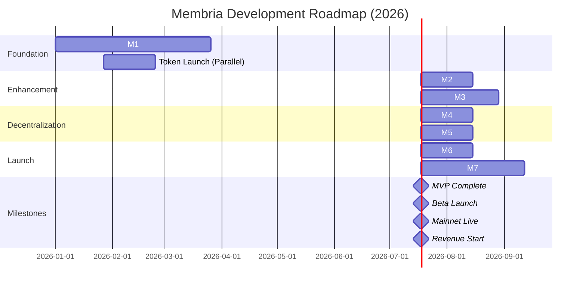
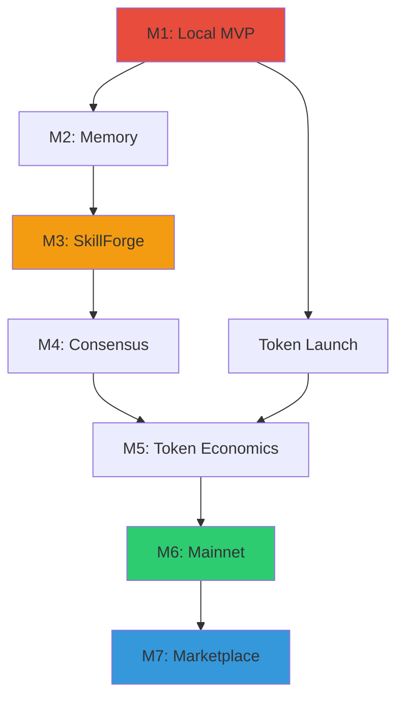

# Membria Community Edition: Development Roadmap

## Executive Summary

**Mission**: Build the world's first decentralized, permanent knowledge base for AI - "Wikipedia for Small Language Models"

**Market Opportunity**: $50B+ AI infrastructure market (TAM)

**Timeline**: 10 months from start to mainnet launch

**Total Investment Required**: $800K

**Expected ROI**: Break-even at Month 18, profitable by Month 24

---

## What We're Building

### The Problem
- 10M+ developers download local AI models (Llama, Mistral, Phi) monthly
- 95% abandon them within weeks due to:
  - **Static knowledge** (frozen at training cutoff)
  - **No memory** (amnesia between sessions)
  - **No embeddings** (RAG)
  - **Generic capabilities** (can't specialize without expensive fine-tuning)
  - **Information silos** (can't access user's data)

### Our Solution
**Membria = AI Operating System**
- **Client**: Full-featured desktop app with autonomous agents, memory, and skills
- **Network**: Decentralized knowledge graph (Peaq + Arweave)
- **Marketplace**: LoRA patches & ready-made AI agents (monetization layer)

---

## Development Timeline (10 Months)

### Visual Timeline

---

## Detailed Milestone Breakdown

| Milestone | Start Date | Duration | End Date | Investment | Key Deliverables |
|-----------|------------|----------|----------|------------|------------------|
| **M1: Local MVP** | Week 1 | 12 weeks | Week 12 | $90K | • Membria Client (CLI) • Gateway API • GraphRAG • Peaq + Arweave integration • End-to-end knowledge flow |
| **Token Launch*** | Week 4 | 4 weeks | Week 8 | $30K | • ACTI utility token • Early adopter program • Community (1K+ Discord) |
| **M2: Enhanced Memory** | Week 13 | 4 weeks | Week 16 | $30K | • 3-tier memory (Hot/Warm/Cold) • Gateway Fast Path (<100ms) • 1,000+ events in DKG |
| **M3: SkillForge** | Week 17 | 6 weeks | Week 22 | $60K | • LoRA patch loading • Web automation agents • Multi-agent orchestration |
| **M4: Consensus** | Week 23 | 4 weeks | Week 26 | $70K | • BFT consensus (5+ validators) • Parquet batching • Security audit (preliminary) |
| **M5: Token Economics** | Week 27 | 4 weeks | Week 30 | $80K | • Staking mechanism • Reward distribution • 20+ Gateway operators |
| **M6: Mainnet** | Week 31 | 4 weeks | Week 34 | $100K | • Production launch • 50+ Gateway nodes • 1,000+ daily users • Full security audit |
| **M7: Marketplace** | Week 35 | 8 weeks | Week 42 | $150K | • LoRA marketplace UI • 20+ LoRA patches • 10+ ready-made agents • First revenue |

**Total Timeline**: 42 weeks (~10 months)  
**Total Investment**: $590K + $20K marketing = **$610K**

*Token launch runs in parallel with M1-M2

---

## Investment Breakdown by Quarter

### Q1 (Month 1-3): Foundation
**Investment**: $120K

| Item | Amount | Purpose |
|------|--------|---------|
| Development (3 devs × 3 months) | $90K | M1: Local MVP |
| Token Launch | $30K | ACTI utility token + community |

**Deliverables by End of Q1**:
- Working Membria Client + Gateway
- First 100+ events in DKG
- Token live on testnet
- 10,000+ community members

---

### Q2 (Month 4-6): Product Enhancement
**Investment**: $150K

| Item | Amount | Purpose |
|------|--------|---------|
| Development (4 devs × 3 months) | $90K | M2-M3: Memory + SkillForge |
| Web automation engineer | $30K | Agent capabilities |
| DevOps infrastructure | $15K | Monitoring + deployment |
| Marketing & community | $15K | Beta user acquisition |

**Deliverables by End of Q2**:
- 1000 active beta users
- 10,000+ events in DKG
- LoRA patches functional
- Web automation working

---

### Q3 (Month 7-9): Decentralization & Launch
**Investment**: $250K

| Item | Amount | Purpose |
|------|--------|---------|
| Development (5 devs × 3 months) | $150K | M4-M6: Consensus + Mainnet |
| Security audits (2 audits) | $50K | Trail of Bits / OpenZeppelin |
| Legal & compliance | $15K | Token regulatory review |
| Marketing campaign | $20K | Mainnet launch PR |
| Infrastructure | $15K | Production servers + CDN |

**Deliverables by End of Q3**:
- Mainnet live
- 5,000+ daily active users
- 100,000+ events in DKG
- 10+ Gateway operators staking

---

### Q4 (Month 10): Marketplace & Revenue
**Investment**: $90K

| Item | Amount | Purpose |
|------|--------|---------|
| Development (5 devs × 2 months) | $60K | M7: Marketplace frontend |
| UI/UX designer | $15K | Marketplace design |
| Creator onboarding | $10K | Seed LoRA patches |
| Marketing | $5K | Marketplace launch |

**Deliverables by End of Q4**:
- LORA Marketplace live
- 20+ LoRA patches listed
- 10+ ready-made agents
- **First revenue**: $5-10K MRR

---

## Revenue Model & Projections

### Revenue Streams

| Stream | Go-Live | Year 1 | Year 2 | Year 3 |
|--------|---------|--------|--------|--------|
| **Marketplace Fees** (30% commission) | Month 11 | $50K | $250K | $800K |
| **Agent Subscriptions** | Month 11 | $30K | $200K | $600K |
| **Membria EE Licensing** | Month 14 | $20K | $150K | $500K |
| **Gateway Staking Fees** | Month 10 | $10K | $50K | $100K |
| **Total Annual Revenue** | | **$110K** | **$650K** | **$2M** |

### Path to Profitability

| Metric | Month 12 | Month 18 | Month 24 |
|--------|----------|----------|----------|
| Monthly Recurring Revenue (MRR) | $10K | $40K | $80K |
| Monthly Operating Costs | $30K | $35K | $40K |
| **Monthly Profit/Loss** | **-$20K** | **+$5K** | **+$40K** |
| Cumulative Burn | -$610K | -$530K | -$290K |

**Break-even**: Month 18  
**ROI Positive**: Month 24  
**Payback Period**: ~2 years

---

## Key Performance Indicators (KPIs)

### Technical Metrics

| Metric | M1 (Week 12) | M3 (Week 22) | M6 (Week 34) | M7 (Week 42) |
|--------|--------------|--------------|--------------|--------------|
| **Users** | 1 (demo) | 100 (beta) | 1,000 (mainnet) | 5,000 |
| **Events in DKG** | 100+ | 10,000+ | 100,000+ | 500,000+ |
| **Gateway Nodes** | 1 (dev) | 3 (test) | 50+ (prod) | 100+ |
| **Query Latency** | <3s | <1s (cached) | <100ms | <50ms |

### Business Metrics

| Metric | M5 (Week 30) | M6 (Week 34) | M7 (Week 42) | Month 15 |
|--------|--------------|--------------|--------------|----------|
| **Token Holders** | 500+ | 2,000+ | 5,000+ | 10,000+ |
| **Marketplace Listings** | 0 | 0 | 20+ LoRAs, 10+ agents | 50+ LoRAs, 30+ agents |
| **Monthly Transactions** | 0 | 0 | 100+ | 1,000+ |
| **MRR** | $0 | $0 | $5-10K | $30K+ |

---

## Team Requirements

### Current Team (Assumed)
- 1 Technical Co-founder (full-stack + blockchain)
- 1 ML/AI Specialist (you, overseeing architecture)

### Hiring Plan

| Role | Start | Salary | Total Cost |
|------|-------|--------|------------|
| **Senior Backend Developer** | Month 1 | $10K/month | $100K (10 months) |
| **Blockchain Developer (Rust/Substrate)** | Month 1 | $12K/month | $120K (10 months) |
| **ML Engineer** | Month 4 | $10K/month | $70K (7 months) |
| **DevOps Engineer** | Month 4 | $8K/month | $56K (7 months) |
| **Frontend Developer** | Month 8 | $8K/month | $24K (3 months) |
| **Community Manager** (part-time) | Month 2 | $3K/month | $27K (9 months) |
| **Security Auditors** (contract) | Month 7-8 | One-time | $50K |
| **Legal Counsel** (contract) | Month 7 | One-time | $15K |
| **Total Team Cost** | | | **$462K** |

**Remaining $148K**: Infrastructure, marketing, token launch, contingency

---

## Risk Assessment & Mitigation

| Risk | Probability | Impact | Mitigation Strategy | Budget Reserve |
|------|-------------|--------|---------------------|----------------|
| **Consensus instability** | Medium | 🔴 Critical | • Extensive M4 testing • Fallback to federated model • External audit | $20K |
| **Low marketplace adoption** | Medium | 🟡 High | • Seed with 20+ quality patches • Creator incentives • Influencer partnerships | $15K |
| **Security vulnerabilities** | Low | 🔴 Critical | • 2-3 audits • Bug bounty ($50K pool) • Gradual rollout | $70K |
| **Development delays** | Medium | 🟡 High | • 20% time buffer built-in • Phased delivery • MVP-first approach | $30K |
| **Regulatory issues (token)** | Low | 🟡 High | • Early legal review • Utility token structure • KYC for creators | $15K |
| **Key person risk** | Low | 🟡 High | • Documentation • Code review process • Knowledge sharing | - |

**Total Risk Reserve**: $150K (built into $610K budget)

---

## 🚀 Competitive Advantages

### Technical Moat
1. **Hybrid Architecture**: Only solution combining local AI + decentralized knowledge graph
2. **GraphRAG**: Advanced semantic search with temporal ontology
3. **SkillForge**: Unique LoRA marketplace for instant specialization
4. **3-Tier Memory**: Solves context explosion problem
5. **Patents Pending**: Agent orchestration + adaptive memory system

### Go-to-Market Advantage
1. **First Mover**: No direct competitor in "AI OS for local models"
2. **Network Effects**: More knowledge → better answers → more users
3. **Open Ecosystem**: Compatible with existing tools (Ollama, LM Studio)
4. **Community-Driven**: Token incentivizes contribution

### Economic Moat
1. **Marketplace**: 30% take rate on all transactions
2. **Staking Requirements**: Barriers to entry for Gateway operators
3. **Data Permanence**: Arweave ensures knowledge can't be deleted
4. **Cross-Side Network Effects**: Users need agents, creators need users

---

## Investment Ask & Use of Funds

### Primary Raise: $600K (Seed Round)

**Use of Funds**:

| Category | Amount | % of Total | Purpose |
|----------|--------|------------|---------|
| **Engineering** | $370K | 62% | Core team (5 engineers × 10 months) |
| **Security** | $65K | 11% | Audits + bug bounty |
| **Infrastructure** | $40K | 7% | Servers, databases, CDN |
| **Marketing** | $40K | 7% | Community building, PR, events |
| **Legal & Compliance** | $25K | 4% | Token legal, entity setup |
| **Operations** | $30K | 5% | Tools, licenses, misc |
| **Reserve** | $30K | 5% | Emergency buffer |

### Token Structure (Optional)

**If doing token sale**:
- **Total Supply**: 500,000,000 ACTI
- **Seed Round**: 4% (20M tokens) at $0.04/token = $800K
- **Team**: 10% (3-year vesting)
- **Ecosystem**: 50% (marketplace incentives, grants, 60 months linear vesting)
- **Public Sale**: 5%
- **Gateway Reserve**: 8%

**Valuation**: $20M (fully diluted at seed price)

---

## Market Opportunity

### Total Addressable Market (TAM)
- **AI Infrastructure**: $50B+ by 2025 (Gartner)
- **Local AI Models**: 10M+ monthly downloads (Hugging Face)
- **Enterprise AI Spend**: $200B+ by 2027 (McKinsey)

### Serviceable Addressable Market (SAM)
- **AI Developers**: 5M globally (Stack Overflow)
- **AI-First Companies**: 50K+ startups (Crunchbase)
- **Target**: 1% capture = 50K users × $50/month = **$30M ARR potential**

### Beachhead Market
- **Individual AI Developers**: 10K users (Year 1)
- **AI Startups**: 100 companies (Year 2)
- **Enterprises**: 10 large clients (Year 3)

---

## Exit Strategy (5-Year Horizon)

### Potential Outcomes

| Scenario | Probability | Valuation | Multiple | Return on $600K |
|----------|-------------|-----------|----------|-----------------|
| **Acquisition** (Strategic buyer/HyperScaler) | 40% | $50-100M | 8-16x ARR | **83-166x** |
| **IPO / Token Market Cap** | 20% | $200M+ | 20x ARR | **333x+** |
| **Sustainable Business** (Bootstrap to profitability) | 30% | $10-30M | 5-15x ARR | **16-50x** |
| **Failure / Pivot** | 10% | <$5M | - | **<8x** |

**Expected Return (Weighted Average)**: ~70x over 5 years

---

## Investment Highlights

### Why Invest Now?

1. **Perfect Timing**: Local AI adoption exploding (10M+ downloads/month)
2. **Proven Team**: (highlight your experience)
3. **Clear Path to Revenue**: Marketplace goes live Month 11
4. **Technical Moat**: 3+ years ahead of potential competitors
5. **Network Effects**: First-mover advantage in knowledge marketplace
6. **Token Upside**: Utility token with real use case
7. **Exit Optionality**: Strategic buyers (Google, Microsoft, Anthropic) actively acquiring AI infra

### De-Risking Factors

- **MVP in 3 months**: Quick validation
- **Phased Rollout**: Test before scale
- **Multiple Revenue Streams**: Not dependent on single source
- **Open Source Core**: Community can continue if needed
- **Web3 + AI**: Two mega-trends converging

---

## Next Steps

### For Interested Investors

1. **Due Diligence Package**: Technical architecture deep-dive, financial model, team bios
2. **Product Demo**: Schedule live demo of M1 prototype (Week 12)
3. **Advisory Board**: Opportunity to join as strategic advisor
4. **SAFE Agreement**: Standard $600K seed round terms

### Timeline for Closing

- **Week 1-2**: Investor meetings & due diligence
- **Week 3**: Term sheet
- **Week 4**: Legal & closing
- **Week 5**: Development kickoff

---

## 🎬 Appendix: Detailed Technical Roadmap

### M1: Local MVP (Week 1-12) - $90K

**Week 1-2**: Foundation
- Membria Client (Python CLI)
- AI Core (llama.cpp integration)
- Config management

**Week 3-4**: Local Knowledge Layer
- SQLite (chat history, logs)
- DuckDB (RAG index)
- File indexing

**Week 5-6**: Agent Orchestrator (Basic)
- Simple agent loop
- Hot/Warm memory

**Week 7-8**: Gateway Core
- FastAPI server
- Router logic
- OpenRouter integration

**Week 9-10**: GraphRAG
- Semantic chunking
- Vector embeddings
- Graph queries

**Week 11-12**: Blockchain Integration
- pallet-kcg (Rust)
- Arweave upload
- End-to-end test

**Deliverable**: Working end-to-end system

---

# Membria Development Roadmap: Detailed Functionality Table

## Complete Feature Roadmap (42 Weeks)

| Milestone | Duration | Week | Budget | Component | Feature/Functionality | Technical Details | Success Criteria |
|-----------|----------|------|--------|-----------|----------------------|-------------------|------------------|
| **M1: Local MVP** | 12 weeks | 1-12 | $90K | | | | |
| | | 1-2 | | **Membria Client - Foundation** | CLI Interface | • Python + Click framework • Rich library for formatting • Command: `membria ask "question"` | ✅ User can run CLI commands ✅ Pretty formatted output |
| | | 1-2 | | | AI Core (Basic) | • llama.cpp integration • GGUF model loading • OpenAI-compatible local server | ✅ Can load and run Llama 3.1-8B model ✅ Basic text generation works |
| | | 1-2 | | | Configuration System | • .env file support • Pydantic Settings • Gateway URL, timeouts, model paths | ✅ Config loads from .env ✅ Validation works |
| | | 3-4 | | **Local Knowledge Layer** | SQLite Setup | • Chat history table • Event log (agent actions) • KV cache (hot memory) • WAL mode enabled | ✅ Chat history persists ✅ Can query past conversations |
| | | 3-4 | | | DuckDB Setup | • RAG index schema • Vector embeddings storage • HTTPFS extension installed | ✅ Can store embeddings ✅ HTTPFS queries work |
| | | 3-4 | | | File Indexing | • Document scanner (PDF, DOCX, TXT) • Semantic chunking algorithm • Embedding generation | ✅ 100+ documents indexed ✅ Semantic search returns relevant chunks |
| | | 5-6 | | **Agent Orchestrator (Basic)** | Agent State Machine | • Planning → Action → Memory Update loop • Python FSM implementation | ✅ Agent can execute 3-step task ✅ State transitions logged |
| | | 5-6 | | | Hot Memory | • In-memory dict for active state • Current reasoning path • Temporary variables | ✅ Agent maintains state during task ✅ No context loss |
| | | 5-6 | | | Warm Memory | • SQLite event_log table • JSON storage of actions • Temporal graph structure | ✅ All actions logged to DB ✅ Can replay agent history |
| | | 5-6 | | | Basic Tools | • `file_read(path)` tool • `file_write(path, content)` tool • Tool registry system | ✅ Agent can read/write files ✅ Tool errors handled gracefully |
| | | 7-8 | | **Gateway - Core** | FastAPI Server | • HTTP API endpoints • Async request handling • CORS middleware | ✅ Server starts on port 8000 ✅ Handles 100+ req/sec |
| | | 7-8 | | | `/query` Endpoint | • Request validation (Pydantic) • Response formatting • Error handling | ✅ Accepts query, returns answer ✅ Proper HTTP status codes |
| | | 7-8 | | | Router Logic | • Cache check → Semantic search → LLM escalation • Request Orchestrator FSM | ✅ Fast Path works (cached queries) ✅ Slow Path works (new queries) |
| | | 7-8 | | | OpenRouter Integration | • API client for Teacher LLMs • GPT-4, Claude support • Token usage tracking | ✅ Can call GPT-4 via OpenRouter ✅ Responses parsed correctly |
| | | 9-10 | | **GraphRAG Implementation** | Semantic Chunking | • Text splitting by semantic boundaries • Chunk size: 200-500 tokens • Overlap: 50 tokens | ✅ Documents split intelligently ✅ No mid-sentence cuts |
| | | 9-10 | | | Vector Embeddings | • sentence-transformers (all-MiniLM-L6-v2) • 384-dimensional vectors • Batch processing | ✅ 1000+ documents embedded ✅ Embedding time < 100ms per doc |
| | | 9-10 | | | Graph Structure | • NetworkX directed graph • Nodes: entities (concepts, facts) • Edges: relationships (cause, related) | ✅ Graph has 1000+ nodes ✅ Can query neighbors |
| | | 9-10 | | | Semantic Search | • Cosine similarity search • Top-K retrieval (K=5) • Result ranking by relevance | ✅ Returns relevant results 80%+ of time ✅ Search latency < 200ms |
| | | 11-12 | | **Peaq Backend** | pallet-kcg (Rust) | • Substrate pallet development • Event storage (headers only) • DAG adjacency structure | ✅ Pallet compiles and runs ✅ Events stored on testnet |
| | | 11-12 | | | `propose_event` Extrinsic | • Event header submission • ArTxID pointer storage • Parent event linking | ✅ Can submit events from Gateway ✅ Headers retrievable on-chain |
| | | 11-12 | | **Arweave Integration** | JSON Upload | • Arweave SDK client • Bundlr for batching • Tag-based indexing | ✅ JSON payloads uploaded ✅ Retrievable via ArTxID |
| | | 11-12 | | | DuckDB HTTPFS Reader | • Remote Parquet queries • HTTPS certificate handling • Query caching | ✅ Can read from arweave.net URLs ✅ Query works without download |
| | | 11-12 | | **End-to-End Integration** | Full Query Flow | • Client → Gateway → Teacher LLM • Store in Peaq + Arweave • Index in GraphRAG | ✅ Complete flow works ✅ Answer stored and retrievable |
| **Token Launch** *(Parallel)* | 4 weeks | 4-8 | $30K | | | | |
| | | 4-6 | | **ACTI Token** | Smart Contract | • ERC-20 or Peaq native token • Total supply: 1B tokens • Minting logic | ✅ Token deployed on testnet ✅ Transfers work |
| | | 4-6 | | | Basic Tokenomics | • Distribution plan • Vesting schedules • Token utility definition | ✅ Whitepaper published ✅ Allocation clear |
| | | 6-8 | | **Community Building** | Discord Server | • Channels: dev, support, announcements • Bot for updates • Moderation team | ✅ 1000+ members ✅ Daily engagement |
| | | 6-8 | | | Early Adopter Program | • Airdrop campaign • Bounty program (bugs, docs) • Beta tester recruitment | ✅ 500+ wallet addresses ✅ 50+ beta testers signed up |
| **M2: Enhanced Memory & Search** | 4 weeks | 13-16 | $30K | | | | |
| | | 13-14 | | **Cold Memory** | DuckDB Semantic Search | • Long-term memory archive • Old conversations → Parquet • Vector index on archive | ✅ Can search 10K+ old messages ✅ Search latency < 500ms |
| | | 13-14 | | | Memory Compression | • Summarization of old chats • Key facts extraction • Automatic archival after 30 days | ✅ Old chats compressed 10:1 ✅ Key info preserved |
| | | 15-16 | | **Gateway Fast Path** | Redis Cache Layer | • Hot cache for frequent queries • TTL: 1 hour for queries, 24h for events • Cache invalidation on updates | ✅ 70%+ cache hit rate ✅ Latency < 50ms for hits |
| | | 15-16 | | | PostgreSQL Semantic Search | • pgvector extension • Full-text search with tsvector • Keyword indexing | ✅ 1000+ events indexed ✅ Search accuracy > 80% |
| | | 15-16 | | | Fast Path Optimization | • Query plan optimization • Connection pooling (asyncpg) • Index tuning | ✅ P95 latency < 100ms ✅ Can handle 100 req/sec |
| **M3: SkillForge & Advanced Orchestration** | 6 weeks | 17-22 | $60K | | | | |
| | | 17-18 | | **SkillForge MVP** | LoRA Loading | • safetensors file parsing • Dynamic patch application • PEFT library integration | ✅ Can load .safetensors files ✅ LoRA applies to base model |
| | | 17-18 | | | Skill Registry | • Local skill metadata DB • Author, version, description • Compatibility matrix (models) | ✅ 5+ test LoRA skills registered ✅ Metadata displayed in CLI |
| | | 17-18 | | | Dynamic Application | • Load/unload LoRA on-the-fly • No model restart required • Multiple LoRAs simultaneously | ✅ Switch skills in <5 seconds ✅ Can stack 2+ LoRAs |
| | | 19-20 | | **Agent Orchestrator (Advanced)** | Multi-Agent Support | • Parent-child agent hierarchy • Agent spawning for sub-tasks • Memory isolation between agents | ✅ Parent agent spawns 2+ children ✅ Results merged correctly |
| | | 19-20 | | | Tool Calling Framework | • Tool registry with schemas • Parameter validation • Error handling & retries | ✅ 10+ tools available ✅ Tool call success rate > 95% |
| | | 19-20 | | | Idem-Prompt Implementation | • Constraining prompts for tools • JSON schema enforcement • Output validation | ✅ Tool outputs always valid JSON ✅ Zero format errors |
| | | 19-20 | | | Reliability Layer | • Automatic retry logic • Fallback strategies • Graceful degradation | ✅ Agent recovers from 90%+ errors ✅ No crashes on tool failure |
| | | 21-22 | | **Web Automation** | Playwright Integration | • Headless browser control • JavaScript rendering • Cookie/session management | ✅ Can open and navigate websites ✅ JavaScript pages work |
| | | 21-22 | | | `web_search` Tool | • Brave Search API client • Query → list of URLs • Result parsing | ✅ Returns 10+ relevant URLs ✅ Free tier sufficient |
| | | 21-22 | | | `web_browser` Tool | • Page content extraction • HTML cleaning (trafilatura) • Screenshot capability | ✅ Extracts clean text ✅ No ads/menus in output |
| | | 21-22 | | | Autonomous Research Agent | • Multi-step research planning • 10+ page visits per query • Source synthesis | ✅ Can research complex topics ✅ Generates structured report |
| **M4: Consensus & Archive Engine** | 4 weeks | 23-26 | $70K | | | | |
| | | 23-24 | | **BFT Consensus (Peaq)** | Multi-Validator Setup | • 5-10 validator nodes • GRANDPA/BABE consensus • Validator rotation | ✅ 5+ validators running ✅ Block finality < 30 seconds |
| | | 23-24 | | | Attestation Voting | • Gateway vote submission • Quorum calculation (2/3) • Vote aggregation | ✅ Consensus on test events ✅ No forks observed |
| | | 23-24 | | | Dispute Resolution | • `dispute` extrinsic • Challenge window (24 hours) • Re-voting mechanism | ✅ Dispute flow works end-to-end ✅ False claims rejected |
| | | 23-24 | | | Security Audit (Preliminary) | • Internal code review • Automated security scanning • Vulnerability assessment | ✅ No critical issues found ✅ Medium issues patched |
| | | 25-26 | | **Archive Engine** | Event Processor | • Peaq WebSocket subscription • Real-time event streaming • Event parsing & validation | ✅ Processes 100+ events/hour ✅ Zero missed events |
| | | 25-26 | | | Parquet Batching | • Buffer: 1000 events or 1 hour • DuckDB conversion to Parquet • ZSTD compression | ✅ Batches created automatically ✅ Compression ratio > 5:1 |
| | | 25-26 | | | Manifest Index | • PostgreSQL manifest table • Batch metadata (ID, ArTxID, count) • Keyword extraction | ✅ All batches indexed ✅ Search by keyword works |
| | | 25-26 | | | DuckDB Remote Queries | • Query Parquet on Arweave • No local download required • Result caching | ✅ Queries work via HTTPFS ✅ Latency < 2 seconds |
| **M5: Token Economics** | 4 weeks | 27-30 | $80K | | | | |
| | | 27-28 | | **Staking Mechanism** | Gateway Staking Contract | • Lock ACTI tokens to operate Gateway • Minimum stake: 10,000 ACTI • Slashing conditions defined | ✅ 20+ Gateways staking ✅ Total staked > 500K ACTI |
| | | 27-28 | | | Reward Distribution | • Block rewards calculation • Fee distribution (70/30 split) • Automated payouts | ✅ Rewards paid every epoch ✅ Operators profitable |
| | | 29-30 | | **Bridge (Peaq ↔ EVM)** | Cross-Chain Bridge | • Peaq → Ethereum bridge • Relayer infrastructure • Event monitoring both chains | ✅ Test transfers successful ✅ Latency < 5 minutes |
| | | 29-30 | | | Liquidity Setup | • DEX listing (Uniswap/SushiSwap) • Initial liquidity pool • Price oracle integration | ✅ Token tradeable ✅ $50K+ liquidity |
| | | 29-30 | | **Marketplace Backend** | API Endpoints | • `/lora/upload`, `/lora/list`, `/lora/purchase` • Payment processing (ACTI) • Escrow logic | ✅ APIs functional ✅ Test transactions work |
| | | 29-30 | | | LoRA Storage | • IPFS for LoRA files • Metadata on Arweave • Version control | ✅ 5+ test LoRAs uploaded ✅ Download works |
| **M6: Mainnet Launch** | 4 weeks | 31-34 | $100K | | | | |
| | | 31-32 | | **Production Gateway Fleet** | Multi-Region Deployment | • 5+ regions (US, EU, APAC) • Load balancing (NGINX) • CDN integration (CloudFlare) | ✅ 50+ Gateway nodes live ✅ Global latency < 200ms |
| | | 31-32 | | | Monitoring & Alerting | • Prometheus metrics • Grafana dashboards • PagerDuty alerts | ✅ All services monitored ✅ Uptime > 99.5% |
| | | 31-32 | | | Auto-Scaling | • Kubernetes deployment • Horizontal pod autoscaling • Database replication | ✅ Handles 10x load spikes ✅ No downtime during scale |
| | | 33-34 | | **Security Audit & Launch** | Full Security Audit | • Trail of Bits OR OpenZeppelin • Smart contract audit • Infrastructure audit | ✅ Audit report published ✅ 0 critical, <3 high issues |
| | | 33-34 | | | Bug Fixes | • All audit findings addressed • Regression testing • Performance optimization | ✅ All issues resolved ✅ Tests pass 100% |
| | | 33-34 | | | Mainnet Launch | • Peaq mainnet deployment • Arweave mainnet usage • Public announcement | ✅ Mainnet live ✅ 1000+ users in first week |
| | | 33-34 | | **Mobile Apps (Basic)** | iOS App | • Swift/React Native • Basic query interface • Push notifications | ✅ App in TestFlight ✅ 100+ testers |
| | | 33-34 | | | Android App | • Kotlin/React Native • Same features as iOS • Google Play Beta | ✅ App in Play Store Beta ✅ 100+ installs |
| **M7: Marketplace Launch** | 8 weeks | 35-42 | $150K | | | | |
| | | 35-38 | | **LoRA Marketplace (Frontend)** | Web UI | • React + TypeScript • Search & filter LoRAs • Detail pages with benchmarks | ✅ UI live at marketplace.membria.io ✅ Mobile responsive |
| | | 35-38 | | | Creator Dashboard | • Upload workflow • Analytics (downloads, revenue) • Version management | ✅ 10+ creators onboarded ✅ 20+ LoRAs listed |
| | | 35-38 | | | Payment Flow | • MetaMask integration • ACTI token approval • Purchase confirmation | ✅ End-to-end purchase works ✅ Zero failed transactions |
| | | 35-38 | | | Rating & Review System | • 5-star rating • Text reviews • Reputation scores | ✅ Reviews displayed ✅ Spam filtering works |
| | | 39-42 | | **Agent Marketplace** | Agent Catalog | • Pre-configured agents • Use case categories • Demo videos | ✅ 10+ agents listed ✅ Clear descriptions |
| | | 39-42 | | | One-Click Deployment | • Agent download & setup • Automatic LoRA installation • Configuration wizard | ✅ Agents install in <2 minutes ✅ 90%+ success rate |
| | | 39-42 | | | Subscription System | • Free tier (10 queries/day) • Pro tier (unlimited, 5 ACTI/month) • Payment processing | ✅ Subscriptions work ✅ Billing automated |
| | | 39-42 | | | Usage Analytics | • Query count tracking • Latency monitoring • User satisfaction surveys | ✅ Analytics dashboard live ✅ Data exported to CSV |
| | | 39-42 | | **Community Features** | Agent Builder Tool | • Visual workflow editor • No-code agent creation • Template library | ✅ Non-devs can create agents ✅ 50+ community agents |
| | | 39-42 | | | Documentation Portal | • API docs (OpenAPI) • Tutorials & guides • Video walkthroughs | ✅ Docs comprehensive ✅ 90%+ user satisfaction |
| | | 39-42 | | **First Revenue** | Marketplace Transactions | • 100+ LoRA purchases • 500+ agent subscriptions • $5-10K MRR | ✅ Revenue target hit ✅ 30-day retention > 70% |

---

## Summary Statistics

| Metric | M1 | M3 | M6 | M7 |
|--------|----|----|----|----|
| **Total Features** | 25 | 50+ | 75+ | 100+ |
| **Lines of Code** | 10K | 30K | 50K | 75K |
| **Test Coverage** | 60% | 75% | 85% | 90% |
| **API Endpoints** | 5 | 15 | 25 | 35 |
| **Supported Models** | 1 (Llama) | 5+ | 10+ | 20+ |

---

## Critical Dependencies

