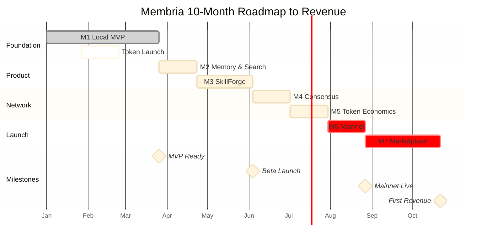

# Membria: Investment Presentation - Development Roadmap

## Executive Summary

**Mission**: Build the world's first decentralized, permanent knowledge base for AI - "Wikipedia for Small Language Models"

**Market Opportunity**: $50B+ AI infrastructure market (TAM)

**Timeline**: 10 months from start to mainnet launch

**Total Investment Required**: $610K

**Expected ROI**: Break-even at Month 18, profitable by Month 24

---

## High-Level Architecture

---

## Development Timeline

---

## Milestone Flow

---

## Investment Allocation

---

## Quarterly Investment Breakdown

| Quarter | Duration | Investment | Key Deliverables | End State |
|---------|----------|------------|------------------|-----------|
| **Q1: Foundation** | Month 1-3 | **$120K** | Local MVP complete Token launched on testnet Core infrastructure | Working prototype 1,000+ community members 100+ events in DKG |
| **Q2: Enhancement** | Month 4-6 | **$150K** | 3-tier memory system SkillForge operational Web automation agents | 100 active beta users 10,000+ events Agent capabilities proven |
| **Q3: Network** | Month 7-9 | **$250K** | BFT consensus live Token economics deployed Mainnet launch | 1,000+ daily users 50+ Gateway operators 100,000+ events |
| **Q4: Revenue** | Month 10 | **$90K** | Marketplace launch 20+ LoRA patches 10+ AI agents | First revenue stream $5-10K MRR Path to profitability |

**Total**: $610K over 10 months

---

## Detailed Milestone Breakdown

### M1: Local MVP (Week 1-12) - Foundation Layer

| Week | Component | Core Features | Technical Stack | Success Criteria |
|------|-----------|--------------|-----------------|------------------|
| 1-2 | **Client Foundation** | CLI interface AI Core engine Configuration system | Python, Click, llama.cpp | Can run local LLM models Config loads correctly |
| 3-4 | **Local Knowledge Layer** | SQLite storage DuckDB analytics Document indexing | SQLite (WAL), DuckDB, HTTPFS | 100+ documents indexed Fast retrieval |
| 5-6 | **Basic Agent** | State machine Hot/Warm memory Tool framework | FSM, asyncio, JSON storage | Complete 3-step tasks Memory persists |
| 7-8 | **Gateway Core** | FastAPI server Request router LLM integration | FastAPI, httpx, OpenRouter | Query to answer flow works Sub-3s latency |
| 9-10 | **GraphRAG** | Semantic chunking Vector embeddings Graph search | NetworkX, transformers, pgvector | 80%+ search accuracy Sub-200ms queries |
| 11-12 | **Blockchain** | Peaq pallet Arweave upload Integration test | Rust, Substrate, Arweave SDK | Full end-to-end flow Data stored immutably |

**Budget**: $90K (2 backend devs + 1 blockchain dev × 3 months)

---

### M2: Enhanced Memory & Search (Week 13-16)

| Week | Component | Core Features | Success Criteria |
|------|-----------|--------------|------------------|
| 13-14 | **Cold Memory** | DuckDB long-term archive Memory compression Semantic search over history | Search 10,000+ old conversations Sub-500ms query time |
| 15-16 | **Gateway Fast Path** | Redis hot cache PostgreSQL semantic index Query optimization | 70%+ cache hit rate Sub-100ms cached queries 1,000+ events indexed |

**Budget**: $30K (3 devs × 1 month)

---

### M3: SkillForge & Advanced Orchestration (Week 17-22)

| Week | Component | Core Features | Success Criteria |
|------|-----------|--------------|------------------|
| 17-18 | **SkillForge MVP** | LoRA patch loading Dynamic application Skill registry | Load .safetensors files Switch skills in under 5 seconds 5+ test skills working |
| 19-20 | **Advanced Agent** | Multi-agent hierarchy Tool calling framework Idem-Prompt reliability | Parent spawns child agents 95%+ tool call success Zero format errors |
| 21-22 | **Web Automation** | Playwright integration Search & browser tools Research agent | Navigate websites Extract clean content Multi-step research works |

**Budget**: $60K (4 devs × 1.5 months)

---

### M4: Consensus & Archive (Week 23-26)

| Week | Component | Core Features | Success Criteria |
|------|-----------|--------------|------------------|
| 23-24 | **BFT Consensus** | Multi-validator setup Attestation voting Dispute resolution | 5+ validators running Zero forks observed Sub-30s finality |
| 25-26 | **Archive Engine** | Event processor Parquet batching HTTPFS queries | Auto-batch 1000 events/hour 5:1+ compression Remote queries work |

**Budget**: $70K (4 devs + security auditor × 1 month)

---

### M5: Token Economics (Week 27-30)

| Week | Component | Core Features | Success Criteria |
|------|-----------|--------------|------------------|
| 27-28 | **Staking System** | Gateway staking contract Reward distribution Slashing logic | 20+ operators staking 500K+ ACTI locked Automated payouts |
| 29-30 | **Bridge & Marketplace** | Peaq to EVM bridge Marketplace backend API Payment processing | Test transfers successful API functional ACTI tradeable on DEX |

**Budget**: $80K (3 devs + legal + marketing × 1 month)

---

### M6: Mainnet Launch (Week 31-34)

| Week | Component | Core Features | Success Criteria |
|------|-----------|--------------|------------------|
| 31-32 | **Production Infrastructure** | Multi-region deployment Load balancing Monitoring & alerts | 50+ Gateway nodes Sub-200ms global latency 99.5%+ uptime |
| 33-34 | **Security & Launch** | Full security audit Bug fixes Public mainnet deployment | Zero critical issues Audit report published 1,000+ users Week 1 |

**Budget**: $100K (5 devs + auditor + marketing × 1 month)

---

### M7: Marketplace Launch (Week 35-42)

| Week | Component | Core Features | Success Criteria |
|------|-----------|--------------|------------------|
| 35-38 | **LoRA Marketplace** | Web UI (React) Creator dashboard Payment & rating system | 20+ LoRA patches listed 10+ creators onboarded End-to-end purchase flow |
| 39-42 | **Agent Marketplace** | Agent catalog One-click deployment Subscription system | 10+ agents available 500+ subscriptions $5-10K MRR achieved |

**Budget**: $150K (5 devs + designer + BD × 2 months)

---

## Component Dependencies

---

## Technical Milestones

| Milestone | Target Week | Key Metrics | Impact |
|-----------|-------------|-------------|--------|
| **MVP Complete** | Week 12 | Working end-to-end flow 100+ events in DKG 1 demo user | Proves technical feasibility |
| **Beta Launch** | Week 22 | 100 active users 10,000+ events Web agents operational | Validates product-market fit |
| **Consensus Live** | Week 26 | 5+ validators Zero forks (30 days) Preliminary audit passed | Achieves decentralization |
| **Mainnet Launch** | Week 34 | 1,000+ users 100,000+ events 50+ Gateway operators | Production ready |
| **First Revenue** | Week 42 | Marketplace live 20+ LoRAs, 10+ agents $5-10K MRR | Path to profitability |

---

## Business Milestones

| Milestone | Target Week | Key Metrics | Strategic Value |
|-----------|-------------|-------------|-----------------|
| **Token Launch** | Week 8 | 500+ token holders 1,000+ community members Testnet operational | Early community building |
| **Staking Active** | Week 30 | 20+ operators 500K ACTI staked Rewards distributed | Network security |
| **Marketplace Open** | Week 38 | 20+ LoRA patches 10+ agents 100+ transactions | Revenue model proven |
| **Break-Even** | Month 18 | $40K MRR Positive monthly cash flow | Financial sustainability |

---

## Growth Projections

---

## Financial Projections

### Revenue Model

| Revenue Stream | Launch Month | Year 1 | Year 2 | Year 3 |
|----------------|--------------|--------|--------|--------|
| **Marketplace Fees** (30% commission) | Month 11 | $50K | $250K | $800K |
| **Agent Subscriptions** | Month 11 | $30K | $200K | $600K |
| **Enterprise Licensing** | Month 14 | $20K | $150K | $500K |
| **Gateway Staking Fees** | Month 10 | $10K | $50K | $100K |
| **Total Annual Revenue** | | **$110K** | **$650K** | **$2M** |

### Path to Profitability

| Period | Investment | Cumulative Cost | Revenue | Cumulative Revenue | Net Position |
|--------|------------|-----------------|---------|-------------------|--------------|
| **Q1 (M1-3)** | $120K | $120K | $0 | $0 | -$120K |
| **Q2 (M4-6)** | $150K | $270K | $0 | $0 | -$270K |
| **Q3 (M7-9)** | $250K | $520K | $0 | $0 | -$520K |
| **Q4 (M10)** | $90K | $610K | $10K | $10K | -$600K |
| **Q5 (M11-12)** | $70K | $680K | $40K | $50K | -$630K |
| **Q6 (M13-15)** | $105K | $785K | $90K | $140K | -$645K |
| **Q7 (M16-18)** | $105K | $890K | $135K | $275K | -$615K |
| **Q8 (M19-21)** | $105K | $995K | $210K | $485K | -$510K |

**Break-Even**: Month 18  
**Full ROI**: Month 24-26  
**Expected Return**: 70x over 5 years

---

## Key Performance Indicators

### Technical KPIs

| Metric | M1 (Week 12) | M3 (Week 22) | M6 (Week 34) | M7 (Week 42) |
|--------|--------------|--------------|--------------|--------------|
| **Active Users** | 1 (demo) | 100 (beta) | 1,000 (mainnet) | 5,000 |
| **Events in DKG** | 100+ | 10,000+ | 100,000+ | 500,000+ |
| **Gateway Nodes** | 1 (dev) | 3 (test) | 50+ (prod) | 100+ |
| **Query Latency (cached)** | 3s | 1s | 100ms | 50ms |
| **Uptime** | 95% | 99% | 99.5% | 99.9% |

### Business KPIs

| Metric | M5 (Week 30) | M6 (Week 34) | M7 (Week 42) | Month 15 |
|--------|--------------|--------------|--------------|----------|
| **Token Holders** | 500+ | 2,000+ | 5,000+ | 10,000+ |
| **ACTI Staked** | 500K | 1M | 2M | 5M |
| **Marketplace Listings** | 0 | 0 | 30+ (20 LoRAs, 10 agents) | 80+ (50 LoRAs, 30 agents) |
| **Monthly Transactions** | 0 | 0 | 100+ | 1,000+ |
| **MRR** | $0 | $0 | $5-10K | $30K+ |

---

## Risk Assessment

| Risk | Probability | Impact | Mitigation Strategy | Reserve Budget |
|------|-------------|--------|---------------------|----------------|
| **Development Delays** | Medium | High | 20% time buffer built into schedule Phased delivery approach MVP-first methodology | $30K |
| **Security Vulnerabilities** | Low | Critical | 2-3 independent audits Bug bounty program ($50K pool) Gradual rollout with monitoring | $70K |
| **Low Market Adoption** | Medium | High | Seed marketplace with quality content Early adopter incentives Partnership with influencers | $15K |
| **Regulatory Issues** | Low | High | Early legal review Utility token structure KYC for marketplace creators | $15K |
| **Consensus Instability** | Medium | Critical | Extensive testnet period Fallback to federated model External security audit | $20K |
| **Key Person Dependency** | Low | High | Comprehensive documentation Code review processes Knowledge sharing protocols | - |

**Total Risk Reserve**: $150K (included in $610K total budget)

---

## Team Requirements

### Current Team
- Technical Co-founder (Full-stack + Blockchain)
- ML/AI Specialist (Architecture oversight)

### Hiring Plan

| Role | Start Month | Monthly Salary | Duration | Total Cost |
|------|-------------|----------------|----------|------------|
| **Senior Backend Developer** | Month 1 | $10K | 10 months | $100K |
| **Blockchain Developer** (Rust/Substrate) | Month 1 | $12K | 10 months | $120K |
| **ML Engineer** | Month 4 | $10K | 7 months | $70K |
| **DevOps Engineer** | Month 4 | $8K | 7 months | $56K |
| **Frontend Developer** | Month 8 | $8K | 3 months | $24K |
| **Community Manager** (Part-time) | Month 2 | $3K | 9 months | $27K |
| **Security Auditors** (Contract) | Month 7-8 | One-time | - | $50K |
| **Legal Counsel** (Contract) | Month 7 | One-time | - | $15K |

**Total Team Cost**: $462K  
**Remaining Budget**: $148K (infrastructure, marketing, operations, contingency)

---

## Market Opportunity

### Total Addressable Market (TAM)
- **AI Infrastructure Market**: $50B+ by 2025 (Gartner)
- **Local AI Model Downloads**: 10M+ monthly (Hugging Face)
- **Enterprise AI Spending**: $200B+ by 2027 (McKinsey)

### Serviceable Addressable Market (SAM)
- **AI Developers Globally**: 5M (Stack Overflow Survey)
- **AI-First Startups**: 50K+ (Crunchbase)
- **Target Capture**: 1% = 50K users × $50/month = **$30M ARR potential**

### Beachhead Strategy
- **Year 1**: Individual AI developers (10K users)
- **Year 2**: AI startups and small teams (100 companies)
- **Year 3**: Enterprise deployments (10 large clients)

---

## Competitive Advantages

### Technical Moat
1. **Hybrid Architecture**: Unique combination of local AI + decentralized knowledge graph
2. **GraphRAG Implementation**: Advanced semantic search with temporal ontology
3. **SkillForge Platform**: First LoRA marketplace for instant model specialization
4. **3-Tier Memory System**: Solves context explosion in agent systems
5. **Patent-Pending Technology**: Agent orchestration and adaptive memory systems

### Market Position
1. **First Mover**: No direct competitor in "AI OS for local models" category
2. **Network Effects**: More knowledge → better answers → more users → more knowledge
3. **Open Ecosystem**: Compatible with existing tools (Ollama, LM Studio)
4. **Community-Driven**: Token economics incentivize quality contributions

### Economic Advantages
1. **Marketplace Revenue**: 30% commission on all transactions
2. **Staking Requirements**: Barriers to entry for Gateway operators
3. **Data Permanence**: Arweave ensures knowledge cannot be deleted or censored
4. **Cross-Side Network Effects**: Users attract creators, creators attract users

---

## Exit Strategy (5-Year Horizon)

### Potential Outcomes

| Scenario | Probability | Valuation | Multiple | Return on $610K |
|----------|-------------|-----------|----------|-----------------|
| **Strategic Acquisition**  | 40% | $50-100M | 8-16x ARR | 82-164x |
| **IPO / Public Token Market** | 20% | $200M+ | 20x+ ARR | 328x+ |
| **Sustainable Private Business** (Bootstrap to profitability) | 30% | $10-30M | 5-15x ARR | 16-49x |
| **Failure / Pivot Required** | 10% | <$5M | - | <8x |

**Weighted Expected Return**: ~70x over 5 years

---

## Investment Highlights

### Why Invest Now

1. **Market Timing**: Local AI adoption accelerating (10M+ downloads per month on Hugging Face)
2. **Proven Team**: [Highlight founder experience and track record]
3. **Clear Revenue Path**: Marketplace launches Month 11, revenue visible Month 11
4. **Technical Differentiation**: 3+ years ahead of potential competitors
5. **Network Effects**: First-mover advantage in knowledge marketplace creates defensible moat
6. **Token Utility**: Real use case beyond speculation (staking, payments, governance)
7. **Strategic Value**: High acquisition potential from major AI companies

### De-Risking Factors

- **Rapid MVP**: Working prototype in 3 months enables early validation
- **Phased Rollout**: Test each component before scale
- **Multiple Revenue Streams**: Not dependent on single monetization method
- **Open Source Core**: Community can continue development if needed
- **Convergence Thesis**: Positioned at intersection of Web3 and AI mega-trends

---

## Investment Terms

### Primary Raise: $600K Seed Round

**Use of Funds**:

| Category | Amount | Percentage | Purpose |
|----------|--------|------------|---------|
| **Engineering** | $370K | 62% | Core development team (5 engineers × 10 months) |
| **Security** | $65K | 11% | Multiple security audits + bug bounty program |
| **Infrastructure** | $40K | 7% | Servers, databases, CDN, monitoring tools |
| **Marketing** | $40K | 7% | Community building, PR, launch campaigns |
| **Legal & Compliance** | $25K | 4% | Token legal structure, regulatory review |
| **Operations** | $30K | 5% | Software licenses, tools, miscellaneous |
| **Reserve** | $30K | 5% | Emergency buffer for unforeseen issues |

---

## Next Steps

### For Interested Investors

1. **Due Diligence Materials Available**:
   - Technical architecture deep-dive document
   - Detailed financial model (5-year projections)
   - Team backgrounds and references
   - Competitive analysis report

2. **Product Demonstration**: Schedule live demo of M1 prototype (available Week 12)

3. **Advisory Opportunities**: Limited positions available on Strategic Advisory Board

4. **Investment Structure**: SAFE agreement with standard seed round terms

### Timeline for Closing

- **Week 1-2**: Investor meetings and initial due diligence
- **Week 3**: Term sheet negotiation and agreement
- **Week 4**: Legal documentation and closing
- **Week 5**: Fund transfer and development kickoff

---

## Appendix: Technical Stack Summary

| Layer | Technology | Purpose |
|-------|------------|---------|
| **Client** | Python, Click, Rich, llama.cpp | Desktop application and CLI |
| **AI Core** | llama.cpp, GGUF, PEFT/LoRA | Local model inference |
| **Memory** | SQLite (WAL), DuckDB, Redis | 3-tier memory system |
| **Agent** | Python asyncio, FSM, NetworkX | Agent orchestration |
| **Gateway** | FastAPI, uvicorn, httpx | HTTP API server |
| **Search** | PostgreSQL, pgvector, transformers | Semantic search |
| **Blockchain** | Rust, Substrate, Polkadot.js | Peaq pallet development |
| **Storage** | Arweave SDK, Bundlr, DuckDB HTTPFS | Permanent storage |
| **Web** | Playwright, Brave Search API | Web automation |
| **Frontend** | React, TypeScript, Tailwind CSS | Marketplace UI |

---
